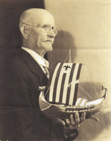

A SAILOR'S REMINISCENCES FROM THE DAYS OF THE SAILSHIPS
=======================================================

> BY OLAVUS VULLUM BJØRNSON VESTBØ
> Translated from Norwegian by B.C. Berge
> Transcribed and edited by Ken Tannenbaum

_NOTE: "Edited" is a strong word.  I've done my best to not change Olavus' original text, as I wanted the site to capture his tone and state of mind, which would be changed if I altered his writing style or terminology.  With that in mind, I give you "Finnøybu".  Enjoy._

_CONTENT WARNING: This site contains mentions of racial epithets and slurs that reflect outdated, biased views which can be disturbing or offensive. Such content was included in order to preserve this historical record._

--- 

## Introduction
This story of my experiences as a sailor, in my youth, in the proud sailships, will probably be somewhat different from all narratives of sailors that I have heard or read. The incidents will be so related as to show exactly what happened, as near as I can remember, without regard to favorable or unfavorable reflections as to myself.

Possibly somewhat wild, as a youth, and not very easy to handle, I hope I may be pardoned for charging not only that, and the yearning I had to get far, far away and see all the world, but also the desire for freedom and hatred of bondage to my Viking ancestry.

Willing to abide by law and justice, I found there was not always a clear line between justice and injustice on board the ships.

Life on the sailships was one of endless changes and all kinds of happenings, some comical, some tragic, and some a mixture of both. I always looked rather for the comical even in the most serious circumstances.

--- 

## The First Lessons
In sailor life I received, as a 15-year-old boy, on a six months' voyage in the Baltic and North sea, as cook, in the brig 'Nanna' of [Stavanger](https://en.wikipedia.org/wiki/Stavanger). This was in the summer of 1875. I learned that even the position of cook was not so easy, as it seemed that he had to be everywhere at all times, and he was subject to the command of every other man on board. But, regardless of the many duties he had to perform, if the meals were not ready at the scheduled hour, the food good and well cooked, he was subjected to criticism, scorn, and unfortunate consequences. I found sailors could be very exacting and unreasonable in their demands, or rather, impossible to suit.

Being subject to seasickness, occasionally, especially on coming out into storm and rough sea after we had been in harbor for a few days, I found the odor of meats and fats in cooking, or any cooking smell, would upset my stomach more than the pitching and rolling of the ship. It was no fun to be cook then. But there was no mercy or sympathy shown by my shipmate. Sick or not sick, the work had to be done. At such times, my sailor spirit sank out of sight. I began to think seriously on whether or not I was really born to follow the sea.

Nevertheless, I learned much on this voyage, such as to steer, shorten and bend sail, splice cordage. and many other necessary duties on board ship. So, it proved a good school of instruction.

--- 

## Coming Home
In the autumn, I spent the winter with my folks. But no sooner did the spring, 1876, open than my longing for the sea awoke, - I must away. Sixteen years old. Large and well-formed body, strong and healthy, I imagined I was a full-grown man, who could fill a man's place.

I had a good home, and my father did not like the idea of my going to sea, and he tried to prevent it, but when he saw he could not he gave in. My mother had passed away many years earlier.

Away to Stavanger. a distance of about 20 miles from my home on [Finnøy](https://en.wikipedia.org/wiki/Finn%C3%B8y). I went to seek employment on a ship. Father went with me. Now, it so happened that John Stensøy. a cousin of my father, who lived very near the city, was part owner of a new schoonership, which lay at anchor, ready to sail on its first voyage. G. K. was to be captain. John gave us his address. Father knew him, and if I remember correctly, he was married to a relative of my mother. This situation we thought was very fortunate, and if I could obtain a place here it would seem as if I was sailing on a ship belonging to our family.

Calling at the home of Captain G. K.. we were received in a friendly manner and yet, the first impressions I received of the captain were not favorable. He was an elderly man with a very weather-beaten and pock-marked face, unkempt hair, thin and sprawling full beard, short but untrimmed, and a big, thick red nose, set between great bushy eyebrows. He was not very tall but broad-shouldered, heavy set, a regular seadog in appearance, quite rough in voice, with a slight hesitation or stammer when speaking. He tried to appear friendly.

Father stated our errand. The captain looked at me, asked a couple of questions which I answered to his apparent satisfaction. It appeared that he was well pleased with me, and he said he would gladly give me a place on his ship. I was to appear at the office of registry in a couple of days, to be assigned place and duty. He also invited me to have dinner with him the next day, after which we were to go aboard and inspect his new ship. Father was much pleased that I had obtained such a good place, and he returned home in good spirits. Good fortune for him he could not see what the immediate future would bring; if he could have done that, I am sure he could not have had a good night's sleep until I should have returned home.

The next day, keeping the appointment, I went to the captain's home for dinner, and found both him and his wife affable and entertaining. The wife was a quiet, refined lady, apparently entirely different from her husband, in his uncouthly appearance and deportment. This was, in my estimation, not much to wonder about. A man who has spent his life in battle with stormy seas must not be expected to be as polished as people who have worked under less strain and adverse circumstances. The ocean puts certain marks on its sons.

After dinner came the inspection of the ship, and the captain showed me round from top to bottom, forward and aft. He was in the brightest of humor concerning this solid, seaworthy new ship. His enthusiasm also infected me to some extent. Think of being of the crew of this beautiful ship, and a particular friend of the captain! Here would likely be pleasant and agreeable days. well, it is fortunate we do not know anything about the future. It is time enough to consider misfortune when it comes. The next day the crew came to the office of registry and signed up for the voyage: 1st and 2nd mate, boatswain. 3 sailors, 2 youngmen, cook or a steward. a deckhand - eleven men in all; not a big crew for this size ship, especially so, when we consider that three of them, the boatswain, one youngman and the deck hand had not sailed a voyage before.

For the sake of clearness of the following narrative I think it well to mention some characteristics of some of these men. 1st mate was of middle age, had a big, reddish full beard, was quite sour and grouchy and not very easy to get along with. 2nd mate was a young, full grown, straightforward chap, friendly and good-natured. His name was Karl Oberg. and I have heard he later resided in [Portland, Oregon](https://en.wikipedia.org/wiki/Portland,_Oregon), where he became well known and much appreciated. He died there a few years ago. I should have looked him up there, had I known, but did not learn he was there until too late. The name of one of the sailors was Thompson. He was tall and think, quiet and reserved, difficult to become acquainted with, but one could not say he did not fill the place he was hired for. Another sailor was Elisøson. He was from [Lysefjord](https://en.wikipedia.org/wiki/Lysefjord), not very far from Stavanger. He was presumably 25 years of age, not very tall, but stocky and heavy, with red cheeks, the picture of health, friendly and very quiet, he would not offend even the ship's cat. The boatswain was from Hogganvik. he had helped build this ship. I do not remember his name. About 25 years of age, he was rather small and thin, by nature a first-class fellow, friendly, quick and courageous, and though this was his first voyage, one could readily see that he was a born sailor. he and I became very good friends, and that friendship lasted till we returned to Stavanger, where we parted, and I heard no more from him. The other youngman was also from Hogganvik, and his name was Nils. He was about as old as the boatswain, average size and weight, but somewhat slow in action, and sometimes he would stammer so it was painful to listen to him. He was not well qualified to become a seaman, but there was sympathy with him because he was good-natured and friendly. The steward or cook was from [Flekkefjord](https://en.wikipedia.org/wiki/Flekkefjord), about 30 years old, average size, big, black full beard, a fine man with whom there was no difficulty to get along on reasonable basis. So much for the crew. We shall meet some of them later.

We had all be hired for the term of the voyage, that is, until the ship returned to its home port, but not for a longer period than two years. So, we went aboard with pick and pack.

The next day, the wind being favorable, we weighed anchor and set sail, in good spirits, and with the customary chorusing (opsang). In those days, when a ship weighed anchor and set sail for departure, an opsang had to be sung, in time and rhythm with the motion of the men who operated the machinery that lifted the anchor. One of the crew would sing a verse of some popular song, and at the end of the verse the whole crew would sing a lusty refrain or chorus, perhaps something like 'Stormy Land' or 'Blow the Man Down', or 'Rio Grande', or others. 'Rio Grande' was like this:

> _Oh Rio, Oh Rio, Sing fare you well;
> My pretty young girl, we are bound for Rio Grande._

There was something remarkable about these 'opsongs', especially if the crew was large and included good singers. People would gather in large groups on docks and wharves and listen. There was something charming, captivating and magnificent in the opsang of departure of ships for distant lands. To define this feeling is not so very easy.

We stood out Stavangerfjord under proudly bulging canvas. Well out to sea, the course was set for [Shields, England](https://en.wikipedia.org/wiki/Shields,_England), where we were to take on a cargo of coal for [Lisbon, Portugal](https://en.wikipedia.org/wiki/Lisbon), and from there we were to bring a load of salt back to Stavanger.

The crew was divided into starboard and larboard watches. I was given place on the latter, together with the second mate and captain who are always on that watch, while the first mate always belongs to the starboard watch. The boatswain was compelled to be a part of the watch on a ship with as small a crew as this. The steward had contract not to be of the watch.

The watch was set in the evening, that is, it was decided which group was to have the first watch, from 8:00 P.M. to midnight on deck. There were five watch periods, 8:00 P.M. to 12:00 midnight, 12:00 to 4:00 A.M., 4:00 to 8:00 A.M., 8:00 A.M. to 3:30 P.M., and 3:30 to 12:00 midnight. As the afternoon watch was long, the same group would never be on watch in the same periods two days in succession.

The weather was somewhat dark and stormy, yet not very bad for March. We could not expect summer weather. It was cold and wet, and the feeling among the men on board also seemed to become cold and disagreeable. The captain began in a small way to show his real colors.

The two men from Hogganvik and myself, and probably others who had imagined there would be only peace and friendship and good days on board here, soon saw the end of our illusions. Friendship vanished, and the captain began to reveal himself as a regular slave-driver. And when we noticed that the food we were given was of the poorest we had seen or heard about, it cannot be denied things began to be disagreeable. The bread consisted of great, course rye-crusts of the poorest kind, probably 4 inches in diameter and about two inches thick, very sour and, for the most part, steel-baked in the middle, that is, there was part in the middle of each crust about 1/4 inch thick that was neither raised nor baked but simply dried dough, hard as flint. When we broke the crust, this middle part would shine like broken glass. It would require soaking about 24 hours to make the crust edible, and even then, not very easily digestible. We were given no butter, but instead each one of us received a quart of a pot of olive oil (about 1/2 pint) for each week, besides some of the poorest dark molasses, and some vinegar. We were directed to make a mixture of these constituents and dip our bread in it. Of the molasses and vinegar, we used very little. But we got used to the oil and gradually came to like it. And I remember that many times when the oil was measured out to us, I took my portion, meant for one week's use, and drank it at once, then ate dry bread for the rest of the week, or rather, ate it after having soaked it for a while in my coffee. The salt meat we had was salt and dry as wood. We used to call it horsemeat and mahogany. The port, on the contrary, was so fat that we could hardly eat it. It was fully five inches thick. We were given no potatoes or other vegetables. Now and then we had peas and beans in soup, also salt fish, and a rice pudding was made occasionally. Never again in all my life at sea did I notice so poor provisions for the crew, except once, on a voyage from [Hamburg](https://en.wikipedia.org/wiki/Hamburg) to [New York](https://en.wikipedia.org/wiki/New_York_City), about which I shall write a little later.

After about a week out we reached Shields, that dark and smoky English town, which I also had occasion to visit sometime later. In those days it was customary for the crew to do all the work taking on and putting off the cargo, except in case of coal loads. Coal was loaded on ship by cranes which lifted a whole carload at a time and dumped it into the ship. In this manner our ship was loaded in a couple of days. Some care had to be observed in placing the cargo in the ship's hold, so it would not shift when the ship labored in high sea and storm. For this purpose, the coal had to be brought out to the sides in the middle of the hold up to the deck, leaving empty spaces under deck fore and aft.

As soon as we had loaded, a tugboat was secured to pull us out to sea. The weather was heavy and gray. So was the temper of the crew. Everything seemed heavy. Even the new sails seemed hard to handle. They were wet, and the new-tarred cordage, by contact with salt water, had becomes hard as steel-cables, difficult to handle, and our hands became sore and blistered.

Coming into the open sea, we had to begin cleaning the soot and coal dust from everything. Our ship was painted white, inside and out. This washing, so far as the outside of the ship was concerned, we made too much haste to do. We could have saved ourselves the trouble, because it was not long before we became good and well washed by the turbulent sea.

The weather was, however, reasonable till we reached the [English Channel](https://en.wikipedia.org/wiki/English_Channel). Here we met with a head wind. Every little while we had to put about and there was constant agitation and hard work. All hands had to be on deck to handle the sails when we had to put about ship, either by day or by night, and there was no excuse from duty, even on free watch.

--- 

## The Bay of Biscay in Uproar

The further west we came in the Channel, the harder the gale blew, and the seas increased accordingly. Ship and sails were new, and she was a good sailer, so we felt we could force our way for a while even in the most contrary weather. But the gale became more violent. By and by we had to trim sail, and before long there was an almost constant drift of seas, not only over our bow but the whole ship and far up into the rigging. The captain took command at every about ship, and his excitement grew with the storm. He roared, yelled, and swore most fearfully, and when he thus raved, he expected the men to be so scared that they would run and carry on as if they had lost their wits. This I did not like. It was not necessary for us to jump out of our boots no matter how much he might act like a madman. I noticed some of the boys became so frightened they ran about the deck like whipped rats, and I believe many times they did not know why they were running around. But the captain seemed to like to see them act that way. He called us plebians, land crabs, and some other worse names I do not care to mention. But at the same time, he made it a point to impress us with the fact that he was a real sailor, and now he intended to teach us how to dance. He soon noticed that I was not afraid when he roared and cursed, and that ended all pleasant relations between him and myself. I had seen him stand and grin through his whiskers when the boys became frightened nearly out of their wits at his behaviour, and I promised myself that he would have to behave much worse before I would be scared.

But this situation was ridiculous. This 'Finnøybu', as he now began to call me, must be humbled, and learn to understand the majestic greatness and supreme authority of the captain. But how? I did my work as well as anyone, or perhaps better, so he really had nothing to complain about. And that was what seemed to hurt him most. He could really find no good reason to make an attack on the 'Finnøybu’ and make him really afraid of the power of the chief officer. Leaving this subject for the present, to come back to it later, the reader will see how this enmity of the captain became a life and death struggle between us.

Probably few readers now know that a schoonership is a three-masted schooner, with yards on the foremast, and schoonersails with boom and gaff on the main and mizzenmasts. The main sail on this ship was a great piece of canvas. I believe its boom must have been between 70 and 75 feet long.

As mentioned, we had come out in the western part of the Channel. Water came on deck faster than it could readily get away through the scuppers. Then, one night, as we put the ship about, Nils was stationed at the main sheet. My place was at the fore-braces. Larboard or port watch on a ship ordinarily handled the sails at the foremast. Starboard watch belonged at the main mast. The main sheet consisted of two great two-fold tackles, one from each side of the ship. When putting the ship about in a gale and rough sea quick work had to be done to slack tackle on one side and at the same time pull up on the other, so the boom would not be permitted to flap or strike to one side or the other. If it got a chance to strike one could not tell what would happen. I have seen the boom strike so hard that fire would spurt and fly from the steel tackle hooks. Nils was a little slow, and the turning was not so easy. It was dark, and the water washed over the deck, sometimes one and sometimes another direction. The boom struck twice. How it happened I could not see. However, the starboard lantern stand was broken, and the glass split from top to bottom, but it did not fall out. The captain became raving mad, and as soon as he could leave the helm, which he always handled while we made the about, he came running down the deck, struck Nils with his fist, roared and cursed like a maniac, vowing that he would teach all of us some seamanship. Nils, poor wretch, took the insult gracefully and kept still. But none of us felt very good about it. And, from this night, one tragedy after another came, blow on blow, during the next three weeks.

Up to this time we thought the weather had been bad, but we had, as the saying goes, seen nothing yet. Having reached a point sufficiently to the windward of the northwest coast of France, we set a more southerly course, to cross the [Bay of Biscay](https://en.wikipedia.org/wiki/Bay_of_Biscay), notorious for its fierce storms and violent seas. Here the weather became worse, and we were compelled to put the ship under stormsail and try to take it easy. As a consequence, we drifted considerably leeward, making it impossible to clear the northwest capes of Spain, commonly known as [Finisterre](https://en.wikipedia.org/wiki/Cape_Finisterre), without tacking. But, after several attempts to put her about astay, we gave it up, because she had too little sail and not enough speed to turnabout against the wind. So, we had to veer around with the wind. The seas were running terribly high. I had never seen the like and had never believed the billows could be so large. It was like looking over big mountains and valleys. The ship appeared like a little chip in comparison to the enormous waves. Some of them broke and rolled in over our deck and the water dashed now this and now that way, splashing up to our hips. Good sea-boots and oilskins were of little avail to keep us dry. But the weather was cold, so we had to have them on in order to keep warm. We had to veer, around again and again, about every twelve hours.

One day I happened to be standing forward near the roundhouse. At the moment there was nothing to do. The captain stood aft on the half-deck, and he called me thus: 'Come here you Finnøybu.' I obeyed, of course. But it was almost like swimming to go along the deck. When I came near him, he said: 'Take that rope-yarn which is floating there and put it in your bunk, then you will know where to find it when you need it.' Rope or cable-yarn is a single thread of the kind used in making ropes. This piece of it was about two feet long, and it was so frayed it appeared most like a rag. Yes, I thought, I shall certainly take care of it. I understood well enough he had told me to do this only to pester me. The yarn was worth nothing. I took it and went forward, rolling it up in my hands, and when I had reached the roundhouse where the captain could not see me, I threw it overboard. Then I went down into the cable-tier, a little room at the very bow under deck, where cordage, blocks, straps, and other things were kept, cut a piece of new cable, took it with me and stuck it under my mattress in my bed. I would be able to find cable yarn when I had need of it, but not the piece I had to swim to rescue.

Then, there came a night when the wind seemed to abate a little, and when the new watch came on deck at 4:00 A.M. we received orders to get a reefed topsail. We went aloft, loosened the sail, and began to reef it. I remember Thompson was out on the yardarm starboard, which then happened to be windward, putting on the earing, which is the rope that holds the sail stretched along the yard. Eliasson lay in on the same side of the yard, about halfway to the mast, and I was about 6 feet from him and 6 feet from the mast. As the weather was cold Eliasson had on a pair of woolen half mitts. Mitts are dangerous things for a sailor to use, especially when he goes aloft, and it was very seldom I saw them used. Eliasson and I were tying up the reefs, taking the ropes one each side of the year, tying a half-knot on top of the yard, then pulling both ends up to take up possible slack, then tying the other half-knot with the loose end. I happened to be looking over his way. It was dark, but not more so than I could see what he was doing. He had made the first half know, pulled it up, then he jerked upward to take in the slack, but as he did so the rope ends slipped out of his hands, and he fell backward. I saw him, in the air as far down as to the forecourse yard. He fell in under the yard so I could not see him when he hit the deck, but I felt it. He was so heavy we could feel the rigging shake from the impact.

We were naturally somewhat overcome by the shock of the accident and called out to those on deck that a man had fallen down, and we left the sail and betook ourselves down as fast as we could. I well remember I did not trust my own hands but put my arms around the cordage as I slid down. I was pretty certain Eliasson was killed. When we came down, we found he had fallen on the anchor chain. We took him up carefully, carried him into the roundhouse and laid him down on the floor.

The captain came and ordered us to take off his oilskins and seaboots. He took hold of the boots himself, and pulled roughly, but to no effect. Eliasson had tied cable yarn around his trouser legs outside the boots, so the captain could not pull them off. Then he began to curse and said one could not expect any better than to fall down when he was bundled up like that. Then we heard Eliasson say: 'Please, captain, do not jerk my foot so hard.' That was the last we heard him say. A few minutes later he was dead. He had a hole in his forehead, and both his legs were broken. We laid his body in the carpenter's shop, to be prepared for burial later.

We were scarcely through with this before the storm began to howl worse than ever, and we had to go up and take in the topsails in a hurry.

The next four days it continued to blow. Then it abated so we could open the forward hatch sufficiently to get hold of some boards of which the carpenter could make a coffin. We put some pieces of coal in the bottom of it, wrapped the corpse in some canvas, put it in its rude casket, and nailed some boards over. Then we carried it aft, where the captain ordered us to take two pieces of rope, of which one end was tied to the outside of the railing. One man held each of the loose ends of the ropes, in the loop of which we placed the coffin, and it was thus lowered into the sea. I held one of those ropes.

When we had placed the coffin thus out on the ropes, we were commanded to hold it there while second office Karl Oberg sang a verse or two of a hymn. Thompson held the other rope. The captain was at the helm. When the singing had been done, we were ordered to lower amain. But whether one of us lowered too rapidly or the other too slowly, I could not say. However, the coffin was not going down in a horizontal position, and the captain roared out: 'See – see now, that Finnøybu, how he lowers like a (terrible execration) cow.' I looked aside at the second officer, and saw tears rolling down his cheeks, and tears were not far from my eyes either. It was exceedingly depressing and unpleasant to bury a comrade and friend at sea in that manner, and under such circumstances.

I never saw such weather and such turbulent sea in my whole life as a sailor, except on a voyage from [Wilmington, North Carolina](https://en.wikipedia.org/wiki/Wilmington,_North_Carolina) to [Bristol, England](https://en.wikipedia.org/wiki/Bristol), one time in winter. But on that trip the wind was with us. Now it was against us.

If the humor and spirit of the crew had been depressed before they now became more so. We had lost one of our best men, and if duties and responsibilities had weighed heavy before, they now weighed heavier.

Then, one afternoon, I was at the wheel, as we had our regular appointed hours, as well on the forward lookout as at the helm, night, and day. I saw an unusual big breaker approach us. It appeared impossible for us to avoid it. Nearing the ship, it raised us like an overhanging mountain. The top or comb of it seemed to hang several fathoms forward; balancing with the speed of the wave until it reached the side of the ship, where the whole mass of it fell like an avalanche, with a terrific crash, over the whole ship from the bow to the cabin. The aft part of the ship was forced upward by the fearful pressure amidships. The upward movement was so rapid that if I had not held fast to the helm with all my strength I should certainly have been thrown overboard. The ship seemed entirely buried, except a small part aft. I wondered if it would come up again. After a while I noticed it slowly emerging, and at the same time I saw hatch-covers and pieces of white painted boards come floating alongside. Then I understood something had gone wrong. The air pressure in the hold, caused by the great weight striking the deck, had forced the forward hatch open, broken the bulwarks from the forecastle to the fore-rigging. Both the forecastle and the bulwarks went overboard at the same time. None of the crew, however, had been injured.

We had some planks on top of the cargo, near the fore hatchway. They were brought up hurriedly. Some men sawed, others nailed, thus rapidly covering the opening, the first mate being on lookout for other breakers while we were working. It is seldom that many such breakers come in succession, even in such unusual weather, and it is not often that one strikes a ship. They have to strike just at the apex of their fury to do damage as this one did.

Nevertheless, we were to have many more tragic events, the time intervening between each I cannot well remember.

Our clothing was soaking wet night and day, and we began to feel completely saturated, heavy, and stiff, so that the mind was affected, and the experience seemed like a very bad dream. And, with the poor food, and very little sleep, it is not surprising that we felt and acted as if half intoxicated.

One morning, at daybreak, we saw a ship near us, not far to leeward. That was also a schoonership, about the same size as ours. It was also steering southward, about a half mile away from us, and we had no fear of a collision. One thing we noticed; between the ships there were always two billows, and when both ships were in the valley between the billows, we could not see the tops of the masts on the other ship. Our mast-tops were about 150 feet over the water. I believe those on the other ship were about the same. How far below the billow-crests the mast-tops went I cannot say, but there elapsed a few moments from the time they disappeared till they appeared again. And let me say, the seas were not only high, but the valleys between them were broad and spacious.

Our whole crew observed, with some wondering, the relative positions of the ships. It remained the same all day, and when darkness fell, the stranger was still two billows to the leeward.

The following morning the strange ship had disappeared, just as mysteriously as it had come into sight.

We veered round and stood northward again. There was nothing for us to do but to stand by, as we called it, and ride out the storm.

In the meantime, we drifted farther and farther into the bay. The next day we stood south again.

The following night, about midnight the mad on the forward lookout called: 'A lantern to leeward.' Our course was southward on starboard tack and, according to maritime law, we were to hold our course. The approaching ship would have to pass us to leeward. But her starboard lantern was steadily in sight as she approached us. Soon we could see the ship thru the darkness and were surprised to notice it was the same ship we had seen two days ago. Now we were on the same billows and were nearing each other quite rapidly.

All our men were called on deck in a hurry. The captain jumped up on the forecastle roof holding a metal trumpet which he put to his mouth and boomed out: 'Ship ahoy.' Answer came back instantly: 'Starboard with your helm.' We understood the situation at once and ordered the man at our helm to put it starboard, which meant the same as to go about. The difficulty was that the strange ship did not obey its helm, so it could not fall off to lee, and therefore, the last and only thing we could try to do, to avoid a collision, was to go about. But, having tried to do that, and failed so many times, we had no hope it would succeed now.

The ships came nearer. Collision appeared inevitable. Everyone, except the man at the wheel, stood on the forecastle ready to jump aboard the strange ship when the proper moment arrived. Our ship was loaded with coal, and a collision in this kind of sea would send it to the bottom at once. The lifeboats would be no help. It was hoped and guessed the other ship had a lighter cargo.

All at once we noticed both ships turning up against the wind, but still coming nearer to each other. These were exciting moments. Could it be avoided, or, had our last hour arrived? The distance between the ships was now desperately short, and each turned windward so slowly. Eventually, however, both ships had their bows straight to the wind, and they were so close together I believe I could have jumped from ours over into the other ship. The situation was terrifying. Would the ships go about astay, or would they fall back? No words were uttered or heard; only the howling and whining of the storm in the rigging of the ships, and the roar and din of the waves.

Only those who have lived thru such moments can understand what this means. Minutes seem as long as hours, and one's breath comes only by spasms.

Then there came a big sea rolling along and struck the bows of the ships with great force; the mass of water that came driving in between the ships parted them, and each was made to go about its own way. If this was not a miracle, I have never seen a miracle. We tried later to tack or go about against the wind but failed. Only this one time it succeeded. The strange ship disappeared in the dark and we never saw it again. But we did not soon forget it.

We had three big watercasks securely fastened to the deck outside the forecastle, each of them containing about three barrels fresh water. By this time, we had used about all their contents, and began to think about a new supply. There was a big iron tank in the hold, standing aside the pumps, and reaching from bottom up under deck, filled with fresh water. It had a manhole in the top, with a lid on it, fastened with bolts. And in the deck, right over the manhole, there was also an opening with a hatch cover on it.

One day when there was a lull in the storm, we opened the manhole, and everyone with buckets, hurried to take water from the iron tank and fill the water-casks. But, to our great dismay, we found the water was mixed with seawater. It was a shock which, on top of all the other adversities, caused extreme fear and consternation.

Were we now, in addition to all other suffering, also to suffer from thirst? Well, there was nothing to do but be calm. The manhole and the hatch had been carefully closed, still, with all the seawater on deck for days and weeks, in some way it had leaked into the tank.

We tried to use the water for coffee and tea but could not drink it. Peas cooked in it were so hard and salty we could not eat them. We gnawed at some bread or what else we could get hold of that was not so salty, then we would go to the water cask, take some of the water, drink as rapidly as we could, thereby trying to avoid the extremely salty taste. But no matter how much we drank of that water it did not quench the thirst. Our greatest desire was to reach land and obtain fresh water.

After some days, the gale once more diminished, and the direction of the wind became northerly. Then we began gradually to set more sail, and to work ourselves out of the Bay of Biscay, and eventually passed Cape Finisterre. We had not been three weeks crossing this body of water and had had enough of it. Glad we were when we finally reached our destination and could cast anchor in Lisbon.

The first thing we did was to get fresh water. We had been, as I remember, 12 days without it. Whoever has had similar experience is more able to appreciate good water.

--- 

## The Proud Captain

Lisbon lies on the north side of a river, of which I do not remember the name, probably 8 or 10 miles from its mouth. At the mouth of the river, and to the north side, was a large fort and all ships passing it had to hoist their national colors. The city is built on ground evenly inclining from a rather high ridge toward the river. It was a large, well-built, and well lighted city. Most of the buildings were painted white or light yellow. One day some of our crew were ashore, and we ventured to go upon the ridge to get a better view of the city. There we saw something that seemed to us quite wonderful. There were buildings constructed of white glazed brick, with a few bricks of other colors in corners and other places, for ornamental effect. Whether these were government buildings or what I do not know.

The streets were wide, paved with marble, on inch square, also of varied colors. In one place there was a great plaza, where the paving was decorated with large inlaid stars and other figures, all made out of these small, shining pieces of marble. It was the finest paving I have ever seen. And these buildings were the most beautiful, of their kind, that I have seen at any time.

The transportation in the city was mostly by mules or asses, as I now remember, - it is now 60 years ago, - and it was almost unbelievable what large burdens these small beasts could carry. Great, big baskets or hampers on each side, filled with vegetables, fruits of all kinds, and a variety of household necessities, they carried steadily all day. Never in my life have I seen animals more meek and gentle and patient. I remember seeing one oxcart with an ox pulling it. The driver walked aside the ox, carrying a big driver's pike. He urged the animal on by talking to it unceasingly, and he would occasionally touch its flank with his pike, with no apparent effect on the movement of the rig, or the feelings of the animal. But we must get aboard the ship again.

Lighters were employed to discharge our cargo. They came alongside the ship, and we transferred the coal to them from the hold by means of a hand-winch, with a big crank on each side. From this windlass there went a rope up thru a block hung directly over the main hatch, and from there down in the hold, where it was fastened by a hook to large baskets, which were filled with coal and thus hoisted up by hand. Some of the crew were in the hold, filling the baskets, others on deck, hoisting and emptying the coal into the lighter. It took time to discharge our load of coal in this manner – at least two weeks.

The captain spent most of his time ashore and was not so seldom drunk when he came onboard. He was not so very friendly, particularly toward Mils and myself.

One forenoon we were ordered to row him ashore. When he stepped out of the boat he said: 'Wait here till I return.' He went, and we waited and waited. Noon came and passed, and he did not return. We had no money with us, and we were hungry. Along in the afternoon we agreed to row over to the ship and get our dinner, and we did so. I knew we had no right to do this, but the captain also knew we had no money, and we needed to eat. We rowed ashore again, but no captain came. Evening drew on and the air became cold. We had very little clothing on, so we were chilly. There we sat in the boat, listening to the big clock in the city, striking the hours.

At ten o'clock in the evening we agreed on rowing aboard and leaving him, reasoning that he could not expect us to sit and wait, suffering cold and hunger, first all day and then all night. We came to the ship and were in the act of hoisting our boat up by the davits, first mate and others of the crew helping, when we heard a voice out of the darkness on the river: 'Faina, aho-o-o-y.' Faina was the ship's name. 'Halo-o-oo', answered that mate. That was the captain who had now gotten a ferryman to take him onboard. 'Have the boys come on board', he called. 'Yes, they came just now,' said the mate. 'I shall teach them to come, just now, I shall,' he yelled back.

Now I knew we could expect most anything. By what he said, I understood he was intoxicated. Sneaking around the cabin, I went aloft in the mizzen-rigging as far as below the top-platform. I expected he might use violence, but I made up my mine he should not reach me. And I was sure he could not reach me unless I came on deck. I could go from mast to mast on the stays, and I knew he could not follow me there.

As soon as the captain had come to the top of the accommodation ladder he roared: 'Where are they?' 'Here am I,' answered Nils. I had never believed Nils to be so thoughtless. The captain grabbed a piece of large rope, wherewith he struck Nils repeatedly until he fell unconscious on the half deck, crying and howling most miserably, and when he fell the captain began to kick him in the sides and head till I believe he had killed him. I stood in the mizzentop, directly above, so I had a good view of what happened, and I was boiling with anger.

I was about to go down and try my hand on the captain, but I knew it was dangerous for a seaman to begin a fight with a captain or other officer on board. Before a maritime court in those days, it was nearly always the officers who would win out, and other members of the crew would be punished regardless of the facts and rights on their side. Another thing was that if I went down and fought the captain, he could call the mates to assist him, and they were bound to do that, and in the end, I would get the worst of it. Having fairly good knowledge of how the maritime law operated in matters of this kind, I thought it best to avoid offending, even though it was hard to do.

Finally, he had finished with Nils, and asked: 'Where is that Finnøybu?' There appeared to be nobody who knew. He is here, I said to myself; and now you may try to catch me if you can. He went over the whole ship, trying to find me, while I watched him all the time. When he could not find me, he went into the cabin. Now, I thought, you will try to deceive the Finnøybu, but we are going to be two about that. When he went to the cabin, he believed I would come out of my hiding place, go to the forecastle, and to bed.

There was a skylight in the middle of the cabin roof, and from my place in the top I could see directly thru it down into the cabin. As I had imagined, the captain walked back and forth in the cabin without any signs of retiring; and, after a while, he came quickly out of there and proceeded forward on tiptoe to the forecastle, tore the door open and looked in, but when he saw I was not there he asked the others: 'Has he come?' When they said no, he uttered, in a voice indicating slight fear, 'It can't be possible that he has jumped overboard?' I saw and heard all that took place, and thought: 'No, you believe you are a great somebody, but to frighten the Finnøybu to jump overboard, you are too small.'

He went aft again into the cabin and started to undress. Now I understood he had dismissed the thought of getting hold of me that night; so, I went quietly down and forward to my quarters and went to bed. But as a precaution I took my big marlinspike and laid it beside me in bed. This I had planned to use if the captain had come to attack me. A marlinspike is a steel spike about 14 inches long and 1 and ¼ inch thick, sharp in one end. This was a very dangerous weapon. But I was sure no officer had the right, under law, to attack a man while in his bed, at a time when he had the right to be there. So, if he had come, and attempted to touch me, I was determined to defend myself with the marlinspike. He did not come, which was well for all concerned.

The next day I stood and helped to unload coal. I looked for trouble whenever the captain should come on deck. After a while he came, walking along the half deck, down the stairs to the main deck, and came forward quietly, passing close to me. I pretended not to see him, but I followed his every move very closely, every nerve and muscle ready to act if anything happened. He squinted at me, with fire in his eyes, his face much like that of a mad bull, while he passed me slowly. Then, he turned around and passed me again in the same manner. I continued to work, and pretended not to notice him at all, making appear I was coldly indifferent and feared nothing.

This action on my part was probably rather surprising to him. And, to my great wonder, he finally went up the stairs to the half deck without saying a word. Still, I knew he would not let me off so easily as that.

Without anything unusual happening our coal cargo had been discharged, and we had cleaned out the hold by Saturday night. There had appeared to be some desire of haste with the unloading, the reason wherefor I did not know. The next morning, which was Sunday before Palm Sunday, three or four of us asked the first mate if we could go ashore, which he granted, however, with the definite reservation we were to be back by noon.

While ashore, we met some other Norwegian seamen, which I believe were from Arendal. According to custom among Norwegian sailors, when they met with boys of their own nationality, in foreign ports, they were met as comrades, and we invited them on board to have dinner, such as it happened to be.

At about noon, when we came out to our ship, there were, surprisingly enough, lighters with salt lying alongside, four on one side and two on the other, and a little army of Portuguese busy putting the salt aboard our ship, leaving it on deck, just over the rail. We came aboard and went to dinner; then lit our pipes and seat and looked out at the open forecastle door at the Portuguese that were putting salt on the deck; and we talked about our experiences on the voyage hither.

The hold was empty, and the weight of the salt on deck, on one side only, made the ship list considerably.

It is said, love is inventive. But hatred and evil can also be inventive, sometimes. We discovered all this had been planned, as we shall see.

Meantime, it was not yet one o'clock. We were entitled to at least an hour's rest at noon. Then we saw the captain coming forward. He had on a pair of brown breeches, very wide above, especially baggy in rear, a blue flannel shirt, and a very broad white woolen bandage round his waist, a red knit cap like a night cap, or pinnhue as we called them at home, and on his feet, he had a pair of clogs, -wooden soles and leather uppers. This was his exterior. But we soon noticed he also had something inside. One of the visiting boys sized him up and said: 'I have never before seen any human being that looked so much like Old Nick.'

The captain evidently feared the ship would capsize. He called to the Portuguese to stop throwing the salt on the deck. They appeared not to hear or understand what he meant and continued to follow what we understood was a previous order of the captain. Then he became furiously angry, ran over into the salt-pile, took large salt-lumps wherewith he began to bombard the Portuguese with all his might. He sank to his knees in the salt, swore and cursed, in Norwegian, that he would teach them to stop putting salt on the deck.

Then the Portuguese awoke, grabbed some long boathooks, and stormed the deck. When the captain saw them coming, he took to his legs back to the cabin door as fast as he could make it, and the boathooks right at his heels. The Portuguese, frenzied with rage, cried out and shouted as they pursued. What they said I could not understand, but there seemed to be a great deal of r and s sounds in their language.

The captain reached the cabin, got inside, and managed to close the door. If he had not done so I believe the pursuers would have pierced him with the boathooks.

Then the mate came, and said we had to come and shift the salt, as the ship was about to capsize. We did not know whether or not we could refuse work under such circumstances, and concluded we better obey orders. We were given salt shovels, each about 6 feet in length, shovel and handle both of one piece of wood, and went to work, first to shovel the salt into the hold, and later to level it out. We continued till 12:00 o'clock at night before we were thru.

A little before 12:00, midnight, I was alone in the hold. I believe the other men had been called up, but I had not been called. There was a small lantern down there to furnish lighting and, while I was scooping, I saw the captain coming down the main hatch and began to approach me. It appeared he was intoxicated. He was mumbling something to himself about pardon. I felt offended, thinking he was approaching me with drunken blabber. When he came a little nearer, I said: 'A slave-ship this, where I have to work Sunday and Monday, day and night.' I stood near an iron post amidships, that stood on the middle deck and supported the main deck. Before I realized what he was about he had seized a salt-shovel, and he swung it with all his might against my head. Fortunately, I saw it just before the shovel was about to hit me and ducked. The shovel hit the iron post, broke, and two feet of it was severed from the other end which the captain held in his hand. As soon as I arose again, he ran for the main hatch and got on deck as rapidly as he could.

I began to wonder if he really was as drunk as he pretended to be. My conclusion was that he had planned to kill me. But he was unfortunate to break his rapier, and therefore had to run to save his own life.

Coming on deck I found all the men in the forecastle. I asked why I had not been summoned from the hold, but nobody could give me answer. In the meantime, I noted everything in memory on the captain's debit account.

The rest of the week the lighters with salt did not come nearly as rapidly.

One day the captain took Mils and the deckhand to row him ashore. He had bought, or in some way secured, several cases of oranges, and some kegs of port wine, at the ship chandler, which they were to bring onboard. While they were carrying these things down to the boat, Nils accidentally dropped a keg from his shoulder, one of its ends was broken against the paving, and they had to set it on the other end, so the wine would not run out. When they came aboard the broken keg was brought to the forecastle, with word that we could help ourselves. The cracked end was then taken out, a tin cup was placed aside the keg on deck outside the forecastle door. The cup was used steadily for a while, not least by the First mate, who finally took and filled a large bowl or pot with wine and carried it aft to the pilot house where he could have it all to himself. After a while, the deck hand was seen lying stretched full length beside the keg, dead drunk.

Then the captain came on board, not so little intoxicated. He came forward and saw the boy lying there and told him to get up and get to work. When the boy did not move the captain kicked him in the side, at the same time swearing lustily. At that Thompson became impatient and said: 'There is no need kicking him, you are well aware he is dead drunk.' So, the captain walked away, growling out threats as to how he would teach everybody to behave.

The rest of us did not drink so much that we could not handle ourselves and our work. We took the boy into the roundhouse and put him in bed for the rest of the day and night.

But that night, after we had retired, the mate came into the forecastle and accused the steward of not keeping the mate's cabin clean enough. After quarreling a while, he went back to the pilot house, took a cup of wine, and came back, began to abuse the steward with offensive epithets, such as Flekkefjaering, and demanded that he get up and make some tea. The steward answered that this was night and if he wanted tea, he would have to make it himself. In this manner the mate continued between the pilot house and the forecastle till about midnight, when he came forward with a big, brazen teapot, on which there was a pouring spout reaching from its bottom up along one side, and the handle on the other side. He filled the teapot with water from a big kettle standing in the middle of the floor, while the quarrel with the steward continued, the latter urging the mate to betake himself aft, so we could get some rest.

The steward had stuck his head out of his bunk while he said this, and at that moment the mate swung the teapot at the head of the other, holding it by the handle. The contents of the pot flew over walls and bunks in every direction, but the steward had pulled his head back in time to avoid being hit.

Then Thompson, who was boatswain, and an old sailor, protested that this would have to be enough, we had to get some sleep, and it would be best for the mate to leave of his own accord, if he did not wish to be thrown out. Thompson and the mate knew we were all agreed so the latter decided to leave.

The next morning, we discovered the pouring spout of the teapot jammed slantwise into the roof beam above the steward's bunk. It was driven in so tight that we had difficulty to pull it out. If it had hit the steward's head, it would surely have killed him.

--- 

## An English Man-of-War

A clear, sunshiny day, I believe it was Friday, before we left Lisbon, a fearful cannonading began down in the vicinity of the fort. A squadron of five English warships came in and were to be in Lisbon to do honor on the occasion of a visit of the crown-prince of Sweden and Norway to that city in a few days. The first ship, or flagship, must have had some great guns. It thundered its 21 salvos greeting the fort, and the fort then answered with 21 shots. The other ships each fired a smaller number of shots, but the fort answered with a similar number.

There was only a small breeze, and it blew directly up the river and, by noon, when the firing ceased, the harbor was so full of black powder-smoke we could not see things a hundred feet away.

While we stood there on deck, there was heard a piping, as of a police whistle, and quite near our ship. Instantly we heard an anchor fall, with a great rattle of the chain. We stared out in the smoke in the direction of the sound but could see nothing. Then we heard another whistling, and at once there came a cannon shot our way, only powder, of course, with such force that it nearly threw us all to the deck. The air pressure was so strong that we felt as if we had been struck hard in the face with a flat hand, and it hurt. Then there was another shot fired, but that did not seem so near, and we judged it was fired from the other side of the ship; but we all bent down below the railing before the third shot came. Thus, there were fired from each side, alternately, 11 shots. And every time the shot was from the side of the warship toward us, our ship and rigging shook considerably. This was a salute to the capital city. We were glad when it was over. Our ears had been affected so we were almost deaf for the rest of that day.

When the smoke cleared away there lay a big and powerful ship, with five masts and yards on four. It was the biggest sailship I have seen. It had a crew of 900 men. When they went aloft, it was like ants out of their hill. And it did not take long to bend or unbend sails. Everything moved easily and rapidly. All commands were given by whistle. We could not hear a word. But we were to get better acquainted with the colossus and its crew.

--- 

## Captain – Able Seaman

We had our cargo in hold, and now we must hurry with preparations to sail by Saturday evening. We expected that on the next day, which was Palm Sunday, we were to have a holiday.

But the captain had other plans. At six o'clock next morning we were called out to weigh anchor and go to sea. Then it was observed that the anchor chains had become twisted. One anchor lay upriver, the other down, to prevent the ship from shifting position when the tide or wind changed.

The captain went around and deplored the unfortunate situation that he did not have a tar on board who could put on crupper chains and get the twist out, saying that he would most likely have to do it himself. He ordered a boatswain stool and an earing (a 20-foot rope). These he got. We put a rope in the boatswain stool and lowered the captain in it down at the bow, gave him the earing and he proceeded to lash the chains. When he was ready, he ordered the carpenter to open the chain-lock and let the chain fall. But when it fell, both lashing and chain went down over the unreleased chain, and the whole thing went to the bottom.

Yes, this was master seamanship. There lay one of our anchors, with about forty-five fathoms of chain, on the bottom of the river. We could not leave them there.

After some consultation, the second mate, carpenter and myself were ordered to go aboard the English warship and ascertain if they had a grabhook they could loan to us.

We laid the Norwegian flag across the rear end of our boat and rowed over to the ship, saluted, and told our errand. They invited us on board for a visit. I noticed the thick steel plates covering the ship's side. We went onboard, were received in a friendly manner, and were shown all over the ship. There were many great cannons. They were mouth leaders, using big round iron balls. The bore of some of these guns was so big I believe a man could have crawled through them quite easily. It was a monstrous large ship, and it was clean and in fine shape.

The loaned us a good grabhook and wished us luck as we left them.

We rowed around and dredged in every direction all the forenoon. Finally, we got hold of something which we could not pull up. We secured a rope from our ship and pulled it up to where the grabhook was fastened. Then we set a heavy tackle in the foretop of our ship, fastened the dredge rope to it and put the runner around the capstan, and then proceeded to wind up. It was our anchor chain we had hold of, sure enough, and we hauled in until we saw it was the anchor-end we had caught.

When the whole chain was on deck, lying in a pile near the fore-shrouds, we took the loose end forward and put it thru the hawse-box. Now the whole chain had to be put out over the rail.

Then came the captain again, uttering regrets that he did not have a seaman on board that could make a chain-stopper with which to check out the chain. He ordered a little chain, out of which he made some kind of a stopper, and began to check it out, standing on top of the chain heap. He made two or three checks, whereupon the chain began to fly over the battlement in large coils, with lightning speed. The captain was thrown this way and that by the chain coils. Now he stood on one end and now on the other, till he was finally thrown clear away over on the deck. It was a wonder that he was not struck dead and pulled overboard. The railing was knocked in splinters by the chain, and there were big holes in the bulwarks. This was the second master-seaman's performance of the captain on the same day.

It was now evening, but he could not give us rest, even though we had fished up the anchor, on Sunday. We had to return the grab-hook to the man-of-war; then back and heave in our own anchors and set sail; and we had to make extreme efforts to get out beyond the fort before sundown. No ship was permitted to pass the fort between sundown and sunrise. It took us till far in the night before we got the anchors on deck and our ship in sailing order. This was a Palm Sunday I never shall forget.

--- 

## Punishment for Disobedience

In the meantime, the chief officer had not forgotten the Finnøybu. The next day I think it was, in the afternoon, he said to me: 'Go down in the cable-tier and take a piece of pork lying there in a box, find a boatswain-stool, and enter up and grease the mizzen masthead and rigging.' I went down and hunted for the port but could not find it. There was an unbearable stench from a box standing there, but I found no pork on opening the lid. On digging deeper, I found something soft which was probably pork, but it was black as coal on the exterior. And oh, how it stunk! There was none other, so I took it and went up. I found a boatswain-stool, entered up and fastened it to the topsail halyard. By this means I could hoist myself up or lower myself to any desired place on the topmast. The weather was fine, with a soft south wind, but quite large swells from the west, so the ship reeled a great deal.

Beginning at the top I greased the mast, but the more I rubbed the stronger the smell of the pork. It was completely rotten and the stench from it was so horrible that I have never smelled anything so bad in all my life, either before or since. Skunk smell is clean perfume in comparison. I wished I could have greased the face and same more of the captain with it.

I had not noticed the slightest sign of seasickness on the whole voyage, but this pork, together with the heaving of the ship, began to be too much for me, and I had to hurry down on deck.

The captain was on the aft half deck, looking at me all the time. I began to understand where the dog was buried. He knew the condition of the pork and the deadly stench it held. Now he would use it to test the patience of the Finnøybu.

When I was thru with the greasing I hurried down, and tried to show the captain it had not affected me in the slightest, but my legs were unsteady as I walked on the deck, and I had to make considerable effort to balance myself till I was on the other side of the round-house, where I threw the port, of which there was still a large piece remaining, and which the captain had told me to save, as far overboard as I could, determined that neither I nor anybody else should ever see it again.

The next day was also fair, with a favorable southerly wind. Then we were ordered to set out our studdingsail yards, as this ship had a full outfit of studding sails. But to use studding sails in these waters, at this time of year, was nothing but slavery. The wind was liable to shift or increase at any time. But it was joy for the captain to drive us to the uttermost.

We put up the studdings, lower and upper topsails and topgallant studdingsails on both sides. It became a spread of sail about 125 feet or more square on the foremast. We had not had them up very long before the wind veered westerly and increased rapidly. We had to brace to. The captain ran to leeward studding halyard, to slack off, but lost his hold on it, whereupon all the studding sails on that side fell down; the studding yard extended from forecourse yard broke, and the whole mess fell into the sea, but the sheets were fastened, so we now had the sails in tow. It was a lot of hard work to get them in.

This was the third example of great seamanship the captain showed us, and we began, in a small way, to understand what kind of sailor he was. It was only by his mouth that he was an extraordinary sailor. But this even proved a benefit to us, nevertheless. We were relieved from the exercise with the bothersome studdingsails, as the boom was broken.

Another day when it began to breeze up0, we hauled in the royal and I was sent up to furl it. The names of the square sails, from below upward, were as follows: Course, lower and upper topsails, top gallant and royal. When I came up on the yard, the captain braced it up against the wind, which was now on our side. I wondered why he did that. I had never seen a yard braced that way when the sail had to be furled. I made the sail fast to windward, then went over to lee. There the sail flapped forth and back over the yard which was now leaning at an angle of about 35 or 40 degrees, because she was listing under the wind.

The seizing or rope used to fasten the sail as rolled up to the yard was fastened out at the yard arm. When we stuck out the sail, we coiled the seizing and tied it to the yard about halfway into the mast. I was trying to loosen the coil when the sail flapped and struck me over the head, nearly knocking me off from the yard. I had to grab the yard with all my might, and in doing so lost hold of the seizing, which fell down and hung full length from the yardarm. What now to do? I had nothing to fasten the sail with, and to go down to the yardarm and get hold of the seizing was extremely hazardous.

The captain stood on the half deck and looked at me, swore a streak and wanted to know if I did not intend to furl the sail soon. Believing I could climb right well, I determined to risk the attempt to get hold of the seizing. Turning both legs about the yard, I slid down to the end, grabbed the rope; but the hardest part was to get back up to the mast.

There I hung, about 125 feet over the water, and nothing but the naked yard to take hold on, and the sail flapping loose overhead and up and down, so the yard shook constantly. If the captain had braced the yard a little to the side of the wind, so the sail could not flap both forward and backward it would have been better, but I now understood that was just what he did not want to do.

I have never been able to believe otherwise than that the captain braced the yard in the manner it was done with the avowed purpose of getting me knocked off the yard. But I could not remain hanging here at the yardarm. I must try to save myself as best I could. Again, I took the yard between my legs, gathered as much as I could of the sail in my arms, crawled slowly up; but time and again a fold of the sail came round my head and threatened to tear me from the yard. Holding fast with desperation as I moved upward, I assured myself this as a life and death struggle. And finally, perfectly exhausted, I reached the mast, with the seizing between my teeth, and threw myself across the yard to windward of the mast.

The captain kept up a constant brawl of curses and yelling. But I let him go it, deciding to rest, which I did for about five minutes, or until I felt some strength returning. I let him curse and dance all he would, and he did rave live a maniac.

Then I rolled up the sail, wound the seizing around it, made fast the end and went down, glad I had got away with my life, but boiling with anger at the captain. I promised myself from that day to guard myself carefully against him, being convinced he would take my life if he could.

The second mate told me that captain had said, now he had been an officer on board ship for forty years but never before had anybody dared to leave him on shore as this Finnøybu had done; but he was determined to teach this young villain something. So, I determined I would have to be on my guard, day, and night.

The next night the gale increased. The caser, or foremost sail on the flying jib boom, flew up and began to strike. It had not been securely fastened. The second mate sent me out to fasten it again. It did not take me many minutes, but just as I was belaying the end of the seizing, the officer called to me to come in. We were to take in the topgallant. I answered and began to crawl in. As I had reached about halfway to the bow, he called again that I must hurry. 'Yes, I am coming at once,' I answered, sprang in over the half deck and down to the fore-rigging. There were two or three men pulling at the halyard. I grabbed the rope and began to pull. Then I heard the captain roar: 'I shall teach you to come when you are called.' Dark as it was, I had not seen the captain. Then I saw him, swinging a heavy rope-end, aiming at my head. Just as it was about to hit me, I saw it and ducked. Instead of me it hit a tight stretched rope or stay near the mast, flew around this, and the end of it recoiled, striking the captain on his wrist. He uttered a howl, like a hob, grabbed his wrist with the other hand, hopped around on the deck and struck up and down with his arms, like a monkey. The whole affair was so comical that I could not keep from laughing. Not wanting the officers to see me laugh, I sneaked away for a few moments to sober up. It was the most joyful moment I had had for some time.

The captain went aft. I did not see him then for a couple of days.

--- 

## No Holidays

Then, one afternoon of fair wind and weather, the first mate came to me with orders to get a bucket of tar and proceed to tar all the fore-rigging, and see to it that there were 'No holidays.'

'No, I thought, there is evidently no thought of holidays aboard this ship, either figuratively or actually.' I knew quite well that this order was from the captain, that I was to tar the rigging alone, and that this was to be punishment for the Finnøybu, who seemed to be difficult to handle.

There was nothing for me to do buy obey. I found a tar bucket and some oakum and went aloft. It was not the most cleanly and agreeable job. The oakum had to be dipped in the tar and thus smear it on the rigging by hand, in and out, between ropes and cables, over and underneath, so the hand soon became covered with tar clear up to the elbow, not to mention my clothing, on which tar-drops fell here and there.

I had come as far down as the upper topsail yard and began to think it must be about 3:30 o'clock, when my free watch was to begin. I looked down to see if anybody else of my watch was on deck. But I saw none. The captain had been walking around all the time to see if I kept busy. At once the thought came to me that it was his intention I should be kept at work during my free watch. I made myself errand on deck to get more tar, though I had a fairly good supply.

Going into the forecastle, I found all the comrades of my watch resting in their beds. I asked why I had not been called. 'Well,' they said, 'the captain told us to leave you at your work.' 'Oh, yes,' I said, 'now I am to be deprived of my watch below (free watch) and be punished with convict labor.' I said no more but went forward to the tar barrel.

Tired of being persecuted in every manner by the captain and being compelled to avoid him and pretend to take it good naturedly, from now I would try to play even.

I knew the captain was part owner of the ship, and it was for that reason, with the idea of greater personal profit, he did not give his men decent food or other means of comfort but tried to use them like slaves.

A gallon pail was used for a tar pot. Now I filled it to the brim and went aloft. The captain watched me, as before. I had reached down to the lower topsail yard with my work; and now I went out on the yard arm and pretended to start tarring the topping lift – (the rope running from yard arm to the mast and by which the yard hangs in place) and the foot rope, (a rope stretched from the yard arm to the middle of the yard, and which was used to stand on when one had to work on the yard). Having come about halfway out on the yard, I looked to see if the captain was watching; and there he was, in the same costume he had on when he bombarded the Portuguese with salt, - wooden shoes, pin cap, etc. With a sudden kick on the footrope, as if I had stumbled, my arms went forward over the yard, as if about to grab hold of it. I saw to it that the tarpot flew up and overturned, spilling the tar over sails, rail, and deck.

Never in my life have I seen an acter play more realistically than the captain did when he saw what happened. He howled and cursed, struck the air with his arms, and clogged the wildest kind of dance in his wooden shoes till I thought they would certainly split, and the red pin cap flew a constant whirl around his head. I stood entirely still and looked at him. He was more comical than an ape. He yelled and roared most wildly, but I could hear no words except oaths; and I decided not to move from the spot until I was told what to do.

At last, I understood him to mean I was to come down. 'So, you had to call me, I thought. And I will now show you I am not afraid of you.' I went down and right over to the half deck and asked in a loud voice and pretended arrogance: 'What do you want?' 'If you don't wipe up all the tar, both rapidly and thoroughly, I shall take it out of you with a good trouncing.' 'Ai-ai,' I said in the same loud and spiteful voice and walked away.

Down in the cable tier I found an armful of oakum and began to sweep up the tar. As the handfuls of oakum were filled with it, I threw them overboard before the eyes of the captain. I knew it hurt his stingy soul that I used so much oakum. But it had to be done that way. Now he could come, if he dared, then we would see who could deliver the best flogging. This was my free watch, and he had no right to keep me at work against my will, without proof of guilt, and without judgment according to law.

Most of the tar on the white railing and deck having been wiped up, while he stared at me like a fiend ready to eat me alive, I cleaned my hands, went to the roundhouse, and laid down to rest, but with the marlinspike at my side. The captain could come if he liked. He should find me ready for him.

Remarkably enough, from that day forward he never tried to either use violence against me or to give me any work intended as extra or meant as punishment. Only now and then, when I passed him, I could notice him making a wry face at me. He probably gave up all hope of reforming the Finnøybu. And, strange to relate, I was not required to complete the tarring of the rigging. There were some large tar-spots on the sails, and he was probably afraid there might be more. Yet, tar did not injure the sails in the least; it only made them stronger, though it did not improve their appearance.

--- 

## Dead Reckoning

The wind was favorable and it did not take long to pass thru the English Channel into the North Sea. Here the winds were variable, skies clouded, and we had to do some tacking. When this had been going on for about a week, I asked the 2nd mate one evening if we could not soon expect to see the Norwegian coast. 'I do not know,' he said. 'By the reckoning in the charthouse we are now thirty miles up in the Norwegian mountains. It is not easy to tell just where we are. The captain works on the charts and does the reckoning.' Thirty miles up in the mountains! And yet we could not see hide or skull of them! That was navigation which could give most anybody something to think about. One thing good about it was that we were really behind the reckoning. If we had been ahead of it the mountains might have found us while we thought we were yet far out to sea. That would have been a serious matter, especially in dark nights and rough sea. The captain was evidently as good navigator as he was seaman.

Along in the night we sighted a lighthouse; I believe it was [Obrestadbrekken](https://en.wikipedia.org/wiki/Obrestad_Lighthouse), on Jaederen. The wind had now become favorable, and the next day we swung in around Tungeneset and stood in the fjord to Stavanger under a nice aft breeze. Glad we were. Now we were soon at home, and free. Think of it – FREE.

But the captain had not forgotten us yet. As he had been accustomed to drive us, so he would continue to the last minute. We received orders from him that all sails were to be unbent, rolled up and stuck in the sail-room under the fore-deck before we could be released. And not only that, but we were also forbidden to cut a single seizing. We were to untie and save them. 'Yes,' I said, and went into the carpenter shop and asked the carpenter to loan me a good knife. He had a good sheath knife which he let me use.

It fell to the carpenter and me to unbend the sails on the foremast, as we were on the larboard watch. We laid our plans and sharpened our knives; then we went up and began on the royal. We had agreed that I was to unbend beginning at the yardarms, and he would handle the middle part of the sail. It was also agreed not to untie any of the seizings, but cut them all, and get thru before the anchor should fall. Cut and slash; - one – two – three, the sail was loose, and we called down, 'Lower away.' Then down to the topgallant yard, with similar operation.

I took some of the seizing, rolled it up after it was cut away and tossed it down on the deck. I noticed it fell right before the nose of the 1st mate. He took it up, looked at it, then looked up to see me and said: 'It was the Finnøybu who did that. Don't do that again.' I did not answer, cut the seizings as before, but took and threw them out over the ship side, not wishing to have them fall before the nose of the 1st mate again. When we came down to the upper topsail we found the seizing so thick it was easy to untie, and took no more time than cutting, so we untied from that place down.

The sails on this or any ordinary ship, either before or since, had never come down as fast as they did on that day. We were determined to show both captain and mates we could unbend sails in a hurry, and we worked at full speed. The seizing that had been cut lay all over the deck but, remarkably enough, we never heard another word about it.

When the anchor fell, in the harbor of Stavanger, every sail was in the sailroom. We cleared up the cordage on deck, and pumped the ship dry, which is the last duty of a crew after having reached the home port. Then the office makes formal announcement that the voyage is ended. This is only a formality, it being understood that when the ship is in port, anchor in bottom, sails unbent and packed away, and pumps dry, the crew is free whether anything is said or not.

--- 

## Home-coming Celebration

To think – we were home again, - and free. It seemed like three years since we left here, but it was only a little over three months. I never experienced so much in so short time all the rest of my life. The reader may think this story is at an end. Not yet. Third act is yet to come. It is the plum in the pudding.

It was about 6:00 o'clock P.M. when we were free. All hands washed and changed into their best clothes, to go ashore as soon as possible. The steward, carpenter and myself did not have any relatives or close friends living in town, to visit, so we decided to stay on board till the next morning. When the others had all gone ashore, the steward came and invited the carpenter and myself to the cabin for a fest. This we readily accepted. We went aft, took possession of the captain's salon, found ourselves chairs and sat at table. The steward went into the provision room and returned with a large mug of the captain's port wine. He filled three big bowls, and said: 'Skaal, - Health to the captain and his beautiful ship.' And that health we drank most heartily. Then the steward brought us many of the captain's delicatessen and dainties, which we consumed with good appetite. The steward was sure we had deserved all we ate and drank. Here we sat, the three best friends on board, having a rattling good entertainment and feed right in the tyrant's own cabin, drank his wine and ate his dainties. Yes, - now he should see us. We lit our pipes, talked over the events of the voyage, sang a few verses, and then took more of the good wine of our chief. I do not remember all the songs we sang, though there was one, particularly suitable for the occasion. The chorus was about like this:

> _Our captain has a lot of money, - lot of money;
> It is not easy to come near to him, - near to him;
> Because he has a cudgel in hi o'coat pocket; o'coat pocket;
> And he drinks, drinks as a sponge, - a sponge._

About midnight we arose from this high festivity. The steward gave us each a bottle of wine to take along to our quarters; and we went forward in the happy feeling that next morning nobody would call us to work, but we could sleep as long as we wanted.

But the next morning, about 8:00 o'clock, the 1st mate came in and called us, asking if we would help take some orange cases and some kegs of wine up to the custom house. I have to confess we did not feel much like going to work that day, but as he made the request very courteously and promised us extra pay, - I believe two crowns each, - we decided better not refuse.

We dressed, ate breakfast, and made ready to work, taking the cases and kegs in a boat and rowed over to the customhouse landing. At first, we took one case of oranges at a time and carried from the landing to the customhouse. The cases were quite heavy, there being 200 large oranges in each, and there were more than 20 cases all told. I thought it took too long to take only one case at a time, so I attempted to take two, one under each arm. When I came about halfway over to the customhouse door, there stood John Stensøy, talking to the captain, right in my way. With my burden I was probably somewhat bent over and not as straight backed as a sergeant; and as I was passing the captain blurted out: 'Now see that Finnøybu, walking like a cow.' But he should not have said that. It broke the retaining wall of all the ill-feeling stored up against him on account of all the unfair treatment I had endured.

Dropping the cases on the pavement, I said: 'You would call somebody a cow. You who are guilty of attempts to kill your men while you are drunk, because they left you ashore after waiting twelve hours for you, without food, while you were at drunken carousals in town; - you who, while drunk also attempted to kill your men with a salt-shovel, after they had worked at shoveling salt from Sunday noon till midnight; you, who bombarded the Portuguese with salt-lumps because they put salt on deck, which you had yourself ordered them to do; you, who will on occasion roll around and vomit all over your cabin floor, dead drunk; you would call anybody a cow, you tyrannical hog.' Both of them stared at me in open-mouthed astonishment, not saying a word, as if they were listening to a judgment passed against them.

I took up the cases and went into the customhouse with them. Looking back, I saw them standing there like statues, and wondered what this might mean. Before I came out again, they had disappeared.

Our work completed, we went aboard, gathered up our belongings and left the ship. Then there came a message from the office of the principal owner of the ship that the carpenter and I were to report at his office. 'Well,' I thought, 'now I shall probably be arrested and brought to trial on my merits or demerits, but it will have to go as it may.' We came up to the owner's office and were directed to come in. He had never seen us before, and demanded to know our names, which we told him. Then he said: 'Is it true this that we have heard?' 'What?' I said. 'That the captain drinks so much?' 'Yes,' I said, 'it is true, every word of it.' The carpenter verified my statement. Then the owner shook his head, saying: 'This is too bad.' He thanked us, paid us the money we had coming, for which we thanked him, and then bade him goodbye.

John Stensøy had gone to the owner with a report of what I said to the captain near the customhouse. Thus, we had given him another fillip on the nose, which he so deserved. I heard later that the captain had to go on his knees before the owners, beg pardon and promise to turn over a new leaf. And not enough with that. He also had to join the temperance society, in order to retain his position as captain of the ship. John Stensøy was later reported to have said that he would never have believed, if he had not seen it, that I dared to face and talk to the captain as I did. But children will act in the way they are brought up. I thought I must be a sailor, as I had received my baptism in salt water, both outwardly and inwardly. I believe both John Stensøy and the captain had to admit I had learned my seaman's confirmation lesson.

--- 

## Youth and Amor

At home on Finnøy, in the beginning of June, 1876, I found it, then as now, a beautiful island, especially in spring, with the millions of flowers of all kinds to delight the eye, and with the thousands of songbirds. I could readily exclaim, with the poet: 'Home, home, sweet, sweet home! There's no place like home.' Here I was, a sixteen-year old sailor lad, who already had experienced more and greater events than the greater number of men twice as old.

The reader may be disposed to pardon me if I related that here I was about to go thru the greatest experience in my life, and the event that was to have the greatest influence on the rest of my life.

How many days I had been home I do not remember. But it was a Sunday afternoon, when the young people of both sexes, according to custom of Finnøy, gathered from the various homes, at certain places convenient for social intercourse, play and recreation. This particular afternoon the gathering happened to be at a place (gaard) called Landa, not far from my home (Vestbø). There were young people from most of the paces (gaards) on the west side of Finnøy, schoolmates, confirmants of same age and others, all well acquainted. There were also a couple of girls from Roda, a gaard on the northeast side of the island, and with them were two young ladies I had never seen before. I judged, by their manners and dress that they were from Stavanger. It happened often that there were people from Stavanger vacationing at Finnøy in the summer. One of these two ladies was of normal stature, slightly dark complected, wearing a dark dress and a black straw hat, but attractive withal. The other was small of stature, appeared like a school girl in early teens, light complected, had a light blue dress and a yellow straw hat. There was a great contrast between these ladies, not only in complexion and dress and size, but the first was rather quiet, the latter lively. Each might be adjudged pretty in her own way.

Before this I had been very little interested in the appearance of women, as to whether they were pretty or not. Most of my thoughts had been on all the interesting things in a life at sea, and how I was to make my way in the world. Sometime in the future, when I had attained to something, then it might be time enough to think of girls. But now I could not deny there was something strangely attractive about this little light complected girl, - something I had never before noticed about girls, either from the countryside or from the city. The main distinction between the two was mainly in manner of dress.

It was not customary among these young people to introduce or be introduced formally. If one wished to become acquainted with a stranger, he or she must devise a means to do so. I was by nature not a little bashful and shy toward strangers, and I had little hope of becoming acquainted with either one of these girls. Hearing them speak I knew they must be from the vicinity of Stavanger, because they used the Stavanger dialect. This dialect is quite easily distinguished from all others in the Norwegian language.

Rather than writing a long love story I shall only make a few notations, which may serve as a connecting element for the later narrative of my story.

The Norwegian women played a very big part in the lives of the Norwegian sailors in the days of the sailships. Sailors stood high in the estimation of the women, and that fact inspired the men with courage and daring, at the same time as it was, in many instances, an opportunity for the women to advance to more important stations in society, to have a prospect of marriage, and set up homes of their own.

The gathering of young people, above mentioned, included 25 or more. For amusement, among other things, we played tag, or 'tikken.' One had to touch another on the arm or back, and say 'tikken', and then that one had to run and touch somebody else, and say the same thing, to get rid of the 'tikken.'

I soon noticed that when the little, light-complected girl, described above, go the tag, she would hand it over to me; and I was surprised at how fast she could run. Altho I could run when I got started, she could beat me on getting started. At any rate, I thought it proper to return the attention shown me. This was repeated several times, and I saw she liked it. Of course, if it had been in some matter of importance I think I could have run faster and farther than she. Everybody in the group had much fun during the tag game, and this little girl certainly appeared to have her full share of it. What she saw in me is probably just as much of a mystery as what I saw in her. I was rather tall for my age, lacking an inch of six feet, and fairly well developed. The first time in my life that I was weighed was one year later, in England; then I weighed 203 pounds, so I must have been of more than average weight for my age at this time.

The time passed rapidly, and it was soon evening. The two girls from Roda, and the two visiting girls had a long distance to walk home, over the upland pastures or heath, so they had to depart; and, according to custom, the whole group would accompany those who had come from the most distant point on their way home. On such walks it was also permissible that the boys could offer arm to the girls, if they cared to accept. Most of them accepted, but these two strangers rejected all offers, and took each other's arm. I must admit I also was tempted to offer them my arm, but as I saw they turned everybody down, I did not want to be humiliated by a refusal. Two or three other boys and myself took a position to the rear of the main group.

In one place the road lay up thru a steep ravine. The walk here was difficult and tiresome; and when we reached up to the more level ground someone suggested a rest. The greater number of the girls sat down on one side of the beaten path, while the two boys with me sat down on the opposite side.

Anybody who has been in Norway knows what beautiful summer-evenings there are. There is really no night, even as far south as Finnøy or Stavanger, only a sort of twilight. And a mild summer-night, out in the open air in Norway is extremely enjoyable. But I must admit that my thought at the time was mostly about that little girl, sitting opposite. How and where in the world was I to become acquainted with her, if not this evening? Probably I should never meet her again. Somebody suggested we better be moving along, and began to get up and go. And as quick as a flash that little girl came running over and grabbed my arm, saying: 'Come, let's go.'

Naturally I became so disconcerted and bewildered that I hardly knew where I was at. But I determined she was not going to ask me twice. I though she was extraordinarily brave who could dare to do what I had not dared. But was not this exactly what I wished? We managed so that there was a distance between us and the rest of the group, so they could not hear all we said. Conversation was easily started. She told me she was from Roalsøy, near Stavanger, that she had a brother who was a sailor, and that the lady who accompanied her was his fiancée. She had relatives living at Roda, with whom she was now staying over the week-end. But what struck me especially was, she told me she was about of my age; only three months' difference, and that her name, also, was about like mine, only differing in two latters: Olaus and Olava. Neither was she quite so small as I had thought. She reached fully up to my shoulders. Her form was so neat and well proportioned that she at first appeared smaller than her real size.

She knew I was a sailor. Where she had learned it I did not know. She also confided that she had watched my actions, and that she had asked others where my home was. She knew hardly any of my people; neither did I know any of her folks. But that made very little difference to either of us. We were only interested in each other. In our conversation, however, there was not one word of love, or anything like that, - only a free and frank chat, as between good old friends.

Thus, it did not take us long to become acquainted. The road seemed entirely too short. Soon we were at Roda, and the members of the party said 'Good-night', but not before she had ascertained from me when I would be in Stavanger, and where she might meet me. Then we parted, to meet again.

While returning home and thinking of the events of the afternoon and evening, it seemed like a dream. It was all unexpected and unpremeditated. A few hours ago we had never seen each other, and now, it could not be denied, as far as I could figure out, we had both been hit by the arrows of Amor. Was it an accident, or was it foreordained? Was it fate? Who knows? It was all an insoluble mystery to me, but I was very well satisfied with the situation, whatever was the cause.

After a few days I went to Stavanger, to hire out on a ship for another voyage, and, incidentally to see Olava. Now I had a double reason for continuing my career as a sailor. Some time ago I had made up my mind that I would become an officer in the merchant marine as soon as it was possible. Three things were necessary to make the grade for that. One could not take the examination for that purpose until he had filled 19 years of age. And one had to have a record of a certain number of years and months of voyages to foreign ports. I lacked considerable in this requirement. Thirdly, in order to attend the school of navigation some money was necessary. Money was not plentiful among Norwegian seamen in those days. Six months attendance at the navigation school in Stavanger cost a lot especially for students who could not board at home. I had determined I would pay for my own schooling. I liked to be independent, and did not want to borrow money from anybody.

Time must not be wasted, staying at home. When I came to Stavanger, I looked up Olava, and she was there, looking for me. But my main object was to find a berth on a ship. She did not have much to say about that. She knew a sailor's place was out in the wide world, and on stormy seas, but to her the thought was rather unpleasant now. Nothing could be done about it, however. She told me she also had another brother who had been a seaman, and that he had come home from a voyage, sick with tuberculosis. She had nursed him and sat up nights to take care of him during his sickness until he died, about a year ago. She missed that dear brother very much, but said she had a consolation in her belief that he was saved and entered eternal life when he passed from this life.

--- 

## To Archangel

Shipping-master Helland was a well known character in Stavanger. He did nothing else than go around and pick up crews for the ships. One could recognize him far away, by his long neck. I met him, and asked if he could find me a place on a good ship. 'Yes,' he said, 'there is a place on a very fine bark, by name 'Hjemmet', belonging to Heling company, ship-owners, where a crew is to be engaged for two years.'

Captain Tollefson, of this ship, was a likeable man, originally from Sand, but now residing in Stavanger. If I cared to engage, Helland would recommend me to the captain. Nothing seemed more to my liking, and I took place on this ship. In it I could be away and at home at the same time, as its name meant 'Home.'

The ship was to sail in about two weeks, which I was glad to know. As soon as I had hired I went home to Finnøy to get my belongings, and be ready to leave at any time. While thus waiting for the day of departure there was little to do but to visit Olava and have enjoyable hours in her company. She came to town in a rowboat every day. She liked to handle a rowboat. I found out she knew all about how to sail in it as well as row. We tried to sail a race one time, and she won.

There was another boy from my neighborhood, or rather from Stjernerøy, who had done farm work at Finnøy for some time. His name was Thomas, and he was a wild chap. He was also hired as a man on the same ship. Thomas had also found a girl, or, may be she had found him. She was a schoolmate of mine from Finnøy. There were also three or four other young people from Finnøy staying in Stavanger at this time, attending an important religious conference. Many people from various parts of the adjoining countryside attended these meetings, which were held in Bethania Hall, a room which held about 3500 people. There were many good speakers. We went to hear them frequently. Olava belonged to Hetland parish, where Lars Oftedal at that time was chaplain and old Sagen was pastor or provost.

As young people, we often gathered for special social hours. I remember at that time having some photographs made, of which I gave on to Olava, and she also gave me one of herself. Yet, no word had been mentioned of love, but we understood each other perfectly well.

Time came when the crew had to be mustered in, and we went on board, and on a fine day about the end of July we weighed anchor under a lusty chorus, while relative and friends looked on from the piers. There were many good singers on board this ship, including the captain. The handkerchiefs waved from shore, as long as our ship was in sight. The feelings, as I remember, were rather sad, especially when I thought of 'the girl I left behind.'

But we were busy, putting everything in sailing order, so the thoughts of parting with home and friends were gradually dismissed. Soon we passed Skudesnes, and set a northerly course, toward the midnight sun. We were to pass the north Cape and our destination was Archangel, Russia, where we were to load lumber, for Cardiff, England.

The crew was divided into starboard and larboard watch, and I became part of larboard watch with the captain and second mate, who always were on that watch.

As before mentioned, I found the captain to be a fine man, of middle age, friendly and agreeable, and a very good singer, who often stimulated good humor and gladness by his splendid voice. Second mate's name was Pallesen. He was also generally good-natured. There were two things about him I did not like: He was too conscious of his dignity, and constantly trying to gain favor with the captain. He was probably 30 years of age. First mate was a middle aged man, with a heavy, brown full beard. He was mostly agreeable, but quite capricious, hasty and not very careful in preserving harmony in the crew. The carpenter was from Tau, near Stavanger. He had just been married, and his wife took the parting very hard. I believe his name was Bertel, about 25, good-natured and attractive. Great friendship developed between us, about in the same manner as with the carpenter on my last voyage. He was also on larboard watch. Then there was a seaman, Theodor Halversen, son of Captain Halversen of old 'Harald Haarfagre', that sailed so many voyages to Pensacola for pitchpine. Theodor was 17-18 years old, somewhat wild, but hale fellow, well-met. The boatswain was the only elderly man in the forecastle, probably over 45 years old, somewhat stooped, very thin, with a wrinkled face, somewhat jolly of disposition, except when he was called out at night and in nasty weather. At such times he could grumble fearfully at the dog's life of a sailor. Also at breakfast, and possibly at after-dinner coffee, when the half hour seemed too short for his tale of woe. While the rest of us could east and then take a little smoke, he would complain that there was not even time given a man to eat in peace. I believe he ate as much as three ordinary men. He was an excellent starter of song and chorusing when there was pulling to do on sheets, braces and halyards. He could 'sing up' to be heard all over the harbor, even if quite large.

The steward was an old man who was married to a woman much younger. He could not obtain a job at home, and I believe the captain had hired him to give him a job, but had to send him home. The steward had quarters aft with the officers, and was not on either watch.

Other members of the crew I do not distinctly remember, but we were nine in the forecastle, all young fellows, except the boatswain. I must mention also a young man from Jelsa, but I do not recall his name. He was a first-class comrade. He later became a student. He was one of my best friends.

This ship was in many respects an extraordinary craft. I never saw another like it. Not very large, but built of oak throughout, ribs and sheathing, very strong. It had been built in Bremerhaven, Germany, for passenger trade on Australia, before the days of steamships. It had upper or hurricane deck from aft to the hatch before the main mast. This upper deck was 7 feet over the main deck, making the appearance of the after part rather clumsy; but forward its lines were beautiful. A little distance from the stern the storm-deck had been lowered 3 or 4 feet, so the pilot house did not extend above it. Everything on board was made for convenience and easy handling. There were patented blocks and tackle, so that, for instance, in tacking the yards would come around with very little pulling. And for seaworthiness I never was in another ship so able as this. Even in the worst kind of storm, when we had to heave to and ride it out, she seemed like a gull on the sea. Similarly, with steering, she minded the helm quicker and better than any other ship I ever steered.

And with a crew of fine fellows, good comradeship, good fare, an agreeable captain, and mates – not bad, what more could we wish? This ship named 'Hjemmet' was as good a home as we could wish under the circumstances. The ship was also a good sailer that would not lag behind any other. The weather, with sunshine and favoring westerly breeze, was tip-top.

The days lengthened as we advanced northward. Soon we reached the latitude where the sun did not go down, but followed the northern horizon eastwardly during the night time, rose less high at noon and a littler higher at midnight as we advanced northward. We set our course far out to sea for safety, in event of coming storm. There is nothing more dangerous for a ship in storm than to be too near land where there is no harbor and a rocky coast. Thus, we saw little of the coast of Norway; only once in a while a mountaintop became visible far to the east. That Norway has a long coast one may find out by sailing from one end of it to the other. How long it took I do not remember, but finally we shifted course, more easterly, came in sight of land and saw the North Cape. We passed it quite near, possibly 5 or 6 miles away, so we could observe its rugged contour very well in the clear sunshine.

Ever since my childhood I had heard much about the North Cape, so I was curious enough about it. It is a big promontory. rising perpendicularly out of the ocean. The top of it was nearly level, leaning slightly toward the north. There was no building or structure of any kind that we could see on the top of the rock.

It was rather queer experience to go to bed while the sun was up and always find it up whenever we were called out or came on deck. It was either in the west or north; east or south.

Soon we lost sight of land again, came into the White Sea, and shifted our course to southeast. Here I saw a sight which even the sailors do not often sea.

We ran into a heavy fog, as heavy as I have ever seen, and the temperature fell, so we had to use mittens when at the wheel. I was sent aloft to do some work; and when I came up on the upper topsail yard the sun was shining as clear and bright as ever. But the surprising thing was that when one looked out over the horizon it appeared like looking at the ocean itself, the fog going in billows like the sea, and at the horizon there was a sharp contrast between air and water. I look at it for some time, and was uncertain whether it was the sea or the fog that rolled in billows. Had it not been for the white color one would have said it was sea, - the White Sea. I took time to observe this wonderful phenomena. As soon as I went down below the upper topsail yard the fog was thick, and down on deck it was rather dark. It seemed as if we sailed under a sea, with only the top of the rigging over the surface. I told the members of the crew and they all went aloft to see the wonderful sight.

After a while we came out of the fog, and saw land ahead. It was Russia. Soon a pilot came on board. We headed in toward the mouth of the Dwina River, where lies the city of Archangel.

There were no tugs here, as in many other harbors in those days, so we had to sail clear into the town which, however, was not so very far from the mouth of the river. The coast was low and the land overgrown with large pine woods. The mosquitoes were also large and numerous, and did not ask for leave to come onboard.

The town was small, and, as it appeared to me, hard favored. There was only one ordinary street. Beyond that the gray huts were spread out over the flats, among the big tree-stumps. All wharves were built of slabs. The men of the common variety, were full-bearded and dirty looking; and the women were both thick-set and swarthy, with coal-black hair. Black was also the general color of the hair and beard of the men.

The bread used by the laboring men in the town was course, almost black, rye bread, on the top of the loaves of which there had been baked in a salt herring, which served instead of butter.

One of the most memorable things about this town was the strong 'Russia-smell.' Every one and every thing had this smell. We bought some articles of fur, caps, mittens, etc. We believed the smell would gradually leave these things. But not so. We had to throw them all overboard eventually. We also bought some of the renowned Russe bowls. Big wooden bowls they were, very artistically painted and lacquered. And we bought some boxes or baskets made of birch bark, carved and colored very fine. These we determined to take home with us; but it took years before the Russia smell came out of them. I could not find out or imagine what that smell came from. It was everywhere and everything was permeated with it. It was worse than the Negro-smell in Jamaica.

There was big export of rye, oats and linseed from Archangel. All these products came down the river from the south, in big lighters. The lighters were built of small tree trunks, split, and round side turned outward. They were flat-bottomed, with upright stem and stern. Limbs of trees were bent to form the frames for gables and the rafters for roof. From the distance they appeared like loghouses with rather flat roofs. These boats or lighters were loaded with rye, oats or linseed, far up stream, and floated down. None of them were ever taken up stream again, because there were no tugs; so they were shunted aside into some bayou when unloaded. A new lighter had to be built for every load that came down the river, but they were so large that each of them held nearly a ship-load. I have never seen such lighters as those anywhere else.

We discharged our ballast, took out the bow port-lid and commenced to load planks. The crew had to do the loading. We received the end of each plank into the port hole, and from there we had to carry them to the hold and stack them. It was fairly heavy and slow work, and it took us 2 – 3 weeks to take in our load. Our hips were sore before we got through.

Then leaving the place we were glad to come out to the clean and fresh air of the open sea again, where we heard no more the phrases, 'Da da' (yes), and 'Njaeto' (no), or 'volsjen dobra' (very well).

The weather continued fair, and when we came opposite North Cape a smacking breeze of north came up and sent us flying south-westerly down between the Faroe and Shetland Isles, on past the Hebrides and down the St. Georges Channel to the mouth of Bristol Channel. Here we were taken by a tug and pulled into Cardiff at high tide.

When our ship had been moored at the lower end of the dock, and everything had been cleared up, I went over to the other side of the dock for some purposes, and there I was told I could go down and inspect the dock gates, crossing on a narrow plank bridge for that purposes. When I came down there I was surprised, indeed, and hardly able to believe my own eyes: The sea had fallen away below the dock. There was probably 25 feet from the now bare and slimy bottom to the top of the gates. Quite a distance out there lay a two-masted schooner listing on its side, aground, and far beyond it, probably a half mile, I could see the water.

Flow and ebb tide in this place may vary as much as forty feet. I had never seen the like before, and was quite astounded at the sea drying up like that in a few hours.

Cardiff was a good-sized city, lying on the west side of the docks. On the east side there were only coal-chutes. It was the place of greatest coal export in England. Several hundred ships were in the docks at the same time. I believe it was said the docks were two miles long, and they were wide. One story I heard was that one man owned practically the whole city. My thought at that was, if this were true, he ought to have put up better houses than the miserable tumble-down shacks in which the laboring class lived. They were in great contrast with the big and extravagant looking business buildings and homes of the wealthy class. But he probably knew the laborers could not pay the rent in better quarters.

Eventually, our cargo was out, and we took in ballast, as we were ordered to proceed to Wilmington, North Carolina, U.S. It did not pay to take coal to America. A tug took us out to sea at high tide. I saw no more of the slimy bottom outside the dock. Well clear of land, the tug came alongside, received the pilot, and we set course westward.

--- 

## My First Voyage to America

Now, for the first time, I was about to cross the great Atlantic Ocean. It was now autumn, and the weather was not always fine, so we had a great deal of exercise, to reef, furl and set sail, and tacking; but, as before mentioned, we had a very good ship and the weather was not worse than we could easily manage everything.

In the meantime, I must mention that Olava was not forgotten. I had, of course, written her from Archangel, received letter from her, and written to her from Cardiff. And, in passing, I may mention I did not think it would do to write to her on common paper, so I had bought the best in Cardiff. The person who sold it understood what it was for, and showed me some very dainty and elegant paper, lace-edged with colored silk fringes, and with floral design in delicate colors around edges of paper and envelopes. But I learned they also had elegant stationery in Stavanger. We had a great collection after we came to reside in the United States and many years later, but they gradually vanished or were lost. I would give a great deal for them now. These letters I read then, over and over, and my thought was often there at home with her, while bodily I was in this 'Hjemmet' home away out on the Atlantic Ocean.

It took us about three weeks to cross the Atlantic. Then, one day, we saw land.

The mate came to me with the Norwegian flag and ordered me to go up and fasten it to our foretop. The flag on the foretop was among other things as sign that we wanted a pilot. I took the flag tied it round my neck, took some rope yarn and a strop or sling, and went aloft. When I came up to the cordage gear, at the very top, I found there were still ten or twelve feet up to the little globe on top of the mast. From where I stood, on top of the cordage, I reached up as far as I could and fastened the stop, then, straightening up, I could reach up to the little sphere on the top. And I began to fasten the yarn for the top corner of the flag right under the sphere.

The ship side-reeled considerably. I noticed that the top was not exactly following the motion of the ship, but seemed to be very unsteady. It was not easy to stand and work up there, holding on to the naked mast, and I had to use both hands to put the flag in place. But the wiggling of the top made me nervous. There was something wrong about it, and I must find out what it would be. I went down to the cordage head again without fastening the flag. Here I took out my jack-knife and tried to stick the point of it into the mast, and found that I could sink it clear to the handle in several places.

It frightened me when I understood how I had risked my life on the rotten mast-top. I went down and told the officer I could not put the flag up under the sphere because the top was not safe to climb. So he said: 'Go up and place the flag as far up as you can without danger to yourself; that will do well enough.' And I did as I was told.

When we came into harbor the foregallant top was taken down, so the carpenter could make a new one before we had to go to sea again. When the old mast was taken down and lay on deck, I took it in one end and lifted and it fell down, broken by its own weight. It was a wonder it had not gone overboard with me when I tried to put the flag at the top of it.

We got pilot on board, and stood in to the mouth of Cape Fear River, on which Wilmington, N. C., is located. It was low ebb, and we had to anchor up and wait for high water before proceeding to the docks.

Here we saw some low skerries and, upon question, the pilot told us they were oyster-banks. We set out a boat, took two large ballast baskets, and rowed over to the banks. We found they were a solid mass of oystershells, mostly empty, but enough live oysters on top to fill our baskets in short time. When we reached the ship with them we had a feast.

As soon as there was sufficient depth of water we brought the ship up to the wharf, which was made of planks. And there was a horse-power crane, by means of which we discharged our ballast in a comparatively short time.

Wilmington, N. C., was at that time not so much of a town, but was prettily situated on a little incline from North toward the river. There was much cotton grown in the vicinity, and considerable export of it, and also resin and turpentine. The population was mostly Irish and Negro. The wharf was extensive. Many ships could be moored there at the same time, discharging or loading cargoes.

When we had unloaded the ballast the ship had to be moved to another place, where the resin was stored. While this was being done, I had a comical mishap.

--- 

## Boyish Carelessness

The officers had found that I was good at handling a rowboat, and told me to get into the jollyboat, a little, round-bottomed yawl belonging to our ship. This yawl was very easily swung around. It would turn about like a tub. I was told to take the tow-line up ahead. One end of the line was fastened in the ship, and as I rowed away the coiled line went out until I reached the place where the other end was to be fastened, where I jumped ashore and belayed it. The ship, in the meantime, had swung out into the stream with the current. The whole crew stood ready aboard to haul in; the boatswain foremost on the line, singing the heave-ye-ho. I rowed back to the ship. Noticing an orange floating in the water I reached out and grabbed it. It appeared to be good, but, on inspection, I found it had a bad spot. It stuck me that I would try to fool the boys on ship by throwing it up to them and see who could first get hold of it. I threw it with full force and called out: 'Here is an orange.' And just as the boatswain opened his mouth to sing the 'heave', the orange hit him in the mouth, went to pieces, bespattered his face and spread around in all directions.

It was so comical that nobody could help laughing, though I felt very bad about my poor aim. The boatswain spat and wiped his face, grumbled and assured me repeatedly he would take it out on me, even though I called to him and tried my best to assure him I had not meant it to hit him or any one else, and that it was an accident.

However, he seemed to think I had to be punished for this misdeed. When I came onboard and into the forecastle to eat dinner, he jumped onto me and was about to give me an overhauling, though I asked him pardon and assured him I had not meant to hit him.

I was not exactly ready to take a trouncing from him or anybody else, so I defended myself, at the same time not trying to hurt him. The scuffle continued until he was pushed into one of the lower bunks. Here I secured a good hold on him, so he could not get up. Then I said to him: 'Now I have you where I can hold you and abuse you if I want to. I tell you once more I did not mean to hit you. If you will leave me in peace, I will let you up. If not, you know what I can do.' Then he promised to let me alone, and I let go of him.

We were, of course, much exhausted from our struggle, but neither of us had received any injuries except a few scratches; and it was not long until we were good friends again. I have never forgotten how amusing it was when the heave-ye-ho was stopped short by the orange, and how a little joke and sport, by a mishap, may have the most serious consequences.

But, what was worse, this event had more far-reaching effect, so that I was destined to have several scrapes later.

I was still ordinary seaman, which I had been for the space of only three months before this voyage, and I was the youngest man in the forecastle.

It was customary in the sailships that the older men would impose little duties of personal services to themselves on the youngsters, or would exercise their authority over them. This I did not like; and, sometimes, when they ordered me to do things for them I told them to do it themselves, and that I was not hired to be their errand boy. This they thought was intolerable obstinacy in a 17 year old boy, and youngest of the crew. And the fact that I had gained upper hand in the fight with the boatswain, the eldest and greatest authority in the 'castle, made the situation so unbalanced it could not well be maintained.

So, later on, at any seeming fair opportunity, and on one pretext or another, there were attempts made, now by one and now by another, to try putting me in subjection. It went the same way every time. They had to give up. Yet, remarkably enough, each one with whom I had a fight, after it was over became a much better friend, and the comradeship finally became most excellent. We could do little services for each other, but never on command.

This, also, had a beneficial influence on the officers, who knew all about what happened. They understood they could not address me like a little boy, but that I was 'a man for my hat.' I do not write this to show pride, but that the reader may have a view of the life aboard ship in those days.

--- 

## Bill and his Negro Boss

Then we had to put the resin in the hold. The barrels in which it was contained were like ordinary flour barrels, the resin having been run into them from a kettle, as a solid mass, quite heavy, so it would sink in water.

For the loading we again used the horse-power derrick on the wharf. And here is an incident of which I never saw the like again.

The horse used was a shiny black, and well kept, and the driver, if he is to be called that, was also shiny black. But, instead of driving the horse, he sang to it. He sat on a barrel, a little distance from the horse, and sang to it from morning till evening. The horse must first go forward, to life the barrel on board, then back up to let it down in the hold, then forward again till the hooks could be put over the raising and fastened to another barrel, then further forward to life that barrel on board ship, and so on the whole day long. The darkey sang the commands. The horse understood them perfectly, and worked so well that no machine could have done it better. And that negro could sing remarkably well, and keep it up all day; and when evening came he would go over and unhitch the horse, stroke it on should and neck, and they would go home together. The name of the horse was 'Bill', and the negro sang his name hundreds of times during the day, and sang what the horse was to do.

--- 

## Crossing the Atlantic in a Hurricane

With a full cargo of resin well stowed in the hold, we were towed out to Cape Fear, and set sail for Bristol, England. Not more than one day out, a gale arose from the west, and soon we had to furl, pull in and tie down every sail. Running before the storm with bare rigging, the sea rising higher and higher, we were eventually compelled to hold directly with the course of the mountainous waves. Two men had to be at the helm, day and night, to prevent the ship from cutting to either side.

Now there was opportunity to observe her seaworthiness. The well built stern lifted like a balloon on the billows. Many times, during my turns at the wheel, I saw the mighty waves tower up in overwhelming threat, as if they would bury us, yet the worst we would get was a splash or a small dash of spray from the comb.

An ordinary vessel would never have done scudding like this. Ordinary ships will take big breakers in over the stern, and that is the most dangerous thing that can happen when scudding in heavy seas. For that reason it was customary with ordinary ships to heave to, run out a drift anchor and let the prow cleave the waves.

Three score years have flown; still I see it all: The mountain high waves, of which I have never seen the like, except once in the Bay of Biscay, heretofore mentioned; the ship lies across the valley, deep down between two of these rolling mountains. Then it begins to rise, stern higher than prow. In that position it naturally beings to run forward. As it rises, and with the increased steepness of the wave, the ship is made to stand almost on its nose. The speed increases; soon it is driving ahead so violently that it trembles. This vibration and great strain is probably most keenly felt at the helm.

Immediately behind the stern is the towering breaker, with an overhanging comb, more heavy and threatening at every moment. This crest or comb of the wave is itself heavy and large enough to sink the ship if its full force comes on deck.

Now there is a race between the ship and the crest of the wave. The water is thrown from the ship's prow to each side in avalanches of foam and spray. Finally the crest reaches the ship, but its speed and the constant rise of its stern to the elevation of the wave have gradually broken its power, and, as it actually comes in contact with the ship's stern it subsides.

Now the ship begins to slacken speed, and comes to a horizontal position. For a while it rides on the billow's top, set squarely across the ridge of it, amid the roar and din of angry breakers, and one feels as if the vessel is on wheels and going on ties not well leveled. The gale howls and shrieks in the rigging like a thousand wild, supernatural voices. It is an awful, grand and fearsome scene.

The ship now begins to settle, prow pointing skyward, and speed is retarded until, the through between two billows it lies almost still.

The next wave rises, and the race is on again. You may talk about sport. This is sport that makes one hold his breath a good share of the time.

About half-way across the Atlantic, there was one day a lull in the storm, the waves seemed a little smaller but still plenty big. We set a little sail, hoping the worst was over. When, at noon, another man and myself were at the wheel, the captain said: 'I believe one of you can steer today while the other goes forward to eat his dinner.'

We agreed that I was to go first. Walking forward on the storm deck, I noticed the 2nd mate and the carpenter busy at some work near the mizzen mast.

In the forecastle my bunk and sailorchest was on starboard side. According to custom every man sat on his own chest. There were no chairs and no benches. I got hold of my soup-bowl, filled it with bean-soup, and seated myself on the chest. Other members of the crew sat each on his chest with his soupbowl on both sides of the room.

Suddenly the ship took a violent list to larboard. Together with all the others on starboard side I went almost on the head over to larboard with soupbowls and all. There was a great confusion. Beansoup squirted and flew in every direction, and we did not know what was coming next. Anything might happen. Would the ship capsize, turn to the wind, or what? However, in a few moments it began to straighten up and come on right keel again, to our great relief.

Later we learned that the steersman had been watching the officer and man who were at work on deck, forgetting to watch the waves and his own job. The ship began to veer and cut to starboard and could not be stopped. It came to the top of the wave with its side to the weather, and one may easily understand how it was thrown over by the crest of the wave. It could have gone worse than it did. The top of the wave struck across the storm deck, took the mate and the carpenter along, dashed them to the deck with its weight and carried them toward larboard railing. One grabbed a rope as he passed the mizzenmast, and clung to it, the other was carried to the railing, where he happened to get one leg on each side of a stanchion and was thus saved from going overboard. It was a wonder both of them were not washed away.

Immediately two men were ordered to take the hem again, and thus it continued till we reached England.

The lull in the storm did not last long. It blew up again, if anything worse than before. After our close-reeved lower topsails (stumperne) had been torn from the yards and lost, we were again coasting before the storm with bare rigging. Topsails broke with reports like cannonshots, and we had some rare fun going aloft to fasten the rags that were left.

Finally, nearing England, one morning at daybreak, it was thought best to heave to and stand by. The air was brownish gray, so laden with the spray and haze that scarcely anything was visible a mile away. To stand in to the windward coast in such weather would be extremely dangerous. Waiting for clear weather, we would try to ride out the storm.

Nineteen days out from Wilmington, we had used scarcely any sails, so above related, all the way. As far as I know, such a voyage is very unusual. The distance is about 3500 miles. To cover it in 19 days, with almost no sails set, is probably a record.

We lay thus to the wind two days. The prow of the ship seemed to be fully as able as the stern to meet the tremendous seas.

Then, one morning about four o'clock, the whole crew was called aft to consult on procedure. In certain dangerous circumstances the insurance companies who carried the risks on the ships demanded that officers and crew should consult on what to do next.

The captain told us that, according to the dead reckoning, we were about 30 miles off shore, but, as the sun had not been in sight for many days, it was not certain that the dead reckoning was anywhere near correct. On the coast we approached there was no harbor; only cliffs and rocks. It was thought we were somewhere off the Cornwall coast, not so very far from the mouth of the Bristol Channel. Now the captain wanted to know what we thought was best to do, lay by longer, or try to make port or harbor. Very tired from the strenuous voyage, and having all been awake the last two nights and days, we thought it better to try and reach port. It was better to sail in with hope of finding harbor than to drift the 30 miles and be thrown on the rocks to certain destruction.

'Well', said the captain, 'go and set up some of the stoutest sails we have; then we shall try to make harbor.' The ship was turned aside and bore away till the wind was at our stern and slightly larboard. Then we set sail till she lay with railing awash, and began to shoot forward on a race for life. Neither sails nor ship could be spared. Its sailing ability and power to hold its own against wind and wave must be tested to the uttermost.

After we had fairly started on this race it became my turn to stand watch forward. In such weather we had to keep constant and careful watch forward, day and night. I shall never forget the peculiar feeling I had then. It was as if the ship was alive and fully realized our situation, taking leaps and jumps, now and then, as if in breathless haste. Its speed was amazing. There was something grand about this dash for cover that is hard to explain.

At about one o'clock in the afternoon we sighted land. It proved to be a little island out in the mouth of the Bristol Channel on which there was a pilot station for all ships bound for Cardiff or Bristol.

We could not see land before we were about a mile away from it. It was remarkable how correct the captain's dead reckoning proved to be. He was a navigator among the few, which was also proven at other times. We steered in lee of the island, where the sea was less violent. A pilot boat came out, and we took the pilot on board.

Here let me say a word about the English pilot boats. They were quite large, - much larger than those on the Norwegian coast. But they lay low on the water. They had a small rowboat standing across the deck; and when the pilot was about to go aboard a ship, he and two men to row stepped into the boat while it stood on deck. The ship wanting pilot braced aback, so it lay almost still. Then the pilot boat is taken away, two men on each side of the rowboat stand ready, and when the pilot boat is close up to the ship's side, they shove the rowboat out on the water and toward the ship with full force, then the men at the oars take hold, and one, two, three – they are at the ship's side, and the pilot enters up the rope ladder and on board. The rowboat shoves off a little distance, then waits till the pilot boat comes up to it. The four men stand ready, take hold of the fore part of the rowboat and pull it up on the pilot boat while the two oarsmen are seated in it. Then the pilot boat is ready for the next ship. I must say I admired the English pilot boats; and those pilots certainly knew their business.

As soon as the pilot came on board he said to the captain: 'Have you some tobacco for the boys in the boat?'

'Yes, I certainly have that.' The captain ran down into the cabin, brought up a couple of plugs, which were thrown down to the boys in the rowboat, as he said to us: 'That man, (meaning the pilot) is worth a plug of tobacco.'

Then the pilot to the captain: 'You are lucky. I am the last pilot out here. No pilot has been able to come out the last fourteen days, so, if another ship should come I don't know what's to be done. I have now been a pilot here for thirty years, but such weather as this I have never seen before. There are ships lying at Cardiff and Bristol that have been weatherbound for two months and cannot get out. And see all the big steamboats lying here under the island. They have two anchors out and they have steam up day and night, ready to use in case the anchors should give way. They have laid here a long time; even they do not dare to go out. And now, what do you think, do we dare to tackle the Bristol Channel in such weather?'

The captain answered that, if possible, he should wish to go in as soon as it could safely be done. 'All right,' and with that the old pilot threw himself on his knees on the deck, and audibly to all of us, prayed to god that He must help us and protect us in this daring venture. Then he arose and told us to set sail. We gave her all she could carry and stood up the Channel at leaps and bounds.

The Bristol Channel is not so very wide, but the air was so tempest-laden that we could see only a short distance. After a while a large tug came alongside, and ran so close that they called to us and wanted to know if they should pull us in. 'How much do you want for doing that?' the captain asked. 'One hundred pounds' was the answer. 'No', said the captain, 'that's entirely too much.' 'Well, the weather is fearfully bad, and there are not many tugs out, so you better let us take you in.' Then there was a long dickering about the pay, while they kept alongside. Not coming to agreement they pulled away and were soon out of sight in the fog. After a little they came back, and offered to pull us in for less, - I think the amount was 60 pounds. That was accepted. They threw us a hawser and took us in to dock. They were well paid, we thought, for a few hours' work.

Toward evening we came up to the mouth of Avon River, on which Bristol is situated. It was ebb tide. We had to heave to again and wait three hours. Then the tide took us up the river, and we had no more of the heavy seas. But the storm was raging as bad as ever, and now it was so dark we could not distinguish earth from sea or sky or river.

We did notice that the river was crooked and winding, the wind coming now from this and now from that side. The tug was big and strong, and that was certainly necessary. It often had to go right close to the bank on one side to keep the ship from going ashore on the other. Soon we noticed high cliffs on both sides of the river. The wind stood in between the rocks with undiminished fury.

It was quite a distance up to Bristol, but finally we were there and came into a basin, from which we were lifted up and into a dock. We were assigned a place at the upper end of it. There were wharves and piers built of stone all around. By the force of the wind we were pressed hard against this pier, so the tug could not move us from the spot by the half speed allowed to be used here. Then we put hawsers up to the other side of the pier to keep the ship clear.

On a new manila hawser from the after part of our ship, I was ordered to slack off as the ship moved forward, but always keep it clear from the dock. This was easier said than done. The ship soon moved forward with great speed. Then there came a kink in the hawser and it jammed in the timber head and could not be released. The hawser broke with a bang; the ends flew into the air; the ship went broadside against the stone wharf with a fearful crack and vibration of hull and rigging; and then we lay tight to the pier again.

Now, there was nothing else to do and the pilot signaled 'full speed ahead' to the tug. And off we started with a frightful crashing, the chainbolt heads on the outside of the ship scraping against the dock wall, and as the speed increased sparks and fire flew from the contact, showing a flare of light over the railing.

The darkness was broken only here and there by some small gas lanterns, not sufficient to give us a view of our surroundings. The gale had increased again.

All crews on ships around us were up and at it, mooring their vessels more securely. All commands had to be given by extreme vocal efforts in order to be heard. With the storm howling and shrieking in the rigging of the many ships, there was a noise and brawl and uproar as if all evil spirits had been let loose, and I expected every moment that our ship should be crushed and sunk under our feet; and that, too, right here in the dock.

Then, before we knew what next, our ship ran into a smaller one, and took away its bowsprit. Immediately our pilot came with a great big axe, on which the edge was about 15 inches. He cuts off every thing that holds us, and we move on.

In a little while we collide, head on, with a big steamer, and our fore-rigging becomes engaged in his anchor hanging high in his bow. Again our pilot gets busy and cuts two or three shrouds of our forebrace. We proceed. Sometimes we see our yards coming in contact and fastening in the yards of other ships. The pilot comes and cuts the braces, so the yards can swing loose.

Having cleared ourselves of still another collision we finally reached our mooring place. Men stood on the wharf ready to take our hawsers, put them on the pile heads, and we lashed her to the pier with almost all the cordage we had on board.

We were on the west side of the dock, where the wind blew off the pier. As soon as we were moored we went to the pumps, being almost certain that the ship had been injured and was leaking, - probably half full of water. To our great surprise, after a few strokes of the pumps they were free. A ship that could stand such sailing and such abuse without opening a joint must have been very well built.

It was now about midnight, and all were ordered to bed except the one man watch on deck. We were glad, indeed, after three days and two sleepless nights, being thoroughly exhausted.

When, at 8 o'clock the next morning we were awakened, I went out on deck to look around. The storm had subsided. Looking aloft I saw a sight never to be forgotten. The whole rigging appeared a wreck. Yards stood in every direction and swung loose in every way. All braces had been broken or cut. Some of the forebraces hung loose, and the whole rigging appeared to be only loose ends of ropes, some longer, some shorter, hanging and swaying in all directions.

It was unbelievable we could suffer such abominable destruction after coming into dock.

I looked down the starboard outside. Some of the chainbolts were bent aside, others torn off, and the heads of a few worn off by scraping against the stone pier. Chainplates were bent and twisted. The ship had had a horrible treatment. There would be work for a long time to put things in order again.

However, we were glad to be in harbor. Had we been out at sea that last hurricane night, I believe we would have had real trouble. But it was certainly an unusual manner of landing, the like of which I never saw, either before or since.

--- 

## Impressions of Bristol

It was now February, 1877. Here we were at Bristol, a large and apparently prosperous city, with fine buildings and good, paved streets, extending out from the river over fairly level ground.

This dock in which we were moored was situated nearly in the center of the town, and traffic in the streets in this vicinity was heavy all day. The people were friendly and agreeable.

There was an old man, by name James, who came on board to distribute and sell tracts and books. He was an exceptionally fine man. He invited us to come with him some evening when we had time off, then he would show us around in the city. He came on board nearly every day and we became well acquainted with him, and went with him several times to see the town. We soon understood he was trying to keep us away from the pubs, (public houses or saloons). One evening he took us along to the Good Templars' Hall. There was a large gathering of both men and women, and we were received with such exceptional good will that I was rather astonished. I could not speak or understand English as well as I would have liked, but it seemed to make very little difference to these folks. They talked to us and entertained us well, regardless of our short-comings in the use of their language. We understood it was a sort of temperance society. We were at their meetings quite often. They had good programs, and their hospitality was of the very best. They seemed to think it was a privilege to entertain Norwegian sailor lads, and they told us so.

But, personally, the best of all the pleasant incidents was that I received a letter from Olava, in answer to that which I had sent her from Wilmington, N.C. It is unusually interesting to hear from the folks at home when one reaches port after a stormy and hazardous voyage. All that has been suffered is soon forgotten when on reads that they have followed us in their thoughts, and are longing to hear if we have reached our destination in good shape. It is almost like meeting with them for a few minutes, and seeing them near by. Then, one has to write again, and express the heart's feelings. And so, probably in the course of some months one may expect to receive an answer again, in some distant port, after one has had a lot of new experiences.

There was a deal of letter writing to do. I must write to father and brothers and sisters; and one letter to Olava at departure as well as at arrival in port, because we seldom knew where we were going next until our cargo had been unloaded. Not even the captain knew, because the owners, in the home port, often made the contracts for freight.

It took about three weeks to discharge our cargo in Bristol. Nothing of great moment happened. It was a comfortable, homelike port, and time passed rapidly enough. One day we heard we were to leave for Cardiff, take in a load of coal, and go to Cape Verde Islands.

Now we were to go south, out of the winter and its storms, and that, we felt sure, would be most agreeable.

We had 30 tons permanent ballast in the ship, to keep her steady, as she was rather top-heavy, but to make sure of safety, we took in 30 tons more. Then we said goodbye to Bristol, and a tug was to pull us over to Cardiff. We went out on ebbing tide and when we came over to Cardiff it was low water. So we had to drop anchor quite a distance out, and wait there till morning.

The captain went ashore, and we made ready to turn in for the night, when a strong wind came up. The ship lay side to the wind and began to list very much. Fearing trouble, we proceeded to take down the main and fore topgallant and royal rigging and put them in the hold. But it did not appear to help much. So we went to the hold and began to shift the ballast, which was mostly sand, over to one side to make sure she would not capsize. We were about through with that at midnight. Then the current changed with the tide, and the ship began to list to the other side. And now we had to work with all our might, scooping the sand back again, as it appeared we were in great danger. A little before dawn the wind abated, so we go 2 or 3 hours' sleep. It was a hard night for us, at anchor there outside of Cardiff, and we felt it in our arms for a long time after.

The tug came out in the morning and took us in to the dock. We took the rigging up out of the hold again, put it up, discharged the ballast; and it did not take long to run the ship full of coal. Then, with the tug at our bow, we were taken out beyond the pilot station.

--- 

## In Tropical Seas

Sails up, the course was set for Madeira, lying west of the strait of Gibraltar, on latitude about 32° north. Here, it was thought we would get into the northeasterly tradewind.

The weather favorable, we soon came far enough south to begin to feel change in the temperature. In the vicinity of Madeira we came into the northeast trade; then, setting course more southwesterly, we lay toward Cape Verde Islands.

These islands are under latitude 16 or 17° north. Fine weather and a steady favoring breeze now, and with a rising temperature, we threw our boots and went barefoot, except when going aloft. A shirt and an overall was all we needed for clothing, the temperature being so even, night and day.

At length we reached Cape Verde Islands. There are several of them. They belong to Portugal. The biggest island is St. Anthony. One of the smaller is St. Vincent, on which there is a town of the same name. Here England had a coaling station. And here we came into a beautiful large bay, the channel or entrance to which was rather narrow. The elevation of the land surrounding the bay was such that ships lying there were somewhat shielded from the wind, but the swell rolled in at the entrance, and kept the ship in motion all the time.

We had to use sacks to unload the coal. This was hard work, and it was slow.

The population in the town was nearly all Negro, with only a few English people in official positions. The town was pretty as it lay on an incline to the east of the bay. But there appeared to be practically no vegetation on this whole island, the surface nearly everywhere being dark gray crumbly rock, which contained so much alkali that we could us it for soap. Taking a little piece of rock we could crush it in the hand and proceed to wash as with soap. Something strange it was to make soapsuds out of sand.

There was no fresh water on this island, and, even if a shower would come, the water could not be used for drinking after it had come in contact with the ground. Rainwater could be gathered from the roofs. And there was a big old English ship, lying in the harbor, dismantled, that was used merely for distilling fresh water out of sea water. That was the waterworks of the town.

And here the sun was warm, as it stood almost directly over head at noon. It was, however, not unbearably hot, because the wind blew steadily right outside of the inlet.

The Negro boys here were, so to speak, half human, half fish. They would be rowing around the harbor every day in a little boat and look to the bottom for pieces of coal, lost from the unloading of some ship. The water was not more than 50 to 60 feet deep, and the bottom consisted of whitish yellow sand. The boys were naked, and when they saw a piece of coal they would dive and swim to the bottom and get it, and it was almost unbelievable how large lumps of coal they would be able to bring up. Such coal they would then sell, and earn a few pennies.

We had a Negro boy about 15 or 16 years old, helping us to unload. Once day, at noon, the captain called to him: 'Tome, if you can find this six penny piece when I throw it overboard, you may have it.' 'Yes,' said Tom, 'let it go.' The captain then threw the six pence piece out as far as he could, while Tom stood and watched to see where it fell. Then he jumped overboard and disappeared for quite a while. Finally he came up somewhere near where the six pence had hit the water, and as he saw the captain he took the coin out of his mouth and held in his hand. That, we thought, was very well done, even for such a fish of a boy.

We made shifts of men to be in the hold and fill the bags, as it was fearfully hot down there. It did not take long, in the coal dust, with the sweat running, before we all looked black. When we came out of the hold in the evening we would get out of our shoes, hop overboard with our clothes on, thus washing body and clothing at once. It was only shirt and overall we had on, and when we came up we would hang them to dry, so they would be ready to put on again next morning. There were no shares, so we spent considerable time playing in the suitably tempered water.

Our anchorage was at some distance from shore. One evening I took a boat and rowed ashore, where I found a number of tropical snail-shells of brilliant colors, the kind the Negros in West Africa use for money.

This was practically a desert island. But St. Anthony Island, which we could see at a s distance of about ten miles, was said to be quite fertile. We bought oranges and bananas which had been raised there. They were rather small, probably because of the scarcity of rainfall or moisture.

When the coal cargo had been taken out, we took some of the soapstone for ballast. Then we lifted anchor and set course for Jamaica, in the West Indies.

But, before proceeding further, I must relate that the stay at St. Vincent had been very pleasant in many respects, including the fact I had received a letter from Olava. In this letter, she gave an affirmative answer to the question, in my letter from Britsol, if she would be my wife. This is the fate of a sailor: Pop the question from the west coast of England, and be accepted on the west coast of Africa. So we were now engaged, but she was, unfortunately, thousands of miles away, and the only way of communication was by letter. Still, those were happy days, in spite of everything. In a year or so I would be at home, and then we were to retrieve all that had been lost.

Meanwhile we stood westward in the most pleasant weather one could imagine. Soon we observed the Spanish Men-of-War, a kind of jellyfish that live near the surface of the sea in this locality. They have a sort of sal that is transparent, in form like a half moon, sticking up out of the water about 6 inches; and they sail apparently with this sail close-hauled to the wind, all of them going in the same direction. They glitter in the sun, reflect all the colors of the rainbow, and in certain places they are very numerous.

And the flying-fishes, shining and beautiful, 8 to 14 inches long, with transparent wings, about 4 inches wide and 6 to 7 inches long. The larger fishes, such as the dolphin or bonetta, give them chase, they jump out of water, spread the wings and fly long distances before alighting again. If then there happens to be another enemy they immediately jump out again and go another direction. Sometimes there are large schools of them, all taking flight at the same time, and going in all directions. Usually they do not fly high, but sometimes it would happen that one would come in over the railing and land on deck. They were goo to eat. I took the wings of several of them, spread them out and laid them in a press where they direct and were well preserved when I came home to Norway.

We could not fish for flying fishes; but there were the greedy dolphins, which would be up to 3½ feet long, and possibly 8 to 10 inches broad. Angling for them we used a heavy line and a halibut hook. Fastening a white rag to the hook, we would go out on the bowsprit, dip the rag into the water and jerk It up again rapidly. The dolphins thought it was a flying fish and watched when it touched the water again, then grabbed it. Sometimes they would grab the rage even when it was several inches out of water. They were heavy to pull up; and when we get them up to the bowsprit we had to put them into a bag before we released them from the hook. One day I got hold of one that was so large it straightened the hook and I lost it. The dolphin was good for food, tasting like codfish. The boneta was another kind of fish, short and thick, tasting about like mackerel. Some of them weighed about 15 to 16 pounds. They would also bite on a rag. One day when they were not biting so well, I secured a salt mackeral from the steward and put it on the hook, and then they jumped out of water to get hold of it.

Sailing in the trade wind is the most pleasant experience a sailor can have. Every sail is spread, to stand day after day, week after week. We fastened the braces and haliards, and there they stood, except once in while, as they dried out and became slack, they needed tightening.

The sky was not quite clear. There were some light, fluffy clouds flying from northeast to southwest. But they were so thin we scarcely noticed them when they passed before the sun and moon. The temperature was almost the same day and night. Our leisure hours we used in fishing or making models of ships. We would make a board or plate of wood, paint it sky-blue, then fasten the half model of ship to the board with the lee one half of all spars, rigging and sails. The sails, or as much of them as was visible, were in position and filled with a good breeze.

I made a model of our ship, which the captain bought and presented to one of his friends in America. This was the first model I completed. The captain praised it and said it was an excellent likeness of his ship, 'Hjemmet'.

While we were yet in the trade wind, one evening the steward came into the forecastle with a great bowl of punch, and announced that his was the birthday anniversary of the captain's wife, and that he would, in honor of that event, treat the boys to a glass. Well, the toddy was good and we drank tht health of the captain's wife amain. It was my turn at the wheel from 10:30 to 12:00 that evening, and I could very well notice the influence of that liquor because I became very sleepy and could scarcely hold my eyes open. I watched the clock continually, and thought the time was dragging slowly. Finally it was near 12 o'clock, lacking only 15 minutes. I think I must have fallen asleep then. When I opened my eyes, knowing I had slept, the captain stood with his back turned right in front of me, looking at the compass. I was frightened and thought at once that the ship must be off its course. I bent sidewise so I could see the compass, and could scarcely believe my eyes: The ship was exactly on its course, and, as I looked at the clock, it was twelve midnight. I grabbed the bell rope and struck eight bells. The captain walked away, not saying a word. I am sure he had seen me asleep, but what could he say when he saw the ship was on its true course, and eight bells were stuck correctly on the minute. But to steer a ship while asleep, keeping it on its course for 15 minutes, that is something not so easily understood.

The captain was, as before mentioned, a very good singer. HE would promenade on the storm deck, especially in the evening, and sing: 'Holy Darling, 'Sweet Belle Mahone', 'Darling, I am growing Old', 'Sweet By And By' and many others. He had an organ, also, in his cabin, on which he played and sang, 'I Walk In Danger All The Way', and other hymns. Such fine singing, out on the ocean, in such fine moonlight evening was something unusually beautiful, and gave me inspirations such as not even the best concerts I have heard have ever given.

Then, one evening just as the sun had gone down, the captain said, 'Go up on the fore upper topsail yard and look forward at lee bow, and let me know if you see a light.' I went up and looked, first from the forecourse yard, then from lower topsail yard, and there was no light to be seen; but when I came on the upper topsail yard there stood the gleam from the lighthouse, clear as could be, and exactly in the direction the captain had told me to look. Here was a striking proof of the captain's ability as a navigator, knowing exactly how many feet from the surface of the sea one must go in order to see the light.

It was St. Thomas, in the West Indies, we were approaching, but we did not reach it before full daylight next morning. This is one of the first islands one may see, in approaching from the east. It is quite high in the center and leans gradually to the water on each side.

We passed several small islands. But then there was quite a stretch of open ocean again before we came to the three large Islands, Haity, Cuba and Jamaica. These islands lay about straight south of Florida, Jamaica being on about 18° North latitude.

Our destination was Kingston, the capital of Jamaica, for orders. That is, we could there learn where we were to go and take in cargo

We came to anchor outside the fort, Port Royal, which is on a low point outside of Kingston Bay; and there we received orders that we were to go up to the east side of the island and take on a load of logwood, a kind of red wood used for dyeing, for knife-handles and other things.

Lifting anchor, we tacked up along the south side of the island to a place where there was a bay and a small town. I have forgotten the name. It was port something. We could see on the line of the coast, marked on the chart, where this town should be, but it was quite impossible to see anything but a straight coastline as we came along. We tacked foreward and backward for two days, but no bay could we discover, though we went near to the coast. And no pilot came out.

Then, on the third day, all at once, here we see a little dug-out canoe with two darkies in it, coming up to our side, asking that we throw them a rope, which we did, and they came on board. One of them was an old man, barelegged and bareheaded. A pair of short trousers was all he had on; and he was very lame on one foot. As soon as he came on deck he approached the captain, pointing to his chest, and said: 'Me pilot'. The captain stared at him, apparently not knowing whether to believe him or not. It was probably the queerest looking pilot he had ever seen.

The other negro was the son of the first, and was dressed in the same fashion. The father then told the son to take the wheel, while he hobbled forth and back on the storm deck, looked aloft and ordered us to set sail, one after the other until every sail was set, while the ship was standing straight in shore.

There was a fresh breeze and it looked dangerous to approach the coast with all sails set.

The captain asked the pilot if it would not be best to shorten sail. 'Me pilot, me pilot,' was all the answer he got. The captain asked the mates what they thought about this man, - if he could be trusted or not. The situation was serious. But every time he asked the pilot anything he got the same answer as before: 'Me pilot,' while he limped back and forth on deck, and uttered authoritative commands.

The coast was steep and high. The waves struck up over a high cliff, not far from our bow, while we were headed straight toward the rock with considerable speed.

This was the worst situation imaginable. The man must be crazy. Not before we were right in the midst of the breakers did we see a little opening to the right, just beyond the rock. The ship was turned sharply to starboard, and in a few minutes it was wheeled port, and there we see a long bay, surface calm and mirror-like, no wind touching its surface.

The ship had considerable speed as it entered this bay, and with the momentum it sailed far in, with every sail set. When it was finally lying still, the pilot ordered the anchor down.

Now we understood the pilot was not crazy, as we had feared he was. There were no tugs available here, and we had to enter the inlet with all the speed possible in order to make the ship go as far as possible into the bay.

The old Negro knew what he was about when he said repeatedly, 'me pilot'. We became to admire him, old barelegged, limping darkey as he was. And the son was no less admired for his ability to steer the ship safely through this narrow and crooked inlet, between sharp and dangerous crag s and breakers.

--- 

## Jamaica, Tropical Paradise

Here we were in Jamaica, one of the most fruitful and productive islands of the West Indies.

There was a forest of tall cocoapalms on the hill-sides skirting the bay. Behind the town, which was situated at the end of the bay there was an extensive plain. There were large sugar plantations in the vicinity, and bananas and many other tropical fruits grew here in abundance.

The heat was unbearable. Not a breath of cool air day or night. At noon the sun stood directly overhead. When the sun went down and darkness set in the air was full of fireflies, appearing like myriad sparks of fire. And the mosquitoes made life miserable at night. They were so big we used to say we could ride them, and so poisonous that every sting would result in a big hard lump.

Thus it was that the broiling sun in the daytime and the mosquitoes at night made life very unpleasant here in the tropical paradise of wonderful vegetation.

And that was not all. In the woods there were lizards, snakes, scorpions and centipedes, all poisonous and many of them dangerously so. The sea was full of sharks, so we could not go swimming, but had to take water onboard in buckets and pour over each other to cool our bodies.

We dumped the ballast out right where we lay, and then began to take in our cargo of logwood, which was brought out to our ship in small lighters. This wood came in pieces about 6 feet long and from 2 to 10 inches thick. The captain hit upon the idea of sawing the smaller and more crooked pieces into shorter pieces so as to load more compactly. The cargo was by weight. So we got some saws, took them down in the hold and there we sawed and packed the pieces.

With only an overall for clothing and pair of cut-off boots for shoes, the sweat would fill the shoes and flowed over their tops. We drank a lot of water, in which oatmeal had been soaked. This was thought to prevent weakening of the body from the unusual perspiration. We bought some green cocoanuts, cut holes in them and drank the milk. It was almost like sweetened water. I like that milk, and it was nourishing.

Curious about that grove of cocoanut palms which could be seen from our ship, one evening I determined to explore it and secure a supply of green cocoanuts. Taking a boat I rowed ashore, and going up the incline, I saw a big tree with a thick branch extending horizontally from its trunk, and on top of the branch, a few feet from the main trunk, there was a beautiful plant. It appeared like one of those house pants I had seen at home. I wanted to examine it.

The branch stood about ten feet from the ground. But I saw a hole in the trunk about 9 feet from the ground, and thought, if I could reach and get hold in that hole then I could get up on the branch. The main trunk was thick.

With some extra effort I reached up far enough to put my hand in that hole, attempting thus to pull myself up. But, what a fright! A perfect stream of lizards came out of the hole, going down over my arm, shoulder, head and back. Naturally, I dropped on the ground at once, and tumbled or rolled down the incline to a more level sport where I landed, sitting in some dry leaves.

The lizards ran with lightning speed in all directions around me, apparently determined to do no harm. They were of various colors, yellow, gray and brown. I don't remember seeing any that were green, which were said to be deadly poisonous. Those I saw were from 12 to 14 inches long, and about as thick as a penholder, appearing like small snakes. They traveled very fast. I could scarcely see them, but noticed the movements in the dry leaves, where they ran here and there. They were probably as much frightened as I was, and tried to find places to hide.

But I had had enough of this fun. The pretty plant up in that tree would be left alone, as far as I was concerned.

Getting up and walking up the hill I looked for a palm that was suitably tall for me to climb. I had heard and read about cocoa palms, but here I was right in the modst of them. They are, generally speaking, straight, naked trunks with a fairly good sized crown of leaves at the top. These leaves, 12 to 18 feet long, consist of a strong stem of petiole, with blades standing out from its sides. The stem can be 8 to 10 inches wide at the trunk. There are new leaves forming constantly at the top of the palm, and the lower fall off gradually as the tree grows. When these leaves fall they leave a bract in the bark of the tree. It is by use of such bracts the bare-legged Negros climb the palms like monkeys.

I was not trained for such climbing, so I looked for a tree that was not so tall. Finally, I found one such, and it also had a slight bend in the middle, so I selected it, and with some exertion climbed up till I got hold of one of the lower leaf-stems. Then, creeping up among the leaves, I seated myself, to rest a little on of the stems.

Here I saw a sight of cocoanuts of all sizes, from the size of peas to those that were 8 or ten inches in diameter. They grew in clusters of eight or ten, all on the same head stalk. With the growth of the fruit the stalk extended farther from the trunk until, when ripe, the shuck turned brown and shrunk up on those farthest out, and those nearer the tree still remained green, with some green leaves among them.

Using my jack-knife I cut down about a dozen or more of those I thought would not be too ripe. Then I went down and made haste to get to my boat, as the mosquitoes were beginning to swarm around me. With cocoanuts in each hand, one under each arm and two in my teeth, not being able to handle more, I started down the hill. But now I was unable to fight the mosquitoes, which were stinging unmercifully. I had only a thin shirt and overall on, and that was no protection against their murderous attacks. Sliding on my back most of the way down to the boat, I got in and came on board with my cocoanuts, the sweat running off my body, and swelled up all over from insect bites, and with such intolerable itch from their poison, I figured out it was my poor business to steal cocoanuts, and determined I would not try it again.

We secured two Negroes to help us load. One was a big, strong chap, called Tom. Being a musically inclined man, he would sing all day while he worked in the old, and the sweat was running down his naked back. In the evenings we could get him to sing for us by the hour. He knew an endless variety of Nego songs, as well as English. He never tired of singing, and we never tired of listening to him. He was ashore on Sundays, and evening after six o'clock.

Going into the country occasionally, we observed something of the conditions of life among the Negros. They had some small, straw-thatched huts, here and there among the palms, often invisible from the highways or main roads. Tom was acquainted everywhere and with everybody. When we passed a certain place, Tom would call out, 'Hello Charley', and the answer would come from the dusk of the forest, 'How are ye, Tom.' Then they could hold a conversation, Charley sitting in his hut and Tom walking along the path. The transmission of sound was unusually good in the forest in still evenings.

These people did not seem to have much to be worried about. If they needed a house they would go into the bamboo swamp and cut some stalks, split them into strips 2 – 3 inches wide, stick them into the ground about 6 inches apart around the desired ground area of the hut. Then they would take other split strips of bamboo and weave in horizontally, as a basket, up to a height of 7 or 8 feet. Then some bamboo rods were set up on all sides of the structure, bent over and tied together over the center, to make a roof, with suitable pitch, over the hut. Other rods were then laid across over the incline of the roof; and finally, long, course rushes, or swamp grass was tied on top and extended out over the sides for eaves.

So the house was finished, with a little opening in the wall for a window, and a grass-mat for door. The earth was the floor. Chimney was unnecessary. If fire was made inside, it was on the middle of the floor, and the smoke easily vanished through the walls.

Furniture there was none, except, perhaps, a couple of boards put up about two feet from the ground in a corner, used for a bed. No dishes or tinware for cooking or dining. Some cocoanut shells and some large snailhouses were the only dishes or utensils we saw. And sometimes they had a big iron kettle, which seemed to be the only thing used for cooking.

Their food was mostly cocoanuts, bananas and other fruits. But the Negros smelled terribly from all the oil in the cocoanuts they ate.

Life here was as primitive as one could imagine in a land supposed to be civilized. But then, they were not lacking any of the necessaries for their existence. Food there was in abundance around about them. Of clothing they used very little, - only some thin pieces of cotton, - on Sundays. The women ordinarily used a sort of shawl, which they put on I n a manner or place of a skirt.

These Negros were jolly and carefree. One evening we went with Tom out into the forest to a dance. There was a large gathering of young people. Several played banjoes. Everybody had a good time, playing and dancing in the moonlight, among the palms.

Their laughter was so hearty and goodnatured that it added considerably to the merriment. It marked like a contagion on all who were present.

The English must be given credit for maintaining good order in Jamaica. There were school and churches. The Sabbath was strictly observed, and the darkies went to church, en masse, in all the variegated and gaudy costumes of the island.

There was an English clergyman in the town; and he, together with his two grown daughters called on us two times.

The other darky who helped us with the loading was of medium stature, but rather heavy, and he was also good-natured and friendly.

One evening we were to have some entertainment on deck, including some athletic stunts. Among other things we were to see who could kick the key off the yard. For this stunt we tied up a spar horizontally, about 7 feet from the deck, greased it well on the upper side, and laid a key on it, then threw a loop of rope over the spar, put the left foot in the loop, and held the loose ends of the rope one in each hand. Thus one was to stand, clear of the deck, and then kick the key off the spar with the right foot.

Trying it first, I kicked the key off the spar. When the negro saw hot it was done he jumped up and said he could do that well enough. The key was put up again. The Negro took the loose ends in his hands, put his left foot in the loop, and gave a violent kick at the key with the right foot; but, somehow, both his feet went up, and his head hit the deck with great force. If it had not been the skull of a darkey it would certainly have broken.

We were frightened for a while until he raised himself to a sitting position. He put his hand on the back of his head and remained thus sitting for some time, then he got up, and appeared uninjured. His thick, strong skull had saved him. It was, or course, our fault, as the Negro had had no experience in such monkey-shines. We believed, however, that he would first have tried and found out it was difficult, which, unfortunately, he did not do. But I feel sure he did not try it again.

One Sunday we went ashore in the morning to remain all day, and really make inspection of the country. At the first opportunity I bought two dozen of those large, juicy bananas, which were tree ripened. They were not like the tough, hard and small things we ordinarily find for sale in semi-tropical or temperate zone markets. Those we bought here needed not to be chewed. They melted in the mouth, and were delightfully good tasting, luscious and refreshing. I intended to eat one now and then during the day, as it was hot and water was not obtainable everywhere; and then take those I had left over along with me to the ship. But they were all consumed before evening. I could hardly believe it. They were so large. And yet my stomach did not seem to be over-filled. And I drank a quantity of cocoanut milk. And I could have eaten a dozen more bananas if I had had them.

We saw orange trees with blossoms and also ripe fruit on the same tree. Lemon trees there were, loaded with fruit; and also breadfruit trees in bearing. Pineapples were growing here and there

The banana trees, if they can be called trees, have a single stem, about twelve feet tall, with great, broad leaves all the way to the top. The banana trees that I saw were only 6 inches or less in diameter at the ground, and their texture was soft, almost like a turnip or rutabaga, so we could stick a knife to the handle in them. There was only one bunch of fruit on each tree, hanging down from its top. When the fruit was to be taken the tree was bent to the ground and bunch of fruit taken off, after which the tree was barren and useless. Each tree bore fruit only once.

There was also another fruit, called Savasap. It grew on a shrub or bush near the ground. The fruit could be 8 or 10 inches long, 6 inches wide, and a little flattened at the top. Its color was dark green, and on one side it had diamond markings like pineapple. The inside was a snow-white soft pulp, which had to be eaten with a spoon. There were some large seeds, like those in a watermelon, which were easily separated from the meat. This fruit was slightly tart, but with a little addition of brown sugar it was the most palatable and delicious fruit I have ever tasted. In the old phrase, one could swallow his tongue after it. This kid of fruit I have never seen since.

One day we were permitted to go up and see the sugar mill, where raw sugar was made. The cane was brought in large loads, but ox-carts, from the surrounding fields, to the press, consisting of two big iron cylinders, rolling against each other, like the rollers of a clothes wringer. The came was put through this wringer, squeezing out the sap, which flowed into a basin below the press.

From the basin there was a spout which sent the juice to eleven large kettles, set on a large oven of mason work.

There the juice was cooked, and the skimming from one kettle put in the next until, from the last kettle, the skum was put in barrels and proved to be brown sugar.

The sugar cane grown here was very tall, up to ten or twelve feet, and about 2½ inches in diameter at the root. It was yellow in color when ready to cut, and the leaves were mostly dried up and removed by the wind and weather, but the stalks were heavy with juice.

When they were squeezed out they were taken to a rum factory where there was extracted from them the famous Jamaica rum. This is about the most potent liquor in existence, too strong to be drunk unmixed by the average person. We tried to put the juice of two or three lemons in a pint of rum; then took 2 tablespoons full of the mixture in a glass, and filled it with water, and found then that the drink was very refreshing.

One Sunday evening we came walking along a path in a plain where there was high grass and saw a little Negro boy striking in the grass with a stick. We sent over to see what he was trying to hit. He showed us a large, green crab and said he was looking for some more of them. We asked if they were in the grass, to which he made an affirmative gesture. Then we secured canes and began to strike the grass and sure enough, they would jump out here and there, and they could run so rapidly that we had to hustle to reach and waylay tem before they reached their holes of hiding in the ground. We could hear the water splash in the holes when they dropped into them.

The incrusted part of their bodies were about 4 by 5 inches, with smooth rounded edges. Their feet and claws were also smooth, so they had little difficulty traveling through the grass.

These crabs undoubtedly had to find their food on dry land rather than in the water, and were, therefore, land crabs.

The Negros roasted and ate them, as we eat sea-crabs.

Thus I ascertained that it was not simply and imagination when we were told about land crabs, but that there really are such crabs which live, for the most part, on dry land.

We lay four weeks in this oven of a place. Then there was no more logwood to be had there.

To get out of this bay we had to watch our chances when a thundershower came, and the wind stood out the bay. Then, one evening we lay all ready, sails up, pilot aboard (the same one who brought us in), ready to weigh anchor. So, when the shower came, the wind took us out to the open ocean.

Then we nosed into another bay, not far from the first one, and not quite so land-locked, and there was a little trade-wind blowing, and here we completed the loading of our ship.

One day, while here, another lad and myself rowed the captain ashore, and were ordered to wait for his return. We tied our boat to a low pier, where the water was not more than 4 or 5 feet deep. We were barefoot, and hung our feet over the side of the boat and splashed in the water to cool them.

A Darkey came by, and when he saw us he called out; 'Get your feet out of the water if you don't want to lose them'. I believed he said that merely to scare us, but we took our feet out of the water, in any event. A couple of minutes later we saw two sharks about five feet long come sneaking up to the ide of the boat where our feet had been. We were naturally very much frightened. We could never have believed these big sharks would come into such shallow water. If the Darkey had not warned us it is not easy to say what had happened to our legs.

We were preparing to go to sea, and we have to have potatoes, among other things in provisioning of the ship. There were delivered on board some big roots that we judged to be roots of trees, about 4 or 5 inches in diameter, and up to 3 feet in length. They had been cut from longer roots or tubers, so I don't know how long they had been originally. They were called yams. Inside they were white and did not taste so bad when cooked as potatoes, cut in thick slices.

Possibly this is enough about Jamaica. We had now been here about six weeks, during July and August, the hottest time of the year. We were full fed and red-cheeked when we came to Jamaica but now we were pale and thin as skeletons. Our flesh had been much reduced by the constant perspiration, night and day. We were glad to come out on the ocean again.

--- 

## Sailing in the Gulf Stream, with Scorpions

We sailed around the west end of Cuba and then northeastward up through [the strait between the Bahamas and Florida](https://en.wikipedia.org/wiki/Straits_of_Florida). The wind was now against us, but it was weak and, as the strait is narrow for tacking we did not try to do that, but braced our fore-rigging aback so we lay almost still with side to the wind, and the current carried us against the wind up the strait. 

This current is the Gulfstream, which comes out of the Gulf of Mexico and runs here northeastward at a speed of about 5 miles per hour. When well out in the Atlantic, we set sail for England. We were to go to a little town, called Goole, 20 miles up the Humber river from Hull.

Not long after we were out of the strait of Florida, in a fine clear moonlight night, it was my watch on deck. There was nothing to do at the moment, so I laid down on the tarpaulin cover of the main hatchway, with folded arms over chest. The position was not quite comfortable and I lifted my head a little to rest more comfortably, and then laid back again. But it came to my mind that I had seen the shadow of something.

I looked up again, to make sure, and there right close to my naked arms was a big scorpion. Jumping up I saw the scorpion run across the hatch and hide in a hole or fold of the tarpaulin at the edge of the hatch-cover. Then I found a little stick and made the creature come out of its hiding, while, in great rage, it struck constantly at the stick. Holding it down with the stick it could not escape. Its body was about 1¼ inch long and ¾ inch wide. It had four feet on each side, and two claws at the head. Its tail was 3½ inches long, bent upward and had several joints, and a big sharp point at the end of it, bent downward.

When it struck it would lift the tail up over its back and then strike down back or to the sides. They are deadly poisonous. It was quite fortunate I happened to lift my head and see this enemy in time to avoid his strike.

Such bugs are not comfortable companions on board ship, and I disposed of it. There were probably many of them in the cargo, but they could not come on deck, as all hatches were closed. They had come aboard lodged in the holes or crevices of the logwood.

One day we were sailing in the Gulf Stream I happened to look and examine the sea-water I had hauled on board in a bucket. I was astonished to see in it a great number of insects or sea infusoria of various sizes and shapes, many of them being transparent. There were thousands of them in this small amount of water. I wondered if these were not good fish-food, and if it is not by reason of their presence in the water that there is so much good fishing in the northern seas, both on American and European shores.

This famous and wonderful Gulf Stream begins at the west coast of Africa, runs across the Atlantic at Equator, up along the coast of northern Brazil and Venezuela, into the Caribbean waters Central America and the West Indian islands, into the Gulf of Mexico, where it turns and goes out the Florida Strait, continues northeasterly across the Atlantic to the British Isles, Iceland and Norway, and disappears in the Arctic Ocean. Think of this mighty stream of food for all the fish, coming from tropical shores and bottoms, running steadily up to the northern coasts. Is not this the reason for the great abundance and also the good quality of the fish in northern Europe and Atlantic North America? The many small varieties of fish live on these small sea creatures and grow fat and trim; and then, as we know, the big fish lives on the smaller. 
True it is that there is an enormous amount of food carried by this stream from the great pantry of the tropics up to the northern waters. And the temperature of the water of the stream has a very beneficial effect on the climate of the northern lands. Once I measured the of the water in the Gulf stream, in the latitude of New York and found it to be 70° F. Before we came into the Gulf stream the temperature of the water was 50° F.

A very large tarantula had in some way got aboard our ship in Jamaica. It was about ten inches between the ends of the out-stretched feet. It was discovered, standing on the wall outside one of the bunks in the forecastle. By the use of a shoe or some similar weapon we tried to hit and kill it. Every time we struck at it, by some lightning speed it moved about 3 or 4 feet, and then sat perfectly still as before. First one and then another of us tried to hit it, but failed. Its movement was so rapid we could not follow it with the eyes. We had to abandon this attempt, as we could not hit it. After a while it disappeared.

Having come up to the entrance of the British Channel, one day we were about to wash the storm deck, as we had done many times since we left Jamaica. When the water washed in under a board at the railing a scorpion came out. It was rather slow in its movements coming out of the sea bath, but was more lively than might be expected after 3 weeks on deck without food. This was the last one of its kind that we saw on deck. 
After about four weeks from Jamaica we came in to Hull. We had a tug take us the 20 miles up to Goole. 
Here I saw something interesting. The land was a broad valley and wide flats out from either side of the river, held to its course by high dikes. We went up on flow tide and at high tide the water was not so very far from the top of the dikes. But I believe the ship's bottom was then higher than the valley floor on either side of the river. It seemed as if we were on an elevated road. Very interesting experience it was to sail on a river probably 15 feet higher than the surrounding land. I saw windmills here and there, used for pumping water out of the land and into the river. This was evidently their draining system. 
We came into the dock and began to discharge cargo. The wood was weighed as it was taken off the ship. A little platform scale was used, and the wood put on it in small bunches. 
Here I had an opportunity to be weighed, and found I weighed 203 pounds, clothed in a light working suit. There had been a good gain in weight since we left the West Indies. We had had ravenous appetites and plenty of good food while crossing the ocean.

--- 

## Worms in the sea-bisquits

It was now about five months since we were provisioned at Cardiff. A lot of biscuits, which appeared sonneting like cakes, had been bought. In America they might have been called hardtack. They were about 5 inches wide and about ½ inch thick, perforated with many holes in the middle part. We used to say this bread was made of bone-meal, but probably it was wheat flour for the most part. It was not bad bread. I liked it very much. Naturally it was dry and hard; but so it had to be in order to keep for months, stored in the provision room.

But now we had been for several months in a tropical climate, and worms had infested the bread. They were about ½ inch long, with hairy backs and brown heads.

The biscuits had some open spaces, caused by the yeast, and the worms held forth in them, three or four in each piece. We could break the bread to pieces and remove the worms; but this took too much time - for the carpenter, and sometimes also for the rest of us. So, the usual method was to put the bread in the cup of hot coffee, where it swelled up, the worms came out and floated on top. Then we skimmed the worms off with a spoon, sometimes half a dozen of them, and everything was in good order.

The coffee tasted just as good as before the operation. But our carpenter, as mentioned, had no time to waste on removal of the worms. He ate and drank as if there were no eliminations to be made.

There was nothing really dangerous about these creatures, but to some of us the appearance of the hairy things did not improve the appetite, especially when one would bite the bread and crush one or more of them. 
Now we were in harbor, but no new bread had been secured, though we had told our second mate, who had to do with the provisioning, that we were tired of wormy bread.

Then, one evening I had been ashore, and came back with three loaves of bread I had bought, and, as the captain saw me he asked what I had in the package. 'Bread', I said. He said nothing more, but next day he took the steamer down to Hull, and bought fresh bread and provisions.

--- 

## Threatening Clouds

When our load had been discharged our ship had to go in dry-dock, to be inspected and classified. For this purpose the copper sheeting had to be torn off, and a plank taken out here and there, to ascertain if any decay existed on the inside.

No defects were found. The ship was classified 'Star A-1'. New planks were laid where pieces had been taken out for inspection, new oakum driven in all over, and new copper sheeting put on the bottom. When we came out of dry-dock we had to remove the permanent ballast, and clean out underneath. The pieces of rock were somewhat large, but not larger than could be carried one at a time.

The first mate had learned that my name was Bjørnson, and sometimes he called me bjørn (bear). This I did not like, although it might only have intended by him to indicate I was big and strong. He had seen me do things requiring strength, which the other men could not do.

That the youngest man on board was thus favored by providence was something, according to the ideas of the officer, that had to be thoroughly tested.

I had carried away a stone and came back to take up another. The officer and some of the men stood and looked at a stone which the officer had set up on edge, and he said to me: 'Come here, you bear, and take this stone and carry it away.' I understood, at once, there was a nigger in the fence, but said nothing. The stone was a big one, and I had to try by putting it in different positions to get a good hold on it. It was clear to me that the officer was trying to give me a task I could not perform.

At last I secured a very good hold on the rock, lifted it slowly up as high as my knees, then proceeded to move forward slowly and steadily, and dropped it in the pile with the rest. The men stood and watched, and when I came back the officer said: 'It isn't bear for nothing'. Later I learned that several had tried to pick up and carry that stone, but had given it up.

One thing they did not know, and I did not tell them, namely; that, of the many athletic practices I had in my childhood was this one, to see who could lift the biggest rock. Practice in the use of strength means a great deal.

At any rate, the officer was cheated in his expectation to see me fail. This also proved to advantage for me later on, when it happened that in a fit of indignation he would have blown it out on me, but resolved he better trim sail and not let quick temper run away with him. The reason I am telling this, the reader may understand later.

We had used a great deal of water to clean the hold, and, when through, we started to pump it out. We began to sing songs as we pumped. In a little while people began to gather on the pier at the side of the ship. This gathering included people from various walks of life. They appeared to be listening as if in a spirit of devotion, and as if they had never heard 'opsang' before.

--- 

## Low Pressure

We received orders to take in ballast and go to Wilmington again, for another load of Resin.

It was now toward autumn. The captain believed we could gain time by going southward and getting into the tradewind.

We went out and the wind was favorable. Down the Channel we passed in a few hours. Coming out into the Atlantic we met a gale from northwest. In that we lay southward at great speed toward the belt of the tradewind.

The captain was in splendid spirits and mentioned that this would probably be the most rapid voyage westward he had ever made. But when we reached the tradewind it was so small and faint that it hardly made us move, and ended in a dead calm.

Storm and bad weather often wearies a sailor, but nothing is so tiresome and depressing as a long continued calm. It was like sitting in a prison, with no way of escape, rolling with the slight swell, the sails flapping from side to side, night and day; it makes one wish it would blow so every sail would bulge and every spar bend in the gale.

We drifted into an area where the water was covered with a kind of green seaweed, delicately branched, and with small yellow berries, the size of peas, growing on it. As far as we could see in all directions the sea was covered with this yellowish green vegetation. And here and there we could see the backs of turtles, out of water, basking in the sun.

There was nobody in our ship who cared much for turtle meat or soup, so we did not bother to set out a boat and try to get turtles.

The protracted calm had a deadening effect on the singing habit of our captain. We lay becalmed for a week or more; and there was no singing on the promenade deck. Then one afternoon, while he was walking up and down the deck, and I was at the wheel, he said to me: 'I have heard that when a sailor desires a favorable wind to take him out of a calm he must scratch at the mast with his finger nails, and whistle. I have had no faith in it, but now I think we better try it.' Then he went to the mizzen mast, scratched it, whistled long and loud to the quarter from which he wanted the wind to blow, and said: 'Now, we shall probably get some wind.' And then we laughed.

There was no sign of wind then. But towards evening that same day we had all we could do to furl and tie down sails until nearly every one had been taken in. The gale that blew was so strong that we had great difficulty and terribly hard work to shorten sail. But there was no complaint, because we had at least been relieved of this monotony and hopelessness of the long calm.

When I was at the helm again the following night, the captain mentioned his act of whistling for the wind, saying: 'I have never done that before, and I shall never do it again. The powers in nature are not to be mocked. One may get more than he can endure.'

Storms can be violent enough in these waters, but are usually not lasting. We soon found out it was necessary to set sails again, and before long we had all our canvas stretched.

One afternoon, while I was engaged at some work in the mizzen-rigging, the first mate comes up on the storm deck and, looking up he noticed the mizzen topsail sheet to be slack, and called to the carpenter, who was also there, to help tighten the sheet. The sheet was a chain and did not run very easy. They pulled and pulled, but did not gain an inch. Then the mate said to me: 'Come here you bear, and give us a pull.' As before said, I did not like to be called bear, as it seemed to be used by him for a nickname. And he and I were not the best of friends.

I had to obey orders. But now I thought of playing a little game of getting even with the mate. The carpenter and I were, as before said, the best of friends. When I joined them I gave the carpenter a gentle hint, which he understood, and we pulled with all our might. The mate was not expecting the result, as we were, when the three foot slack was taken up, and he dropped, seat first, on deck. We did not dare to laugh at his mishap.

He raised himself quietly, and, with pretended meekness, said: 'I noticed it was the bear that came.' So he fastened the sheet, indicating he did not want any more assistance from the bear.

The trade wind, though mild, continued. The second mate, in order to please the captain, who was in haste to reach our destination, kept us busy on deck during the night watches with many efforts supposed to speed the voyage. This was all well enough, but to keep up shifting, bracing and squaring sails all the time, when there was no change in the wind, only to please the captain and gain his favor, and without any actual gain in speed, we thought was useless. The carpenter and I uttered our objections to this, but the mate was conceited, and let us understand he was in command.

One night this became very wearisome. There was a constant disturbance. I protested several times, without result.

The main topgallant brace had to be hauled very close. We sang out, and pulled, making the brace as tight as a fiddlestring, and I mentioned something about a wish we could pull these braces to pieces. 'Yes,' said the mate. 'I can well Imagine you would like to do that, but, luckily, you can't.' Then I made signal to the carpenter, and whispered, 'Pull', and as we did so the brace broke. 'That was good,' I said. 'You think so,' said the mate, and then he sent the carpenter up to splice the brace. He did not trust that I would do it well enough.

When the carpenter came down, I said, 'I wish we could break it again.' Then we pulled hard, and sure enough, it broke and we flopped on deck. 'that was well done,' I said again. The mate said nothing, but sent the carpenter up to splice it again. Then he sent us away and tightened the brace himself.

From that time there was no more disturbance at night, unless it was really necessary. But the brace must really have been rotten, otherwise we could not have broken it. The result was a piece of good luck for us, as it resulted in a little more rest and peace during our off-watch hours at night.

For one reason or another the first mate was almost constantly out of sorts. He bawled us out and swore at us no matter what we did. He had no good reason to do so, and we decided we would not tolerate it. When he scolded we talked back. Then he lost control of himself. Once during such fit of anger he struck Thomas in the face so the blood flowed from the wound. Thomas did not dare to strike back, as the mate was bigger and stronger than he was. I was angry but did not know what to do. If I tackled him, I could not say it was in self-defense as long as he had not attacked me personally. And to make attack on an officer would be to my disadvantage if it came before a maritime court. So all there was to do for me was to swallow my rage for the present, but it was not easy to do so under such circumstances. I knew he would have struck me too if he had dared. If he had done that then the two of us would have handled him easily, and given him all the punishment he deserved.

Finally we reached Wilmington, N.C. Here we were acquainted since our sojourn, about a year ago. But I had no idea that here was to begin a most interesting chapter in my experiences as a sailor.

--- 

## A Fight for Existence

We came into harbor in company with an English bark. Our anchors were dropped at the same time. It was a custom that as soon as the anchor was in bottom, we must go aloft and make fast all sails that hung loose. We knew the English were fond of showing their superior seamanship by quick work in striking sails. But the Norwegians were also making efforts to show what they could do.

Then the captain said to us: 'Show yourselves now, boys, and don't let John Bull beat you.' Aloft we went. We noticed the English hurried all they could. But, as had been the result so often, John Bull was too slow in his movements to beat the Vikings. We were through and back on deck long before them. The captain praised us generously, saying he felt justly proud of such crew.

We discharged the ballast, and made ready to take on resin.

One afternoon, near evening, we were sent up along the dock, in one of the life boats, to another Norwegian ship. Our captain had secured some cordwood they had to spare. This wood could used for props and wedges in stowing the resin barrels, so they would not move and be broken if the ship should come into heavy seas.

The second mate, carpenter and myself were sent to fetch the wood. When we came over to the other ship I was ordered to stand in our boat and receive the wood and pack it down. The carpenter was to hand it down to me. The mate, meanwhile, busied himself in conversation with some of the officers of the other ship.

Our boat nearly loaded, and it was six o'clock, at which time we always quit work when in port. When no stop was made, I asked the mate if we were not to stop working, as it was after six o'clock. 'I will decide when we are to stop. You have nothing to do or say about that,' he said, in a spiteful and arrogant manner. He was, as before mentioned, very proud of his title and position, and now he must show his authority, before these other officers. My anger kindled at such caustic answer, and I said: 'Well, if you want more wood in the boat now you will have to come down and receive it yourself.' 'Do you refuse to work?' he asked. 'I only said if you want more wood in the boat now you will have to come down and take it yourself,' I said. 'Go in the boat,' he said to the carpenter; and to me: 'You can come ashore and walk down the pier to our ship. You have refused to work, and you will not be permitted to row.'

Both ships were at the same pier. 'O, I think there is room for me in the boat, and I have not refused to row onboard,' I said, and began to put out an oar. 'You shall not row; you have refused to work,' he said, and with that he came running and tried to take the oar out of my hands. I jerked rather hard at the oar, and he lost his hold and fell on his back in the bottom of the boat.

When he got up he did not attempt to take the oar from me, but said: 'I have heretofore been easy on you, and sent others, when the royal or any other small sails were to be handled, because I looked on you as a good man. But wait till we get to sea again. I shall no more be so easy on you. I shall send you aloft as soon as anything is to be done.' 'Listen, mate,' I said, 'you know I have never been afraid to go aloft, and you know I can run as fast as anybody. You also know that, usually, I have been the first man to the top, and the first back on deck when the work was done; and, even if it was on the topgallant yard, I used to swing into a back-stay, and come down, hand over hand, to the deck in less than ten seconds. I am not the least bit afraid of going aloft and do anything that has to be done, and that I can do as well and as rapidly as anybody, if not better. But is it not a bit too early to begin to talk about this now, as we are not ready to leave Wilmington yet?' 'Probably you think of deserting', he said. 'I said nothing about that. I only said, we are not yet out of Wilmington.' 'Well, you try to desert. I shall find you and bring you on board again in less than 24 hours.' 'It is probably not necessary to talk about this, either,' I said, 'I am here yet.'

Now we were at the side of our ship, and the first mate asked us: 'Have you a load?' 'Ask this chief here,' said second mate, and pointed at me. At that he stepped on board and I heard no more of what he said to the other mate.

It was plain that both mates had become my open and bitter enemies, without any wrongdoing on my part, except this, that I wanted to be treated like a man, and not like a dog. There was no need of working overtime. Twelve hours work per day was enough for a pay of $8.00 per month, together with the board and lodging we had.

I knew that as soon as we came out to sea now, it would be a dog's life for me. These two officers would try to torture me whenever they could do so, humble me and impress me with their authority and power of command, and I doubted not that we would have fights that might become serious.

Then I took a piece of paper and wrote a complaint to the Norwegian Consul in Wilmington, demanding to be mustered out of service. When this complaint had been written I read it to my comrades in the forecastle. They said it was proper, truthful and timely, and they were all willing to be my witnesses in event of a hearing.

The next day I asked the mate for leave to go an errand ashore. He granted me leave, and I went up to the consul and filed my complaint. He read it, and asked: 'Have you any complaint against the captain?' 'No,' I said, 'the captain is a fine man, and I like him well.' 'Well,' he said, 'I cannot muster you off on account of your complaint against the mates. The captain is the man to take care of the mates, and if you have no complaint against him I cannot do anything for you; but I can write the captain a letter, which you may take to him, then we shall see what can be done.

I received the letter, took it with me onboard where the captain read it that evening.

He must have had a conference on the matter with the mates, because the next morning when I saw them they were like mad hornets.

Now I was to be punished with the hardest and worst work they could find for me to do. They could give a man something to do only for punishment and torment. The only thing to show that it was necessary ship labor.

Being then ordered to take a big cableyarn mat off the forestay, which was there for the purpose of preventing too hard wear on the forecourse against the stay. I looked for a boatswain stool to use for this work. The forestay is a steel cable, the lower end of which is fastened to the ship's bow and the upper end is fastened under the foretop, and stands at an angle of about 45°.

The mate denied me the use of a boatswain stool. It was doubtful whether he could have stood his ground in so doing, but I decided I would show him I could do this work without it, though probably no other man on board could do it. The mat was sewed on the stay with cable yarn, and the seam was on the upper side of the stay. The order was not to cut the yarn, but loosen it and take it off.

It would require considerable time to do this, especially in the awkward and diffcult position one had to hold while doing the work. I went up, and began in the upper end. The mat was about 20 feet long, and I sat on it as I moved downward.

The mate was promenading the front part of the storm deck, and watching me. When I was through I went over and told him. 'Now you may tar the stay,' he said. I went ahead, and finding it not very difficult, that was also done, and I told him. Then he ordered me to put mat on again, without the use of a stool. 'Aye-Aye,' I said, and went away. I had on a pair of English moleskin trousers. Moleskin was a heavy cotton cloth. They were already quite well daubed with tar, so it would not hurt them if they got some more.

I went to it, but found that this was, no doubt, a piece of work the mate had thought would become impossible for me to perform. It was at the risk of my life I determined to do the work, even though I was refused the use of a stool.

The stay, with the newly applied tar, was so slippery that one could not hold his place while working. I had determined he was to have no satisfaction out of his plan of torture.

Getting hold of a haliard hanging loose at the mast, I twisted it around one limb, thus securing support, and mastering the situation. I began to sew on the mat, while I sang and whistled and sometimes called to the boys on the deck and joked with them, as if I enjoyed my work. I knew this angered the mate, and he showed it as he walked back and forth, chewing at his whiskers which he twisted up into his mouth from time to time.

Continuing thus, I pretended I had a fine time of it until the work was done. That I could do this work without complaining seemed to vex the mate to desperation.

Now he could think of nothing worse for me to do than to send me up the foremast to tar all the permanent rigging, from the top down. But he refused me the use of a stool.

This was easy, in comparison with the tarring of the forestay. All the rest of the day I was busy at this work; but in the meantime I had determined to desert the ship that night. No longer would I tolerate this unfair treatment.

Evening came, but the mate did not call me down. I knew it was after six o'clock, but no call came for me to quit. It was customary that I should be called and I had not thought of quitting before the call came, but now it was getting dark. The mate was down there watching me, and knew I could not see to do any work, but no call came. I did no more work, but it occurred to me I could put some marks somewhere, as a memorial, so I dipped my hand in the tarpot, went out on the topsail yard and, with spread-out fingers I put several marks of the hand on the sail, then I went down in the top and stood there until he called me.

When I came down I walked over to him and asked if I could have shore leave, and to my astonishment he granted it.

Then I went up to a boarding house where a Swedish boy was cook, told him I was about to desert, and asked if he would come with a boat to the bow of our ship at midnight. He promised to do it. I went aboard again.

Now, Thomas had also decided to desert, and it seemed good to have the company of such a good and brave comrade. We knew the mates feared we were about to go and, as we later learned, they had decided one of them was to be on watch till midnight and the other the rest of the night. Now it remained to be seen who could outwit the other. We thought one of the mates would come into the forecastle sometime during the evening to see if any preparation was being made for the desertion. Therefore we had left everything undisturbed, taken our clothes off, and gone to bed; and the covers on our beds were turned aside slightly, so it could be seen at a glance that we had turned in to sleep.

But I had previously asked the steward, who slept in the cabin, and who was one of my good friends, to keep awake and see when the mate went to bed and then call me.

About eleven o'clock the mate came into the forecastle, lit his pipe and looked around, and he saw Thomas and myself undressed and in bed. He must have concluded we had determined not to go that night, but that he would be up early the next morning, if so should be that we would try to leave at daybreak. So he went to the cabin and to bed.

At about 11:30 PM the steward came and called me. I was really asleep. He said the mate was now in bed. Out on deck I went and there I saw a head sticking up over the gunwale. It was the Swedish cook, and he had the boat ready at our bow. I went back and awakened Thomas, telling him to be quick, as everything was now in order and the coast was clear.

He was sleepy and not quite sure of whether he wanted to go or stay. 'You do what seems best to you', I said. 'But I am going'. Soon he began to gather up his belongings.

We got our chests up on the forward deck, and were letting them down in the boat. But there was a lighter lying in the way, so we had to put our belongings first on it, and take them from there into the boat.

Everything went quietly until we had to take my chest, which was heavy. I did not tie the rope on it as securely as I should have done. It fell on the lighter with a thunderous report. I was afraid one of the mates would hear it and be on our neck in a minute. But they must have slept soundly. We had got our things in the boat and were about to move away when someone came running along the deck. He had some big hard seaboots on, and on the planks of the wharf they made a great noise.

We thought it was the officer and that now we were caught, until we learned, to our consolation that it was one of our own boys who had been sleeping when we went out but now came to bid us good-bye. It was comical, but he nearly scared the life out of us.

Then we rowed out on the river where it was dark and we could not be seen from the wharf, and we came to a landing at the end of a dark street, took our things up and got them into the boarding house, and were in bed by one o'clock.

--- 

## Ups and Downs of a Deserter

The carpenter and others of our crew knew where we were, and came to visit us sometimes In the evenings. They told us that at 4:00 o'clock in the morning after we had left the ship both mates came into the forecastle, and when they saw we were not there they cursed roundly and regretted exceedingly they had not kept a more strict watch. Now it was too late. The birds were gone.

It was dangerous for a boardinghouse to keep deserters. Under the law the landlord was subject to a fine of $200.00. For that reason we were shown into an old brick building, to the rear, with only one window, high up on the wall. There we spent the first two days. It was something like a jail, but very near and handy to the boarding house. If the officers of our ship or police officers should find us here it could not be said we were in the boarding house. There were chairs and a table in this jail, and a spacious cement floor to walk on, so we could amuse ourselves in any way we saw fit. We ate breakfast and supper in the boarding house. The dinner was brought to us in the jail.

But, since nobody came to look for us during the first two days, after that time we stayed at the boarding house all the time.

There was, however, a protection for the boardinghouses. If the captain would hunt us up, he had to engage a policeman to go with him. Then, when they came to the suspected house, they had to give the proprietor notice of their business, and the captain had to put up a $200. bond with the proprietor, as a guarantee, before entering and searching the house. If they did not find the men they looked for the captain would lode the $200.00. If the culprits were found in the house he would get his $200. back, and the proprietor also had to pay a fine of a similar amount.

It was not so easy for the captain to make a search, as long as he was not absolutely sure where we were; and he also knew that every house had many secret hiding places; so, he feared losing his money instead of catching his boys.

But he knew our comrades visited us. I wrote a letter to the mates, and sent in aboard with one of the men one evening. In the letter I thanked them for all kindness and good comradeship in the past, wished them a prosperous voyage; and said to the second mate, who had often bragged about his ability as a detective, that he might now make use of some of that ability, and try to find us.

One evening they brought me a letter from the captain. It was a very nice letter, wherein he voiced his regret over what had happened, and said if we would come back there should not be one word said about our desertion, that he would try to make everything as agreeable as possible for us, that were good boys and he liked us, and for these reasons he asked us to return.

I knew he meant everything he had written. I had now been with him 17 months, and I felt bad about leaving him, especially since he made such condescending and kindly request to us to come back. But I knew, on the other hand, that the captain would usually be asleep nights, and that then the mates would undoubtedly make life very miserable for me. Having deserted, I concluded I would stick it out, and see what happened.

The people who owned this boardinghouse were Irish. I believe the name was O'Brien. At any rate, I will let that be their name. The man was not a good business man, and he boozed too much, but did not make a great deal of disturbance. The wife was, however, an able housekeeper capable in business matters, and she had the management of the house. They had a boy who was a fine young man. He worked in a store in the city and was living at home. They also had two nice little girls, Mary Ellen, 13 years old, and Margit, 9 years old. I mention their names because their kindness became of great importance to me before I left their home. The religious faith of the family was catholic. This woman and her daughters became like mother and sisters to me, by reason of later events.

Besides Thomas, and myself, there were also two other Norwegian sailor boys in the house. One was 16 years old, and was out on his first voyage; the other, somewhat older, but still a very young lad. There were also five middle aged Irishmen boarders. They worked in the cotton mills. So, with the Swedish cook, we were quite a big family. The five Irish boarders were hard drinkers, and did not look very good. One of them really looked as if he had eaten one man and was ready to eat another any time, we used to say.

The lower story of the house was one large room, which was used for living room and dining room, and there was a small stove in the middle of it now during the winter time.

One Sunday forenoon the five Irishmen had brought with them to the house an Irish tailor, and they sat around the stove which was red-hot, and began to drink whiskey from a bottle which they passed around. Some of us sailor boys stood around outside the circle. The 16 year old lad had on a heavy, knit, blue Scotch cap, with ribbons hanging down the back. The tailor saw the cap, liked it and asked the boy how much he would take for it. 'Two dollars', the boy answered. The tailor thought that was too much, and offered $1.50. 'No,' the boy said, 'I want $2.00.' Then I said to the boy in the Norwegian language that it would be better for him if he had nothing to do with these drunken Irishmen. But he thought he was able to handle his own affairs, and would take no advice from me, even if he could hardly talk any English.

At last the tailor said he would give two dollars for the cap, and took up four half dollar coins.

The tailor sat on one side of the stove and the boy stood on the other side, and between them sat the three other Irishmen. The tailor delivered the money to the man nearest him, and he in turn to the next, then he again to the third, who was the man above mentioned of the savage appearance. When he was delivering the coins to the boy who sold his cap he let one of them fall into his coat sleeve, then he stuck that hand down in his coat pocket and let the coin fall into it.

When the boy received the three fifty cent pieces he said, 'No, I want two dollars,' and he delivered the three coins back to the tailor the same way they came. Then the tailor claimed he had given the boy two dollars, which was all he asked, and now there was only $1.50 returned to him.

Then there arose a great uproar among the Irishmen, who seemed to come to agreement that the boy had stolen the missing 50 cent piece. The boy could not speak for himself, and it appeared perilous for him when these drunken men circled around him. He protested that he had not taken the fifty cent piece. 'Who took it then,' they all yelled at him.

To help the boy, I thought I must answer for him. So I said, 'That man there has the fifty cent piece,' pointing at the man. 'Did I take it?' he roared. 'Yes,' I said, 'and I will tell you where you put it.' And, pointing at his coat I said, 'you have the money in that right side coat pocket; I saw you put it there.' Then he had to turn out the fifty cent piece. But the eyes he put on me spoke as plainly as words that I had now put myself in a very dangerous position, like some inexperienced boy.

A little while later this man was dickering with the same boy to buy his big pocket knife. I called the boy aside and told him if he had never been whipped before I would give him a sound thrashing if he dared sell his knife to that man. I had a suspicion it was on me that ugly, drunken wretch would use the knife. The boy did not sell the knife.

I felt uneasy and went out in a little rear shanty, used for a cook house. A big cookstove stood on one side of the room, and on it stood an old-fashioned iron kettle full of boiling water. At the side of the stove was a chair whereon I took seat. I did not want to be in that room with the drunken men.

Not very long after I came out into the shanty I heard a fearful commotion in the room I had left, and soon the ugly looking man came running out into the cook house, and said: 'It was I who took the fifty cents?' At that he lifted his fist and was about to strike me in the face, but before he reached me I raised off the chair and set my foot against his stomach so he landed against a table on the other side of the room.

He appeared to be somewhat stunned and stood still for a while, not trying to approach me. Thoughtlessly I sat down on the chair again, while he moved near the stove. Then, with a hurried move, he grabbed the kettle of boiling water and emptied its contents over my head.

Raising both hands to my head to press the water out of my hair, I jumped up, and make my way out to a waterbarrel that stood outside the door, applying some cold water to my head and face, as soon as possible. My scalp and skin on the forehead was scalded, and with the pressure of my hands and downward movement some of the skin rolled down to my eyebrows. The pain was extreme.

The Irishman dropped the kettle as soon as he had emptied its contents over my head, and ran out in the back yard.

In the meantime the people in the house had seen the steam coming out of the cook house, and immediately there was an effort made by them to get hold of the man who had injured me. Two policemen also happened at that time to be coming up the street. The Irishman was soon surrounded and put in jail. I learned later that, before he came out to quarrel with me there had been a fight in the main room, upset the stove so the fire was spread over the floor, and it was then this man had come out to attack me.

Nearly fainting with the pain of my injury, I knew not what to do, but soon Mrs. O'Brien came with a cloth full of white lard and applied it to my forehead from eyes to top of head.

Then she made ready a room upstairs where I was put to bed, and after the excitement and shock of the occurrence had subsided somewhat I went to sleep. When I awoke there was no pain from the bum except when I touched the spot.

After a couple of days Mrs. O'Brien took off the bandage of whitelard, and then she put some ill smelling oil or salve on the burned spot. This salve was to prevent the scab on the forehead from drying up and cracking thereby leaving a bad mark.

The two little girls had much sympathy with me, and came up quite often to console me. They said the four other drunken men had said it was a big shame to treat me this way.

The third day after this happened Mrs. O'Brien told me there was to be a trial that day to determine the punishment of the culprit, and that the judge had told her if I would come and testify against him he would be given not less than three years in the penitentiary.

She also told me the ship I had deserted was still in harbor. And she wanted to know if I would get up and give my testimony. I thought it over and concluded it would not help my condition no matter how much he was punished. And if the captain of my ship should find me he would take me along, and I would be compelled to make the rest of the voyage without pay. That was what deserters could expect if they were caught. So I answered I would not go and testify against him, - let him go as far as I was concerned. He will do me no more harm than he has done.

I do not know exactly what kind of judgment was entered against him, but I think he was to pay a fine and was then released. Later he came up to see me, examined my head and then said: 'O, that will be all right in a little while.' Then he hurried down stairs. There were 3 or 4 other sailor lads in the room at the time, so he probably thought it was best for him to leave as soon as he could. That same night he ran away from the boarding house, and we saw him no more. He may have had a bad conscience, and also feared revenge.

It was good fortune I did not lose my hair. Pressing the water out of it as soon as I did was probably what saved it. The skin on back of both my hands came off, and a scab was formed on my face and forehead clear to the crown. In the course of 8 days new skin had formed on all the burned parts. During those days I had been confined to the house for the most part with a big, unsightly bandage on my head.

It was now December. There was ice on the streets in the morning some days. I developed, somehow, a very bad cold, and was compelled to go to bed again with what was called a case of country fever. Being very sick, I lost consciousness for some time. Here again Mrs. O'Brien's ability as a doctor was demonstrated. She brought a large tub up into my room, and put water in it. I wondered what it meant. Then she came with a glass of water, wherein she put a quantity of epsom salts, and then a big pitcher of lukewarm water, and told me to drink what was in the glass first, then take from the pitcher and drink all I could swallow.

I was willing to do whatever she said, having boundless faith in her medical advice. The purpose of the tub was soon revealed, as I had use for it before I had drunk half of the contents of the pitcher. And such cleaning out as that I had never had before.

Thomas sat at my bedside during the nights when I was unconscious. He had to keep my covers on, and smooth them out, as it seemed to be cause for more vomiting if I saw wrinkles in the bedcovers.

The sickness took my strength, and when I began to recover, Mrs. O'Brien made various soups and other easily digestible foods, which the little girls brought to me. They were so glad when they could do something for me that it seemed quite touching. And as soon as they were through with their work, and had their mother's permission, they would come running to my room, days or evenings. They were not noisy but rather quiet and reserved, though they would talk and laugh in a most agreeable manner, showing such good manners and deportment as I have seldom seen. They were real ladies, or, to me they were more like good angels.

When I began to improve they would often beg for a few cents from their mother, with which they would buy candy for Willie, as they called me.

It was somewhat difficult for them to pronounce my name, Olaus, so they wanted to know if I did not have some other name. Then I said Vullum, they changed that to Willie. They liked that name. They talked and laughed about many of their experiences, and vied with each other to get me to laugh with them.

I have written quite extensively about these little girls because they set a mark in my heart which has never been obliterated, and I believe their kind visits contributed very much to my early recovery. When I was well enough to get up and come to the dining room for meals, they wanted to wait on me. It did not appear they thought so much about the other boys. They told me the other boys were rather rough and uncouth so they could not like them so well.

One evening at supper Margit asked me if I did not want another cup of tea. I said I had not emptied my cup yet. 'O, that makes no difference,' she said, 'let me pour another cup for you.' So she brought the cup back filled. When I was through, I went to my room. And when they had washed the dishes they came running up, Mary Ellen first and Margit right after, trying to hold the first back, while she said, 'Don't tell him. Don't tell him.' Mary Ellen only laughed and said to me: 'Now I will tell you something.' 'No, don't tell him,' said the other. Meanwhile the first one said, laughingly: 'Now I know why Willie is so sweet, he uses so much sugar in his tea.' And then they both laughed heartily. When Margit had poured the second cup of tea for me at the table, she had drunk what was left in the first cup before pouring in the second. I used sugar in the tea, and that which was left probably contained the most of the sugar.

So, now they had the explanation of it all. They knew before that I liked candy, but that had not struck them so funny as this tea experiment. With their straight forward openheartedness they were really stealing my heart, even though they did not realize it.

This Irish catholic family has been a treasured memory with me all my life. They could not have been better if they had been my own mother and sisters. All the pain I had had during those weeks was forgotten when I thought of the gentle and loving care I had, and that from an entirely unknown family of Irish catholics. They knew I was a Lutheran.

My ship, 'Hjemmet', had now departed, and I had to think about employment on another ship. Thomas had hired and had already started on another voyage.

I must have laid on my left side all the time while unconscious, as I found my left leg paralized when I came to walk on it, and I had to be very careful in its use. The kneejoint seemed to be much affected, and I did not dare to hire until it was better.

Two boys from the bark 'Cito' of Mandal, Norway, came in one evening. Their ship was about ready to sail; but they were thinking of deserting, so they could hire out at better pay. They wanted to know the current wages of seamen sailing from this port. We told $30. per month, which was true. But I did what I could to get them to desert.

The fact was that 'Cito' was the only ship in port here at present, and it was uncertain when there would be another on which I might find a place. I did not have a cent when I left my ship, and now I had been at this boarding place 21 days, for which I was owing at the rate of $1. per day. One month's pay was all I could expect to be advanced, if I found employment. Mrs. O'Brien ought to be paid something extra for her special care, and I needed some money for purchase o a few personal effects.

It was said at the beginning of these reminiscences that I would write the narrative of events just as they happened, regardless of what reflections there might be on my own actions. And thus I shall continue to write.
Now, if I could help those two boys desert I might find a place on their ship.

The Swedish cook helped them come ashore one dark midnight hour. I knew the captain of their ship would be coming ashore the next morning to report the desertion of his men to the police. So I was up early and, as the captain stepped ashore, I was there to meet him and offer my service before he could hire anybody else. He was a big, tall man. I stopped him and asked, hurriedly, if he needed any men. He looked at me sharply and said: 'It wasn't you who took my men off the ship last night, was it?' I did not say no, but answered by asking if he had lost any of his men. 'Yes' he said, 'two men deserted last night, and I wonder if you did not help them get away.' But he needed two men at once, he said, as he was ready to sail, and I could go with him up to the consular office, and see what arrangements could be made.

In the meantime a comrade from the boarding house came and said he also wanted to hire. The result was, both of us were hired. $30. were paid in advance, to each of us.

Now, principally for my own advantage, I had acted as boarding house runner. Boardinghouse runners were, in those days, especially in the larger seaport cities, the worst kind of gangsters. They would virtually steal men from the ships by foul or fair means. They had a certain wage paid them for each man they brought to the boarding house. But the boarding house boss took this money back out of the boarders. And he would, in turn, sell his boarders, in certain cases, to the highest bidder. If the boarder would not voluntarily hire to a certain ship, then he would be 'shanghayed' (made drunk and doped), and brought aboard unconscious.

This boarding house where I stopped did not have any runners, and the boarders there were at liberty to hire to whom they would. But I had to pay dearly for my activity as a runner, as the reader will see later.

When I returned to the boarding house and told that I had hired and would sail the next day, the little girls were much grieved. It was a week before Christmas. Mary Ellen said she had hoped I would remain there during Christmas, when they had a festival at their church, to which they would invite me. At that time she had intended to present me with a book mark which she had made, and now showed me. She had embroidered it with blue silk thread and an inscription: 'to Willie. Welcome. Mary Ellen:'

Mary Ellen was, indeed, a very fine girl, of face, form and poise; and she was very intelligent for her young years. When she understood I had to depart, she wanted to present her gift now. It was a beautiful piece of work, and I kept it as a memento many many years after I came to reside in the United States.

Then I asked Mrs. O'Brien what I owed her. She answered; $1. day is the regular price, and you may give me $2. extra for medicine and care, that is $23. Total.' I was surprised again. $2. Extra for medicine and care! That was practically nothing. After I had paid her I went out to a store and bought a pretty little sewing case, at $2. for Mary Ellen, and a smaller present for Margit.

With what remainder of cash I now had I bought some small personal needs for the voyage. The little girls were much pleased with the gifts, thanked me heartily, and ran to show the mother. But I understood it hurt them to say goodbye, and I had similar feelings. But I had to follow my career on the sea, and them I also had a girl at home who expected me to return to her some day; and I had received letter from her while staying here, and had also written to her.

My experiences here at Wilmington this time were some of the most romantic of my life.

--- 

## Life in a Floating Coffin

Next morning, on board the 'Cito', we weighed anchor and set course for Hamburg, Germany. The ship was loaded with resin, and had an additional deck load of 100 barrels. Being thus heavily loaded the deck was only about four feet over the water line, and did not appear to be in the very best condition for crossing the Atlantic in the wintertime. She had been on the way once before and had to return to this port to repair a leak. Now she had laid here three months for such repairs as was needed to make her seaworthy. A new set of heavy cotton sails had also been made for her, so now she was thought to be in very good shape.

The crew consisted of 13 men. The captain was a big, stout, brave-looking man. The mates were apparently agreeable men, and so were the comrades in the forecastle. I remember very little about each one in particular, except one, young, quiet lad, who was on his first voyage across the Atlantic; and one other, a tall man, about 30 years old, from Hamar. who was remarkably congenial.

We had favorable wind, and all went well until Christmas Eve. We had then come out into the Gulfstream, and there came up a storm from northeast. This was directly contrary to the current, and a very choppy sea arose, which threw and jerked the ship with great violence.

All sails had been made fast that evening. The wind veered around to the west. At eight o'clock, on trying the pumps, we worked for some time, and they did not come free. She had sprung leak again. We had an iron measuring rod about 6 feet long which we could let down aside the pumps, in a small pipe, and ascertain how much water was in the ship.

But now the seas were washing over the deck almost constantly, so the pipe was full of water, and we could not find out anything about the amount of water in the hold. The only thing we could do was to keep on pumping until air would come from the pumps. Hour after hour we pumped, but no air would come, and we began to doubt about getting the water out of her. The seas rolled in over us worse and worse till we stood up to our waists in water, and now and then a breaker would go over our heads.

The pumps were located at the main mast. Every stroke of each pump would bring about 3 to 4 gallons. These were called 'Balance Pumps', with large steel handles and cross bars on each end. Pieces of rope were fastened to the bars, permitting a larger crew for the pumping. It was very difficult to work at those ropes, because one had nothing steady to hold on to when waves washed over. My place happened to be at one of those ropes, because it appeared that I had the ability to maintain myself as well as anyone in this position.

But the weather became so bad we finally had to put ropes around our bodies and tie ourselves to the ship, so as not to be washed overboard. Many times when the ship seemed to be buried under the seas and appeared as if it could not emerge, we kept the pumps going, on top or under the water. When all the men were at the pumps we probably pumped out 300 to 400 gallons per minute.

At midnight we had become somewhat discouraged. 'Then came the captain, and he, too, began to help at the pumps, the other officers having taken hold earlier, and he said: 'Don't give up, men. Sing a chorus or two, that will help. 'Well, we thought we might as well sing, it might not do any harm. So we sang quite lustily. Sometimes big billows would roll over and drown our voices.

That singing, on that Christmas night, I shall never forget. There was something dismally weird and unnatural about it, like singing our own funeral dirge. And in the darkness of the night I seemed to hear our ghostly echoes from the great seas that rolled along. But, remarkably enough, it seemed to help in the work of pumping.

About 9 o'clock next morning after about 13½ hours pumping, the ship keeled over temporarily on a big wave, whereby the water in her hold was thrown over into her side, and air came in the pumps. This lifted our spirits considerably, as we then understood she was not ready to sink. What a dark Christmas Night this had been!

One half the crew was now released to go and eat and get two hours' rest, while the other half continued to pump, after they had had something to eat. From 12:00 to 2:00 P.M., everybody was at the pumps again. Then the other watch had two hours' rest.

In this manner we continued for six weeks, until we came to Hamburg. Two hours rest and six hours at the pumps, day and night; or six hours rest and eighteen hours pumping every day; the pumps going constantly, except when we were compelled to shift sail, reeve or set sail.

This ship had been built in the United States, of some sort of soft wood. When it came into heavy seas it would twist and bend sometimes so much that we could clearly see one end twisting one way and the other the opposite. This motion worked the oakum out of the outside planking, and then she would leak. It was one of those ships which are ordinarily called 'Floating Coffins', which should never have been permitted to sail the seas. The crew had to carry them on their arms from port to port, or leave them in sinking condition, or founder and go to the bottom with them.

I sailed in two other ships also which were so rotten and miserable that they should never have been permitted to cross the North Sea, much less the Atlantic Ocean. Many of those rotten ships became the coffins of their crews.

As before mentioned, 'Cito' lay low on the water, as a watersoaked log; could not lift on the billows, but simply permitted them to roll over her, and was something like a submarine. Neither could we make her speed up. 7 to 8 miles per hour was all we could force her, under favorable wind and all her sail pressure. We even tried to set up a heavy helping stay on the main mast, so we could put up the greatest possible spread of canvas, without danger of sailing the rig overboard. But nothing would help. It was the same snail's pace.

If we could only have come back to America again, it would not have been so bad. But the winds were westerly, and heavy seas; and if we could not make much progress scudding, it would surely be worse if we should try to buck the weather. There was nothing to do but hold on our course, though the prospects were everything but bright.

Now I understood why the two men were so ready to desert and let us have their places. They knew the ship and knew what it meant to pump day and night for weeks to keep her afloat across the Atlantic. We got all we bargained for.

At first we attempted to change clothing once in a while, and be dry now and then; but it was not long until we had no more dry clothing. For drying purposes we had to put our clothing some distance up in the rigging, out of the wash and spray of the sea. But dry clothing did not stay dry. As soon as we came on deck we were soaked again. And soon we became so careless and so accustomed to be wet that we forgot to change, and went to bed in wet clothing. For a while we took off the outer garments; but if we became warm in bed, and then had to get out, and put on the cold, wet clothes, we began to shiver and our teeth clattered fearfully before we got our clothes on; so we gave it up, and rolled into with everything on.

For a long time we took off our oilskins during the rest hours, but, as it was seldom we could warm during the two hours off duty, we went to bed with them on. There was no stove in the forecastle by which we could warm ourselves.

Soon our bedclothes became so wet we could wring the water out of them. It may seem incredible that we could live in this manner for weeks and weeks, without sickness or death, but it is the actual fact. And I shudder at the thought of it. If it had not been seawater, we had all died in a short time, of fever or other sickness. We had good food and good appetite, and that was necessary to maintain strength for pumping. Sometimes we got some sleep in the two hours rest period, but often we did not sleep a wink, which is no wonder, since we were both wet and cold. And not only so, but oftentimes there would come big breakers, striking against the forecastle wall with thunderous noise, as if something was breaking and one might expect forecastle and inmates would be washed away.

There was a boat, turned keel up and lashed to the forecastle roof. Before we reached the English Channel it was splintered, and only its stern was intact.

Some days there was not so much water on deck, and our clothes had a chance to dry on the upper part of the body, but it was not often and it did not last long. Nearly all the time we had to lash ourselves to the position at the pumps, and stand to our hips in water, and now and then an avalanche would drive over our heads.

It was noticed that our forebraces had become slack, and we had to tighten them, so the yards would not break. To give as many as possible a chance to get hold of the brace I jumped upon the railing and tried to take hold away up. Then came a big sea, and someone cried: 'Lookout for the breaker.' I took hold as high as I could reach on the brace, then lifted myself, and thereby succeeded in keeping my face over the water as the breaker went over. The others bent down in the lee of the railing, took hold of anything solid until the sea went over, and then came up.

We were about half way across the ocean when the steward found that the fresh water had leaked out of one of the tanks which contained our water supply. He told the captain, who then examined the contents of the other tank and found there would be water enough for 3 days if each man used only a pint of water each day.

Now it began to appear that we might die of thirst in a few days unless a miracle happened. The effect of the report of shortage of water made us all so thirsty we could drink any kind of water, even though it were brine.

We had seen no ships so far, and it was not probable that we would see any during the next three days. The weather was typically winter-stormy and depressing. Were we to drown or die of thirst? It appeared we must meet it, by one method or the other.

Sometimes we could empty the ship of water by pumping, so there was a slight release, other times we could keep on pumping for days and nights together without coming free.

As near as I can remember it was the second afternoon after we had been put on water rations, when a black cloud appeared in the west. Such were not uncommon; but if there came a rainstorm, it was usually followed by a gale, so the driving spray of the seas made it impossible to gather any fresh water. But we had to be ready, if there should be an opportunity to gather some rainwater.

We washed the cabin roof and the halfdeck. There was a big moulding around the edge of the cabin roof, which held the water and brought it to a downspout. So also, on the half deck. We were ready with buckets in hand. A gale was blowing, and we feared it would blow harder when the shower would come. But the almost unbelievable happened. As it began to rain the wind died down and it became almost still. The rain fell faster than we could gather and carry away to our empty watertank. We filled it and then we filled some empty barrels that were available and every container that could be spared.

It was hard to believe our own eyes. We had filled our fresh water tanks in mid- Atlantic, and in winter. It is something I have never heard of before or since. If it had been in Equatorial waters it would not have been so strange. As soon as the shower was over it began to blow as before. But now we had water enough.

I do not remember how many days later it was when we had another unfavorable experience. As said before, we had 100 barrels resin on deck. Some short planks had been placed on deck on which the barrels had been set on end, and solidly stowed against the riser to the aft half deck. To hold the barrels solid against the halfdeck a long heavy spar, reaching from side to side of the ship, had been placed in front of the barrels. The spar was fastened by chains to big iron rings in the half deck.

It all appeared solid enough. But we learned it was not. The severe heaving of the ship and the power of the breakers going over made the barrels roll and slide, now this way and now that. This movement caused a barrel here and there to be smashed. Thus given a little more room to slide, more barrels were broken. We tried to wedge them together and stop the sliding but we could never be sure they would stay solid. There were also three cords of wood piled and lashed on top of the barrels.

One night, on my free two hour watch, I had just turned in and gone to sleep, when some one tore open the forecastle door and roared: 'Every man out. Now we are going to the bottom.' I heard a fearful noise, together with the wash of the waves over the deck, and it was easy enough to believe we were sinking. The man, no doubt, believed it himself. But it was a rough and thoughtless manner in which to wake us from sleep.

We were on deck immediately. Here was the whole deck load of barrels and wood sailing around the main deck in utter confusion.

The mate cried out: 'throw overboard everything as fast as you can get hold of it.' But this was not all play. We were in danger of getting our legs broken by the rapidly rolling barrels, not to mention being knocked over by the various moving objects, wood and planks in the water, going now to one side, now to the other, and thus going on our heads in water, which we did again and again.

Taking my place at the railing, every barrel that came within my reach I put overboard, as if there was little or nothing in it. Fear seemed to add strength. A barrel of resin weighed 200 pounds or more, but they seemed to me like empty barrels. I handled a great number of them. It did not take long before the deck was cleared.

And then we had to feel around the edges of hatches and other places, and collars around the masts, to ascertain if there were any holes. We feared the barrels had knocked holes through which water could get into the hold. It was enough that the ship had a leaky bottom. We found no large holes or breaks, the tarpaulins were solid on hatches, but there was a crack in the collar around one of the masts. We filled it with oakum and nailed some sailcloth over it.

We were all more or less permeated with the constant soaking received from the stormy seas, tired and drowsy, caused by the endless pumping.

The young lad, and the man from Hamar, before mentioned, seemed most affected by the severe ordeal. They appeared not to be able to take hold and protect themselves from the waves that rolled over so freely. Sometimes they would be washed from side to side by the rushing water, unable to hold fast to any object, and seemingly without strength. Many times I would take and lift them up and move them to a place where they could hold to something, and then tell them to hold on, or they might be washed overboard. They said they would do so, but soon I would see them tossed around in the water again. I pitied them; they were so worn out and appeared as if walking in sleep, caring little whether they lived or died.

This waterlogged feeling is almost like seasickness. If one gives in to it, it gets worse. It can be overcome, at least to some extent by resistance. Anybody who has experienced this feeling will agree with me, that men were not created to be fishes, and live in the sea, even if they could hold their heads over water.

We had on a great press of sail, to make her speed up, and the sails were new and strong, so we let them stand as long as we believed the rigging would hold up. One night the gale was too strong for the main upper topsail. The bolt that held the yard to the mast broke, or its head was pulled off, and the yard began to swing from side to side, so we thought the whole main mast would come down. We found some chains which, by hazarding life and limb, we were able to put around the yard and the mast, and made it stand solid again.

One afternoon, I was off duty and in bed to get some much needed sleep, a man came to the door, tore it open and called out that we were foundering, 'Every one out. We are going to the bottom.' We had had our minds so long on this idea that it did not seem to be news any more. What seemed more surprising to me was that we had not gone to the bottom long ago. But we came out of our bunks in a hurry, and from the after deck we heard the mate calling. It was to swim rather that walk aft. When we got there we saw the cabin and the provision room half full of water. There were two windows on each side of the cabin, reaching from deck to its roof. A big sea had broken both windows on one side and nearly filled the cabin with water.

I stepped down the stairway to look, and there were the captain's bedclothes and other things, sailing this way and that, together with flour and bread-barrels and other things that would float.

We were ordered to get hold of flour and bread-barrels as soon as possible, and get them on deck before they became entirely water soaked. We had, not so long ago, been in danger of death from thirst. Now it appeared we would soon be in danger of starvation, with all our provisions spoiled by seawater. We opened the barrels as soon as we could do so safely, and found, to our great relief, that the water had not gone entirely through them. We hurried to take out from the middle what was dry. And there was so big a supply that we had enough provisions of such as had not been spoiled.

The water soon leaked out of the cabin and provision room, so we now had that much extra water to pump out. It might well be said that, on this voyage we were trying to pump the Atlantic dry.

The ship was still afloat. But what would happen next? It seems as if this ship was doomed to go down, sooner or later. There was very little hope that we should see land again. The cook's galley was ahead of the forecastle. It had a sliding door on each side, so that if the wind was from one side and compelled closing of that one, the other door could be opened. One morning there came a violent sea over the bow, broken in the windward door and went out the lee door, cleared the galley of all cooking utensils, washing everything overboard. The stove was so securely fastened that it did not go. But what was now to be used for cooking our food? The coffeepot was, luckily, in the forecastle at the time. And, from that day, all we could cook was coffee.

The men seemed not to care anymore about anything and were going about like half-drunk. But to go thus, looking death in the face night and day for many days and weeks, became too much for me. I knew there was a God who could exert his power on the wind and wave, and that He could save us and bring us into port if He would. One night when I was relieved from watch I went forward beyond the anchor windlass, where nobody could see me, and there I went on my knees in prayer to Him who can save from all harm, and called to Him for mercy and salvation. This I then repeated, night after night, but I said nothing to any one about it. I thought the other men appeared hardened and dull, and if they had known what I did they had probably scoffed and ridiculed me. It was not so seldom I heard them call on their god, Satan, so I concluded it was better not to say anything to them.

From all appearances it could hardly be believed there was another one on board who thought of God, or prayed to Him. But I firmly believe God heard my prayer, and that the promise contained in verses 23 - 32 of the 107th Psalm was fulfilled.

Eventually we came into the English Channel. The sea did not run so high, and we were less flooded with water on the deck. But here it was colder than out on the Atlantic.

It was now the first part of February. A cold northwest gale blew, and I remember I suffered much from the cold, particularly when at the helm, where I could not move around to get warm.

Our seaboots had loosened in the seams, and I put oakum in the holes to prevent the cold wind from freezing my feet, but it helped very little.

The captain had often encouraged us by saying that when we reached Hamburg we would all leave the ship as soon as the anchor was in bottom. We could now have gone into some nearer port for repairs, but if we had done so then we would have been compelled to stay with the ship until repaired and brought to her destination before we could be discharged. It could have been 3 to 4 months more. We had carried her on our arms over the Atlantic, in turbulent seas, so we ought to be able to carry her now for another week, in more quiet waters, and then be mustered out. There were harbors to be found now, on either side, if we should be unable to keep her afloat. The wind was favorable and we kept her going until, after another week, we reached Hamburg, seven weeks after leaving Wilmington, and after having pumped almost constantly for six weeks, day and night.

--- 

## In Hamburg

Anybody can well imagine our feelings of gratitude and joy, having reached port, at last, and every man in good health. I cannot think of it as anything less than a miracle.

We anchored in the river, right outside the city, cleared the deck, pumped her dry, and were all through at midnight. Then we heard the welcome words: 'Now you are free.' Receiving a bite to eat, we turned in and had the opportunity, once more, to sleep out and rest after that long period of constant strain and hard work - a most perilous and horrible voyage.

We slept till about nine o'clock the next morning, then packed our belongings and had them brought to a boarding house near the docks. It took the forenoon. Now, the ship had sunk one foot since midnight, and a new crew had to be hired to pump.

The boarding house was kept by a Swedish family. They were good people.

Our carpenter, who was from Stavanger, and who was married to a Swedish woman, resided in Hamburg. He invited us to visit him one day, and we had a good time there. His house was cozy, and he had a fine wife. One evening he took us out to see the city, and among other things we saw was the casino, the dance pavilion of the city. The front view of this building was decorated with a bas relief of life size angels and other figures over the entrance. Inside there was a long, roomy hall, filled with dancers. Across from the middle of the hall there was an arch-formed bridge, about thirty feet from the floor. On this bridge there was an orchestra of about 50 musicians, playing the most lively and stirring music. This seemed to me some of the greatest music I had ever heard.

It was said there were about 3000 people on the floor dancing at the same time. Apparently these people were from the various stations and walks of life, high and low, young and old. But one could not be admitted unless he was tolerably well dressed. At the far end of the hall there were many little tables with four chairs for each. If one did not dance, he could sit there, have a glass of beer or a cigar, and watch the others dance. Here I sat down for a while and listened to the music. Never having learned to dance, I thought it was something of the most useless a person could do, - hop and run around, sweat running, until one is completely exhausted. This I still think is something of the most stupid a person can do.

We did not stay very long. Now we had seen Hamburg's famous, and probably also infamous casino. It was one side of life in a large city. Hamburg, together with its suburb, Altoona, was one of the biggest cities I had seen. A great number of Norwegian and Swedish people were living there.

But I was not in Hamburg merely to take in the sights. My clothes were pretty much worn out, with all the soaking they had had. My oilskins, new in Wilmington, were now merely gray cotton rags with no sign of oil in them. The few pennies of wages I had coming had to be used for some clothes, and then I had to secure hire again at once. I could not go home now, without money and without clothes. Being now in the wash, as it was called when men had deserted, I had to go from port to port with any ship that could be found. To get out of the 'wash' now was the principal object, unless I was to be one of that class who only work for the support of the boarding-houses, desert in every port they come to, and never have enough to get decent clothes.

In about a week the boarding house boss told me there was an American ship hiring a crew that day. We learned the location of the mastering office and hastened thence to see what luck we would have in securing place on this ship. When we reached there we found the place full of men, probably 200, who were looking for hire.

--- 

## A Pirate Crew

There sat a large, bearded man on a chair, and looked at us who stood around the floor, and he spoke out abruptly: 'I want you; and you; and you;' and so on, pointing at each one as he spoke until he had pointed out all he wanted. I happened to be one of the first he spoke to. I did not like the appearance of the face of that man. He looked like a grobian. But I had better accept the offer I now had.

We were mustered in for the voyage, that was, to New York and return to Europe. The man spoke English, but he did not appear to be an American, with that big, brown full beard. We learned later that he was Swedish, and was first mate on this ship. He was about 45 years of age and had sailed many years from America.

Then it was to get our belongings on board that same day. The ship was a large bark, and did not look so bad. But I was astonished when I saw the crew. The captain was a small, middle-aged man, sickly, sour and taciturn. Second mate was a Norwegian from Lillesand. but had resided in New York 12 years. He stood over seven feet, was broadshouldered, strong as a giant, and as rude and more vulgar than a wild beast. He belonged to the infamous band, called 'New York Red Shirts'. a lawless aggregation that would not hesitate in the perpetration of any crime or violence, so as to get some money out of it; and they were feared even by the New York police. He always wore a thick, red flannel shirt on the outside of his pants. He was probably thirty years old. The steward was an Austrian, small of stature, easily irritated, malicious, and dangerous as an associate. The boatswain was a German, reserved and silent, though not so bad. And there was a middle aged French seaman, whom it was safest to avoid under all circumstances. He bore cudgel-marks on his neck and down his back; also a mark of a saber-cut which had split his thumb up to the wrist. Where he had received these marks he would not divulge. Another seaman was Danish, had only one eye, but was the likeliest comrade to be found among this crew. There was also a very young Englishman, and a little Swede, about 25 years of age. The captain was the only American; while among the thirteen men on board there were seven different nationals.

Judge by the years of service I was at the time of the class called (fuldbefaren ) able seaman. In that class I also belonged when aboard the 'Cito.'

The first day onboard, another seaman and myself were sent aloft to fasten the topgallant and royal yards, which were lying on the deck when we came onboard. There was a bitter cold wind blowing, and I suffered intensely from it, while hanging up on the rigging all day.

In a couple of days everything was in order and we went to sea; and it did not take us long to find out where we were at. The mates proved themselves to be the worst slave-drivers I have seen or associated with at any time. Both of them had voices well calculated to frighten the fiends, and their orders were hardly ever given with less emphasis than salvos and rounds of curses, abusive terms and frightful oaths. The food we were given was not only of the very poorest, but we did not even get half enough of it. But work there was given us a plenty, day and night, and it was the worst and hardest one could think of.

The deck had been driven with oakum while the ship lay in Hamburg, and boiling pitch had been poured over the oakum between the planks. The pitch had spread somewhat out over the planks. One day, about a week out of Hamburg, we were ordered to scrape the pitch off the deck. We were given some scrapers and told not to lay on our knees on deck, but stand with head bent against the deck while we scraped.

Not having felt well for several days, and by reason of this stooping position while at work, I developed a great headache and dizziness, so that, several times, I felt like collapsing. After several bad attacks or fainting spells I was forced to give up working, going to the mate and telling him I was sick and could not work. He answered, 'No man is permitted to go to bed sick on this ship. Go to the captain.' I was so sick I could hardly stand up, but thought I better see the captain. When I came down into the cabin, (the captain was hardly ever on deck) he said: 'What is wrong with you?' I answered: 'I am very sick.' 'I know what is the matter with you,' he said, 'you drank too much while in Hamburg.' 'No,' I said, 'I had no money while I was in Hamburg, and I did not drink.' 'I know,' he said, 'you drank too much, and now I will order the mate to prepare some medicine that you are to take, and then go to work, and work as long as you live, and when you are dead I shall have you thrown overboard. Now you can go.'

Those were comforting words for a sick man; but the worst of it was I was not quite sure but that he intended to throw me overboard before I was dead, if I was unable to work.

There was evidently no law and justice aboard this ship, nor any human sympathy; only inhuman, devilish rudeness. After a while the mate came and offered me a big glass, half full of epsom salts, and he filled it with water, a dose big enough for a horse, and said: 'Drink this, and then go up and down the deck, and you will soon feel better, but do not sit down.' I thought it was best to do as he said as long as I was able, and I drank a good part, but it seemed impossible to take it all, and, remarkably enough, he did not compel me to drink the whole dose.

This was in the forenoon. I began to march forth and back on deck near the forecastle, taking hold of objects now and then to steady myself against falling. But it was not so very long before I got busy, as a result of the medicine.

It was a terrible cure, but resulted in recovery. Along in the afternoon, I felt better, but I did not think it was necessary to hasten going to work again. When my free watch came, I had four hours to sleep, and after that I felt much better. The sickness was no doubt caused by the bad chilling I had while working in the rigging before leaving port. But the cure I had taken was what might be called a horse cure.

We had mostly contrary winds, and did not make rapid progress. It was a siege of tacking, and the second officer, especially, had good opportunity to show his nature, and his 'love of humanity.' An illustration of this was when the main yards had to be hauled around. There was a narrow gangway between the railing and the cabin roof, and when we had tightened the braces on one side and were to go to the other side, we had to pass single file through this gangway. The mate was always the last man on this movement, and when we started to go through the passage, he would bellow: 'Run, you sons-of-bitches, run,' and with that he ran up and brought his heavy seaboot toe, full force against the seat of the boy who happened to be last in the line before him. Thus it seemed to be literally true here that it was 'every one for himself, and the devil take the hindmost.' There was no use of protest or resistance. The mate could strike a person dead at one blow. And he was also armed with a revolver, so it would be folly to resist him.

The best one could do was to keep as far from him as possible, and avoid being subject to his abuse, and I was quite successful in escaping his kicks.

But such bellowing cursing, oaths and execrations as out of these mates I have never heard on any other ship. Whether one was aloft to very tops, or out on the jibboom in a storm, or if in bed, night or day, there was no greater noise than these voluminous and longwinded curses and oaths from one or the other of the mates, so one could well expect everything to catch fire and burn up.

The captain was a consumptive, had a weak voice, and was seldom on deck. But what little we heard from him was pure evil and hatred; so we understood he was of the same breed as the mates. The steward appeared to be in accord with the officers most of the time. One could not well imagine hog feed worse than what he prepared for the men. I remember distinctly the hotchpotch stews or soups he would put before us. Peasoup or beansoups, several days old; potato peelings and pork rinds unshorn of the bristles, some of which were an inch long. All this he would make into a stew, and serve it to us for dinner. It was sour, salty, bitter, nauseating and loathsome.

There was, however, one of two things for us to do: Either eat it or starve. For breakfast we received one hardtack, about 6 inches broad by ¾ inch thick, and a cup of black coffee. No butter or anything else as a substitute. This was doled to us at breakfast, at 3 o'clock, and for supper. At dinner we could have as much as we desired of the 'hogfeed' that was served, and many times we could eat very little of it. Once in a while boiled meat was served for dinner. It was boiled in seawater after it was taken from the preserve brine. The kettle in which this meat had been boiled had a very heavy coating of solid salt in the bottom when we reached New York. The cook had never emptied the water from the kettle after cooking, but, when necessary, added some sea water for every cooking. I remember distinctly when we got those little pieces of salt meat doled out among us in the forecastle, they were as white as chalk on the outside from all the salt on them.

To make protest was also in this matter useless. We were told it was served in that manner by the captain's orders, and if we would not eat it we could let it alone. We were so hungry at all times that we could eat almost anything given us, but I am sure a hog would not have eaten what we were often compelled to eat.

But we had plenty of work. The first job was to pound all the rust from iron mountings on spars and yards. Then it was to be scraped and painted black. It was no fun to hang up there day after day, while the ship was tossing and heaving, and it was difficult to reach the places where the work had to be done, because sails were set and in the way. It was nothing but torment.

When that was done we were set to pounding and scraping the rust from the anchors and chains, and then cover them with coal-tar. We became exceedingly dirty and black from this work, but we could have nothing but seawater in which to wash, and one may imagine the sanitary conditions. One may think of slavery, but here was the most actual and veritable slavery that could be imagined.

And that slavery was not the only thing. There was no comradeship among the men in the forecastle. Every man for himself was the rule, and be careful not to come too near anybody, either in word or deed. One could not be sure that a knife would not be used, in an unguarded moment.

One day I said something in Norwegian language to the one-eyes Dane, in the forecastle. The Frenchman was also there. When he heard it, he drew out a good-sized butcherknife, and said, 'If I knew you talked about me I would put this knife through you. Be careful. Not a word but English to be used here. Look to your safety.' I did not doubt that he would cheerfully try to execute this threat.

It was as if life hung by a thin thread that might be easily cut, night or day, on deck or in our quarters. We dared hardly say a word. It was as if we lived in a cage with tigers. Every man had to be watched, and even at that it was a question whether we could reach our destination alive. No brotherhood here, no law, no justice, no mercy, no pity; only the rudest and roughest brutality, and a veritable hell on the sea.

To bear the 'Cito' across the Atlantic on our arms was hard enough, but this was worse. There we had the heavy seas and constant deluge of water to fight, but here we had men with natures as fierce and atrocious as the most devilish beasts of prey. Of two such bad conditions I am inclined to choose the first.

One day the Frenchman stood at the main mast, and was at some work. 1st mate was on the halfdeck and looked at him, and soon reared out, with an oath or a volley of them, that the Frenchman was not doing the work satisfactorily. The Frenchman looked at him and said: 'Don't talk that way to me. I have done this kind of work before, and I have also seen men like you before. If you do not speak to me like a man, you look out.' The he brandished his big butcher knife as a warning signal. The mate had to pull in his horns, so to speak. He understood the Frenchman was able to use his knife, and would not hesitate to do so, on provocation.

The little Swede had been taken under the protecting wings of the mate, because he also was Swedish. He was invited to sleep in the cabin, and given the position of cabin-boy. So, the only comrade I could talk to in the forecastle was the one-eyed Dane.

We all knew the treatment we were given onboard was for the purpose, among others, of making us desert as soon as our anchor struck bottom in New York. Then the officers and steward would divide among themselves all the wages we had coming.

But the voyage was long, almost 2½ months, so the Dane and I had made plan of what we would do. We did not like to lose the hard earned pennies, and I told him I had had bad luck since I deserted, and I now wondered if it would be possible to stay, if and when the others deserted. He said he had also tried to desert and had only bad luck like myself. We agreed that we would try to remain if we possibly could do so, and see how it would go. It could not be much worse than it was now, and if we were unable to endure it, and, if so, we could desert before the ship went out again. We said nothing of our plan to any of the others. We knew they would all desert, which could not be wondered at, considering the treatment we had.

Finally, we reach New York, and came to anchor in the East River near Brooklyn. It was forenoon, and we had fastened down the sails before noon. As soon as the men came into the forecastle they began to pack up their things. Runners soon came aboard, and the officers did not hinder them. The boys dressed themselves in their best, and were soon in the runner's boat. All went on in full sight of the officers. The runners wanted to know if we wanted to remain in this slave ship. We answered that there was no need of haste. We preferred to wait and see the outcome. Since none of their presentations and arguments prevailed with us, they rowed away with those who were going, passed around the stern of our ship, where the captain stood on the halfdeck and looked at them. When the Frenchman saw him he took off his hat and called out, 'Goodbye'. The captain did not answer. He knew it was no friendly 'goodbye'. But he appeared not in the least to regret their going. Now the Dane and I were the only men remaining in the forecastle, and for that we were glad. Now we could have peace, and feel safe.

But it was not the thought of the officers that we should remain on board. We were sent down in the hold to scrape some dirt and oil from some planks. It was the worst and dirtiest work they could think of, and we understood it was for the purpose of driving out of our heads the thought of staying with the ship. We went to work and did the best we could.

The next day the runners came again, and wanted to know if we were not ready to go with them. We said we had not thought of that yet. When no efforts on their part seemed to have any effect, they left for shore. We were kept at the dirty and unnecessary work down in the hold. The next evening the runners came again, - four of them this time, in one boat. When they came into the forecastle, one of them said, 'Well, aren't you ready to go ashore yet?' 'No', I said, 'We are not going ashore.' 'Don't speak so loud', he said, 'we can probably take you whether you will or not.' I knew that was not impossible, and I kept still, to see what would happen.

They were armed with revolvers, and they could, no doubt, take us with force of arms, if they would. But I let them understand we were unwilling to leave. After sitting and looking at us for a while they got up and, to our relief, slid down into their boat, rowed away, and came back no more.

The captain, being sick, had now gone to his home. The next evening we were to scrub and wash the decks. We filled a barrel with water. The second mate took a pair of nicely painted buckets, bearing the ship's name, and which were not ordinarily used for this purpose, and began to carry water from the barrel and pour over the deck, while we used the scrubbing brushes. When he passed the door of the cook's galley the steward asked who had given him leave to use those buckets. 'That is none of your business. I don't ask your permission,' said the mate. The steward ran out, and quick as lightning knocked the feet under the other so he lay flat on the deck, the water flying in all directions. Then he ran back into the galley and grabbed a butcher-knife not less than 18 inches long, and arrayed himself with it in the door. The mate arose and began to threaten the steward, saying he would do this and that to him, while the steward stood swinging his big knife and inviting the other to come on and see what would happen.

The mate did not dare accept the invitation, and after some exchange of threats, he took the pails, went to the barrel and filled them again. When going past the cook's door he uttered some bad words to the steward again. Quick as a flash he was out on the deck again, knocked the legs under the mate the second time, and there he lay in the water again. He got up and ran to the cabin for his revolver, which he had not taken in his pocket that morning, and came forward to the cookhouse door, where he took aim at the steward's head and said: 'I shall blow your brains out.' The steward projected his downside out against the other, and said, 'Blow me there. But if you come in here I will make chopped meat of you, as big as you are.' With that he swung his big butcher knife forth and back over his head. He was so mad his head was blue. We expected they would certainly kill each other.

Remarkably enough, the big second mate did not dare to fire on the little whisp of an Austrian, who looked at the revolver, scorning death; and after a deal of rag-chewing the mate resumed his work, but did not pass the galley door after that.

The next night both of them deserted, probably each afraid the other would kill, if they remained in the ship. But heartily glad were we that both of them were gone. We saw them never again.

Now, the first mate expected he would be made captain of the ship. But soon he received word from the owners that they were sending another captain onboard, and asked him, in the meantime, to take care of the ship. Then the first mate also lost interest in the ship and was ready to leave as soon as the new captain should arrive.

--- 

## Festive Days in the Slaveship

The next morning, I woke with a feeling that it was late. I called the Dane and asked if he had not been called. 'I have heard nothing,' he said. 'Well,' I said, 'We don't get up before we are called.' We lay there and waited for call until about 9 o'clock, when an elderly man, a stranger, came into the forecastle, carrying a large tray, on which there was beefsteak, fried potatoes, new-baked bread with butter, and coffee, and he said: 'If you please now, boys, you may arise, and have a little breakfast.' The smell of this excellent breakfast filled the forecastle, but we could hardly believe either our noses or our eyes. Was it a dream? Or had a miracle happened? We asked the man who he was, and was told that he had been hired to cook for us; and he also told us he was an old steward from Stavanger, but had now resided in New York fifteen years.

We needed no more than that first invitation to eat. We were hungry as wolves, and had not had much but hogfeed since we left Hamburg. And now, this wonderful and delicious wedding breakfast, - we could simply not believe it was a reality. But we ate until we were well filled, - for the first time in two and a half months. We eased ourselves into our clothes, opened the door, cast a random look forward and aft, to know we were in our ship sure enough, and then considered what wonders would happen next.

No officer called us out to work. And we had decided not to go before we were called. We took our pipes, lighted them leisurely, laid back in our bunks and smoked. But no mate came until about 11 o'clock.

What had happened to him? What a change? We were struck dumb, and could only sit and stare at him, while he, in a modest, civil tone, said: 'Well, boys, you may go up and loosen a couple of sails for drying, and then you may take another smoke till dinner is served.' Was it possible? Could we believe our ears? What had happened to this man to change him from a roaring lion to a meek lamb during one night?

It took about ten minutes to loosen the sails. Thereafter we did as the mate had said. At noon the old man came again with an excellent dinner of good quality and very well prepared. It tasted so good that we thought here was a steward who really knew how to cook. After this feast we took a good afternoon map. About four o'clock the mate came and told us to take in the two sails again and make them fast, and then you may sweep the deck. That would be all for today.

We were tempted to pinch ourselves in the arms to ascertain if we really were awake. This was a change the like of which neither one of us had ever seen or heard. What was the meaning of it all? And how would it end? We had, all at once, been accorded the treatment of guests in a hotel, instead of being slaves in a slave ship.

Men were hired to take out our ballast. We were not asked to take a hand in that work. We only swept the deck occasionally, ate and slept, and had what might be called feast-days. Now we did not regret that we had not deserted.

When the ballast was out, the ship was towed down to Staten Island, where a load of petroleum barrels were put in the hold. But the Dane and I still continued to have feast-days, and were not required to take a hand in the work. How long it took I cannot say with certainty, but probably about three weeks from the time we arrived in New York, until the ship was loaded. And still no officers or crew had come onboard.

Then, one evening, the Dane, the little Swede and myself thought we ought to go up town, buy a few trinkets and see the famous Bowery. It was the Dane who suggested the idea of going to the dancehall, but, as good comrades, we were willing to go along. The place was well known to the sailors. We took the ferry, and were soon there. The Dane danced and drank to his heart's content, while the Swede and I had a glass of beer, took our time to it, and looked at the fun.

We had understood that the last ferry to Staten Island would leave the Battery shore about 11:00 PM. We told the Dane many times that we ought not to miss the last ferry; but he had taken somewhat too much, and it seemed impossible to get him to leave, even though we threatened to leave him. Eventually we had to go alone to catch the ferry, as we only had 10 cents each in our pockets, just enough for fare. But when we came to the ferry landing we found the boat had left, and no more ferries till six o'clock next morning.

This was a great situation. Strangers, - and stranded in New York at midnight, without money; and this a place where we had heard murders and robberies were committed every night. There was nothing for us to do but try to pass the time as well as possible until next morning. We walked the wooden planks of the wharf till we were tired and sleepy. Not a human being appeared, but it was not entirely dark; whether there was moonlight or some small gas lanterns here and there I do not now remember. I had on a big sea-coat or overcoat. We laid down on the planks, put the overcoat around both of us, and intended to sleep.

After a while I woke up and saw two suspicious appearing men standing over and looking at us. When they saw I was awake, one of them asked: 'What are you doing here?' I answered truthfully that we had come too late for the ferry, and had no money for lodging, so we had to wait here till morning. They said no more, but looked at us closely.while we got up and began to walk forth and back, and conversed as if nothing had happened. They disappeared without saying anything more to us, and we again laid down and tried to sleep.

Soon I woke again, and saw the same two standing over us, saying not a word. The one was tall and big, with a black felt hat pulled down over his face. The other was small, wore a gray cap, also pulled down in his face. I touched the Swede in his side, and we got up and walked again. The men said not a word, but stood still and watched us. I did not want to have them think we were afraid, which we certainly were. Those men were not here for any good purpose. Therefore we began to talk aloud to each other, laugh and whistle as if we were not the least concerned about any possible danger.

They scanned us closely for a time, then they departed, not saying a word to us. They probably though we had nothing valuable for them to take, as they noticed our clothes were not worth a whole lot. But we were glad when they went away. I feel sure that if they had thought we had anything worth taking they would not have hesitated to knock us unconscious, then take what we had and, like as not, thrown us over the wharf into the river.

Not daring to lay down any more, we walked up and down the pier till morning.

When we came to the ferry station, here was the Dane, sitting on a petroleum barrel asleep, outside the closed gate. The barrel stood up against a wall, as he reclined against it. He was pale, soiled and worn. I roused him out of sleep, and we began to tell him of our experiences in the night.

Here was a fine representation of the three Scandinavian countries. When we looked at each other we had good cause both to laugh and to weep. Poorly clad and penniless, we had now spent our first night on shore in this great American city, on a naked wharf or pier, where even the wharf-rats did not deem it worth their efforts to have anything to do with us. The wharf-rats are those suspicious, ghoulish characters that infest the ship-wharves at night, to see what they can get by stealing, robbing and killing. The Swede and I had been visited twice by these night-birds, but it was probably our great good luck that we had not appeared inviting to them.

We had nothing but working clothes, and we had determined not to buy clothes in America, as we had been advised that it was a land of fraud, deception and cheating, where men demanded big prices for the poorest kind of goods, and where money-greed drove people to commit all kinds of knavery and villainy.

But glad we were when the gates were opened at 6 o'clock that morning and we got on the ferry and came aboard our ship, which now appeared to us like a cozy home, and where we had no more fear of wharf-rats.

To me, a boy of about 18 years, the sight of the great cables and the mighty towers that were to carry the Brooklyn bridge was something to be remembered. We were told the bridge would hang about 145 feet over the East River. In those days the construction of this bridge was the wonder of the world.

The new crew came on board, and we were naturally curious to know what kind of men we would meet now. We found them to be entirely different from those who had left. Friendly and congenial were they all. The captain was American. His home was near Boston, the ship's homeport. First mate was Finnish, and second mate was German. All were fine and able officers. Among the men foreward there were 2 Hollanders, 1 Scotsman and 1 Englishman. With the Dane and myself we represented five nations. But if there were not an international brotherhood now on this ship then I know not where. As a group they were the most companionable and friendly men I have ever known.

The former mate took the little Swede with him when he left the ship. I saw them no more.

Next morning we lifted anchor and went to sea. The captain approached the Dane and myself and said: 'I consider you, from what I have been told, to be good, reliable boys. Now, you are the only men who are acquainted on the ship. We are all strangers but you. And if you now will help the other men get acquainted on the ship I shall be greatly obliged to you.' It sounded as if he valued highly that we had stayed in the ship and not deserted. The owners had probably been told all about us, and had done everything they could to make us comfortable. They must have hired the old steward who made all the fine meals for us, and paid for the provisions and his services. And it may be they had also heard about the suffering we endured on the way over from Europe. Be this as it may, the captain had been told about us and seemed to know us quite well before he came onboard or had seen us.

There was a new steward now. I cannot remember his name or nationality. But he gave us good food, and all we could eat, if not quite such hotel fare as the old Stavanger steward had served while we were in New York.

One of the first nights when we were well out to sea there blew up a gale. First mate came and asked me to go up and take care of something aloft, I don't remember just what. I went up, and found there was a haliard. which was fastened down below and needed to be loosened before I could do my work above. Then I called down to somebody that might hear me on deck to throw it loose. The mate came and called: 'Bill, come down.' I was called Bill on this ship. I could not understand why he called me down, but I obeyed order. When I came down he said: 'When there is anything you want done then you come down and tell us. I do not like to hear loud calls and yells onboard the ship. We have time enough for everything. Come down and say what is wanted.' I was so astonished I did not know what to say. Did he call this loud calls and yelling? What would he have said if he had been onboard here on the westward passage? And so calmly and agreeably he spoke! Talk about change. Never in my life had I seen such change as had come on this ship. It was unbelievable. From the worst kind of slaveship, it had become a pleasure yacht. No work except the absolutely necessary maneuvering of the ship, good food, friendly and kind officers and men, and a cozy good ship. What more could we wish?

The weather was fine but we were making only moderate progress. And what did we care? The greater number of days, the more money for us. And the time passed rapidly in such company. I don't believe we ever heard an oath or a bad word out of the mouth of any man onboard.

Several weeks we spent thus pleasantly at sea, and finally nosed into Bordeaux, France. This city, on the coast facing the bay of Biscay, lies about 20 miles up from the mouth of the Gironde River.

Ships loaded with petroleum were not permitted to come nearer than three miles from the city until the oil had been discharged. It was feared explosions might occur, caused by sparks of fire from chimneys or other places where fire was used.

The trip, so far as the Dane and myself were concerned, had now been completed, and we approached the captain with request to be discharged. It appeared he was disappointed, and did not want us to leave. He asked if we were dissatisfied with the treatment or anything onboard. We said we were not, but now we had been out nearly 2 years and would like to go home. He said he was more than satisfied with our services, and did not like to let us go, but would be pleased to do anything within reason to make it worth while for us to stay, and go out with him again. We thanked him for his offer, but repeated we had to go home; and I also said it was my plan to attend navigation school. I said nothing about going home to see my sweetheart.

He could not deny us a discharge, but regretted having to do it. We went forward to make ready to leave. Then came the steward and told us the captain wanted to see us in his cabin. We went aft again; and he said: 'Now, boys if there is anything you have been dissatisfied with on our trip from New York you should say it to me. I do not want you to leave me if it is possible to make it so you can stay.' 'No,' we said, 'you have been very good to us and we have liked the treatment here very well; but we are longing for home.' He let us go; but the steward came back again to the forecastle and said the captain wished to see us. When we came to the cabin, he said: 'Boys, I do not want you to leave me. I believe I know what you want. You would like to get your money, go ashore and have a good time. Then, when your money is gone, you will hire to the first and best ship you see. Now, I tell you what I will do. I will give you all your money, and five days ashore on full pay. Then, when you have had a good time, you may come back and sail with me again.' 'Many thanks for your kind offer,' I said, 'but it is not what we want. If we did not intend to go home there would not be a ship in Bordeaux with which we would rather sail than with yours; but we are determined to return to our homes now, and, as I have said, I wish to attend a navigation school, and try to get a little further than the position of a common seaman.' 'Then, let me see that you go home,' he said. 'Yes, that you shall see,' I said, and then left him. Such an offer as he had made was quite unusual.

--- 

## Two Dudes in Bordeaux

We left, and were discharged, and were paid off with 400 - 500 francs each. A franc was worth 20 cents in those days. This was quite a sum of money in a sailor's pocket at one time, in a European port. When we looked at our discharge papers we found the captain had given us special notations for ability and good deportment.

We found a boarding house, if I should call it that. It was, indeed, a very fine place, where the food and service was as good as at any hotel I have ever patronized. Aside from everything of the best in eatables, a whole bottle of portwine was set before every man at every meal. One could empty the bottle if he wished, but if he took more than half its contents he would be unable to see the flies on the wall. Nobody seemed to drink any more than he was able to carry and behave properly. The price at this boarding house was not more than 5 francs per day.

But we had to look up a tailor, where each of us secured a fine suit of clothes. And after that, we had to find shoes, hats, and everything, new, from top to toe, even to umbrellas, used mostly as a cane, according to fashion in those days. Our tastes were so much similar that when our full new regalia was on we looked like twin dudes.

Then we went out into a pretty park, where there were marble tables standing here and there. We seated ourselves by one of those tables, rang a little bell for a waiter, who came on tiptoe, dressed entirely in white. We ordered some wine, of the best we could name, and it was brought to us in glasses that were as large as beer-glasses. But it cost only a few cents per glass. I have never been any place where the wine was so cheap and so good. The weather was delightful, and there were many people out to enjoy all the beauty and the pleasure in this pretty park.

Bordeaux was a large, fine city, clean and comfortable, as a place to live. But we could not stay here. We had to plan our journey home. The first thing to do was to go down to the wharves and see if we could find a ship sailing our way. We found a ship from Sandefjord. I do not remember the name of it; but I do remember it was named for the daughter of the owner. It was ready to sail for Norway, in ballast; and, remarkably enough, there were two sailors needed. We looked up the captain, and he seemed glad to see us, and to hire us. Now we had been five days ashore, in accordance with the suggestion of our former captain, and now this ship lay here, as if ordered, for the purpose of taking us home to Norway.

We came aboard, and the next morning a tug was secured to take the ship out to sea. On the way down the river, my comrade and I happened to be forward on our ship, laying in an anchor, at the time we passed the American, our former ship. Our captain was also there with us. As we were passing, the Dane and I saw our former captain, standing on the halfdeck of his ship. We were quite near, so we took off our caps and signaled him farewell. He knew us, and signaled back by lifting his hat. Then he went to the flag haliard and dipped the American colors 3 times in greeting. Our captain looked at him, and then at us, and asked: 'Who is that man?' 'That is the ship on which we came here,' we answered. Then he said, 'He must be quite a man. 'Well, he was so much of a man that neither our captain nor any other had ever before seen a captain signal a farewell to two common tars by the dipping of the national colors. It was only captains or other officers who used to greet each other in that manner. I had never heard that a common sailor had ever been greeted like that before.

The American captain saw the name of our ship and the flag it carried, and he must have understood we were now going home to Norway, as we had said. Now he could see, as he had said he wanted to see, that we were going home.

And, curiously enough, this occurrence made the officers and comrades on our ship look on us with a sort of reverence, so we were treated with the greatest respect and kindness. Think of a pair of youngsters who had sailed on an American ship, and had been so signally honored on their departure. These lads must be outstanding in virtues of some kind. And what with their modern, new, French clothes and smart outfits, and the money in their pockets, these young chaps were not to be scoffed at. There was certainly something comical about it too; especially when we remembered that it was not so very long ago that even the wharf rats in New York would have nothing to do with us.

Our pay was to be $30.00 per month, as it had been on the American ship. This was three times as much as paid to other seamen on this ship, and 3 times as much as ordinarily paid to seamen who were hired in Norway. We did not need to draw in advance on these wages, but we delivered what money we had in pocket when we came onboard to the captain for safekeeping till we should reach Norway.

When we came down to the mouth of the river there was no wind. The captain would not attempt to go out, and put us in hazard of drifting ashore with the current. We anchored, and waited for wind. The next day was also still, and bright sunshine. So we took it with calm resignation.

A man of the crew had been out on the jibguys to do some work which I had now been asked to complete. When I came up on the bow rail I noticed he had tied a rope to one jibguy, put the other end on the windlass. and thus hauled the one guy away from the other, to make more room for himself to work. I wanted that rope removed; so I loosened the knots and expected the jibguy to spring back to its proper position. But it did not. So I believed there was no strain on the rope. I did not notice that the rope was stuck in the old tar on the guy-tackle, so it remained taut even with the knots unbound. I went out, put one leg each side of the guys and began to work. After a while the rope pulled loose from the tar, the guy sprang back in position, throwing me off into the air, and I fell into the sea. Going quite far down, I had time, before reaching the surface, to call to mind there was a boat on the water at our stern. There was therefore no danger. I began to swim to the boat as soon as I came to the surface. But noticing I had lost my cap I swam back to get it.

In the meantime, I had been seen falling in the water, and a rope was let down for me. But I swam for the boat. First mate then ran aft and slid down into the boat by its towline, and did all he could to help me in. And the men let down a ladder for me. But as they got me up to the window in the captain's cabin, looking out from the stern, the captain opened it and told me to step in there. He asked if I had intended to take a swim. I said it was quite unexpected.

The next morning there was wind. We lifted anchor and set course for the English Channel and for Norway. I had notified my betrothed that I was now on my way home. It was now about midsummer, and the weather was unusually fine, but the breezes were very small, so we did not move rapidly. Our captain here was an elderly man with a big, black full- beard, and he was good-natured and friendly. First mate was also a man up in years, jovial and playful; and the men were all friendly and good-hearted people.

As the ship was homeward bound, she must be put in the very best appearance, and we were set to painting and polishing and putting her in fine trim. Good mariners always liked to do that. They felt proud of a fine looking ship, painted white and cleaned up all places inside.

We had watch by watch, that is; the afternoon watch was free from 12:00 noon to 7:30 P.M. Thus we had much time to spend on any little hobby we might be interested in. To make small covers for the chest-tops was a pastime with some men. These covers were painted white and were embroidered and set with ornaments and fringes. I made one of those for my chest, and it seemed to be much admired. It remained on my chest as long as I sailed, and was left in Norway when I emigrated to America.

Time passed rapidly and pleasantly until, after nearly a month we saw the Norwegian mountains on the horizon. They did not look very inviting at first. But as we came nearer, and especially when we saw woods and grassy slopes, which were now in the full flower of summer, we admired and readily agreed this was the most beautiful country in the world.

The day after arrival at Sandefjord we were mustered out. There was a Stavanger man on board. I do not remember his name. He was also going home. He had been bumming as a sailor for some time, and did not even have decent clothes to put on; and of money he had no more than enough for fare to Stavanger. Whether he had sailed and worked only for the boardinghouses or runners, or had spent his money at drinking and carousing, I do not know. But I would not have gone home in his condition, and looking like he did. He had probably been away a long time, and was glad to come back and see his relatives and friends. So, we traveled together to Stavanger. To my good friend the Dane I said farewell. He was going home to Denmark. I saw him no more.

Looking for a coast steamer, we found there would be no regular schedule boat westward, calling here, for several days. But a boat would go west from Laurvik the next day. Then we secured a man with horse and wagon to take us over to Laurvik next morning, and after having taken a walk up through the valley a little distance, we came back to town, looked up a hotel where we stayed till next morning. The man came with the wagon and we got in. Up hill we went for quite a while until we were upon a plateau of many well- improved farms. It was haying time, and good weather for it. Soon we were going down hill again, and were presently in Laurvik.

A little coast-boat was going as far as [Christiansand](https://en.wikipedia.org/wiki/Kristiansand). It was as delightful day, steaming along the coast in beaming sunshine. We touched at Kragero, Risør, Arendel, Grimstad and Lillesand. When we came into Christiansand we got on the mail-steamer from Hamburg, 'Kong Sverre.' We obtained a berth in it, and slept till next morning, when the steamer swung in around Tunganeset and in Stavangerfjord.

--- 

## Summertime in Norway

Stavanger lay bright and beautiful at our bow, rising slowly from the sea, with pretty grass-clad island to the north. Two years had now passed since I sailed out. One has to have the experience to realize the feelings that stir in the breast upon the return of a native son from strange adventures in foreign lands. I am unable to describe those feelings. They took me fairly off my feet. And, over there lay Roalsøy. where my sweetheart lived. The sun shone just as brightly today as it did two years ago, when I departed, and she was on the wharf, and as it did when I received her letter of "Yes" on the west coast of Africa a year ago. Was she at home now; or was she in town? I knew where I could find out. On landing, I found a man to take my belongings to a hotel. There I learned she was in town, and after a little time I met her.

It was a strange meeting, expected and yet so unexpected. We became somewhat bashful in each other's presence. We had been in each other's company only a few times before I went away, and now we were betrothed. It was almost like a dream, and difficult to realize at once. And she had changed so much. She was no longer the little girl I had imagined, but a grown-up, fully developed woman. She was taller but especially more symmetrical of build, and more beautiful than before. I hardly dared to talk to her. The situation seemed so strange. But, as usual, she was able to overcome difficulties, and was equal to them also on this occasion. She ended the embarrassment by inviting me at once to come home and meet her parents, and become better acquainted.

Rather doubtful as to how her relatives might look on me, thus suddenly being placed on exhibition before them, I accepted the invitation, and we went over to Roalsøy in the afternoon, where we found her parents, and we greeted each other without many formalities. Olava had told her parents about me before, and her mother seemed to feel acquainted at once, but her father seemed to regard me more as a stranger, and seemed to wonder how to address me. He finally asked if I was the one who had been on a long voyage, to which I answered I had been away for quite a while. Then the ice appeared broken. I was asked to sit down, and soon we were good friends.

Gustav, the youngest brother of Olava, came in. He was also a sailor, married and residing in a house near by. He had seen us come, and was desirous of making acquainted. It did not take long for us, as seamen, to become acquainted, and we were soon comrades. He was of agreeable and kindly temperament; physically larger than average. He called Olava 'the child', and that she could take it into her head to become engaged to marry at her age was something he could not understand. But she took it goodnaturedly, and said that he, at any rate, could not deny that her fiancé was a full grown man. But he still maintained that it was too bad for a child rashly to proceed to get married without considering the seriousness of it all.

True, she was the youngest member of the family, but she was over 19 years old, and I was of about the same age, and we considered ourselves grown-ups. She was rather small compared to me, as I think I weighed about 220 pounds at that time. Her brother's remarks were made mostly for the purpose of teasing her.

It was not long before everybody in the neighborhood seemed to know we were betrothed. At her home I understood I was always welcome. Olava was much thought of in her family, probably because she was the youngest daughter and sister, and she was now the only on at home with her parents. They seemed very much pleased that she was satisfied and happy with me; and we made no secret of our love for each other. Her mother told me that she and my mother had been the best of friends in youth. She was from Rossøy. near Finnøy. She told me my mother was very beautiful, and of a quiet, lovely nature. That was 50 or 60 years earlier.

Olava's father had been the owner of nearly all of Roalsøy. Now he was up in years, and in poor health, and he had divided his part of the island among his three married sons. A fourth son was married to a girl at Eide, Fogn. who had a farm of her own. And the eldest daughter was also married and resided on Sandøy. near Roalsøy.

For themselves the parents had retained a small piece of land on which theer was an orchard and garden, and had built on it a new, cozy little house, where they now resided. They were moderately well to do, and their daughter did about as she pleased, always with due regard for proper conduct toward her parents. A very good table was the pride of the house, and I did not suffer from hunger while staying there.

The father, who was now ageing somewhat, had been a farmer in his younger years, and later, when his sons were old enough to accompany him, a very successful fisherman (notebar), and in that occupation had amassed a snug fortune. And, located as they were in a seaport of great activity, the family was much interested in trade, commerce and sea-faring.

My stay here at this time could only be for about a day, as I must go home to father and sisters and brothers. Going home to Finnøy on the steamer 'Rogaland' I landed at [Judaberg](https://en.wikipedia.org/wiki/Judaberg) on the east side of our island. This afforded me a walk across the island which I shall never forget.

It was in the latter part of July. The loveliness of midsummer enshrouded the island. I had never before seen anything so beautiful. It was like going through a flower garden the whole way. Again and again I had to stop and admire the surroundings. Though born and brought up on this island I had never before noticed its beauty as I did now. The truth of the poet's lines came to mind:

> _'There is no place on Earth like Home.
> Home, Home; sweet, sweet Home.'_

My folks at home I found all in the enjoyment of good health, and glad to see me. Father had had an order on the ship owners to draw 20 crowns of my wages each month during the time I sailed with 'Hjemmet.' This money he had saved for me; and now he added something to it, to make up a total of 400 crowns. I also had saved some of my wages on the last voyage. Thus I now had money enough to begin my course at the school of navigation, that would begin in September. And I was now old enough, and had served long enough as a sailor before the mast, so I could take the examination when my studies should be completed.

Prospects now seemed very bright. There was not a cloud in the sky of my prospective fortune. But I now had two homes, and was always welcome in either.

(Now, I sit here, aged and alone, dreaming and writing about those lovely and unspeakably happy days of youth. Tears run down my cheeks as I dwell on those treasure memories, and I hope the kind reader will not blame me for that.)

With Olava I took many trips here and there, sometimes by sailboat and sometimes by steamer, to visit her and my friends and acquaintances. We were cordially received everywhere, and treated as most honored quests. My betrothed was lively and versatile, and had a remarkably winning way. If she met people she had never seen before, it was not long before they seemed the best friends. She had many friends in Stavanger, from school days and through church affiliation. I also had several relatives in the city. Everywhere we were received in the most friendly and genial manner.

Those were the happiest days of my life. No worries either about the present or the future. But the best of all was that I found my betrothed and myself so well suited to each other. The same kind of wishes, joys, longings, and anticipations of a bright future. We could read each other's thoughts, and were as happy as I think anybody could be.

--- 

## The Navigation School

The Navigation school opened in early October. There were 120 students, 4 teachers, and a dean, whose name was Gabrielson. The students were divided in four rooms, with one teacher for each. The room in which I happened to be placed was in charge of Prof. Nilson, and sometimes the dean was in charge. There were about 30 students in that room. Some of their names I remember: Theodor Halvorson, Erik Rasin, Laland, Tonning, Hamre, Sivert Murer and Christian Naaden, from Finnøy. The hours were from 7 o'clock A.M. to 1 o'clock P.M. every workday. The boys were all good comrades, and the professors were kind and helpful.

The school was a government institution and was partly supported by public funds, but the students had to pay a monthly fee, and had to buy their own books, charts, drawing materials and instruments used in ascertaining positions at sea. All these things, however, did not amount to so very much. But the cost of board and private room, where one could study without being disturbed, came to a great deal more. I secured a very good room in the third story of a residence apartment building owned by one Kindingstad, located on Bredalmendingen. This location was convenient to reach all parts of the city and also to see the people who came to town in their sailboats and landed at this pier. And on Olava's frequent visits to town she did not have far to go to find me. If I had time to call on her, I could readily find chances with neighbors, or borrow, or sometimes loan-taking a boat, (not stealing), because I always brought it back. And if no boat was to be found at that place, then at Kjerringholmen was the next place where one might be found. Kjerringholmen was fenced around with a high stockade, and the gate was locked from 6:00 P.M. to 6:00 A.M.; and, moreover, it often happened the only boat available there would be fastened to the pier with chain and padlock. But all such obstacles were overcome. 'Love laughs at locksmiths.' I sometimes feared the police would stand ready to grab me when I returned in the morning, but was fortunate all except one time. I had loan-taken a boat at Bredalmendingen that belonged to a fisherman who lived at the shore on Roalsøy. I did not know the boat was his, but he knew Olava, and knew that a student of the naval college sometimes came to see her. He also knew I sometimes went over to Roalsøy. and therefore he mistrusted me for taking his boat.

There was something that seemed to warn me the owner would stand ready to receive me when I returned with the boat in the morning. So I landed in another place, a little distance from where I had taken the boat. And it was lucky for me I did this. He told Olava a little later that he had missed his boat one evening and that he stood ready to catch the culprit the next morning; that he thought I was the thief; and that if he had caught me I should not have got away easy; but, unfortunately the knave landed at some other place, so he did not get hold of him, Olava acted as if she knew nothing about it, which was true, as she had not seen the boat I used. But she had told me to be very careful when using his boat.

One thing I learned, before long, was that to go to school and at the same time have a sweetheart so near at hand was detrimental so far as the results at school was concerned. I wasted a great deal of time, and became very careless. The dean called me in one morning for a private conference. He was friendly, but told me it was too bad I had become so careless, and wasted so much time. He seriously advised me to take hold of my studies and use every hour, if I intended to be ready for examination at the end of the school year. He was entirely correct, and I admitted what he said.

At Roalsøy I was treated too well. They would always have me sleep in their best guest chamber when I stayed there over night. In the morning they would serve breakfast in my room. Olava was a good cook even at her young age, and had no difficulty in proving to me that she was the best cook on earth. By all this fine treatment, as well as that she waited on me, I became spoiled.

We also took trips, extending over several days, when I would be absent from school. One time we went home to Finnøy. It was winter. There was ice, and one day we went skating. A large group of youth had gathered. Olava had no skates, and probably could not skate. But that made no difference; I skated and carried her on my arm. My sisters were afraid I would drop her, but she did not have any fear, and seemed to like it. It must have been a very cold winter, because I can remember we went skating several times near Stavanger, once at Mosvannet. Another time we drove a horse and sleigh on Breivannet. right in the city.

All this, of course, was great hindrance to my progress at school. Olava was anxious that I complete my course, and take examination as soon as possible, and she seemed to have no doubt that I would pass. Every afternoon, when she came to town I always understood she did not like to go home unless I went along, so, what could I do? There was always chance to get back to town in the morning with the milk transport boat, though it would be late for school.

We went to the meetings held in the Bethania Chapel Sunday evenings, where we heard Rev. Lars Oftedal preach and his great choir would sing, under direction of Mr. Davidson. They sang a capella. so we could hear every word of the songs. And I also remember some of the songs Oftedal would sing as solos with his excellent and powerful voice. Journeying over to Roalsøy after those meetings, we would try to sing some of the songs. The words of one of them were about as follows:

> _Come to your Savior; do not delay,
> Here in his word he shows you the way. 
> He loves you tenderly; hear him today,
> Calling and saying: Come!_
>
> _[Chorus]
> Blessed, blessed will the meeting be
> when from sin and sorrow we are free.
> Then with our Savior glad we shall be,
> There in his angel choir.'_

It was not seldom in those days people would sing religious songs on their travels over land or water. And the distant sound of song, especially at night on the sea, was extremely beautiful and cheering. Often, as we arrived at Olava's home, she would conduct evening worship with the whole family gathered for that purpose.

The time went rapidly. Soon it was spring. But now the clear sky of my fortune seemed to become overcast. Somehow I had acquired a kind of sickness that made me cough, at first only slightly, but very persistent. I did not feel really sick; but yet was far from in usual health. The vigor of youth and bright hopes were leaving me, and I was losing weight. My folks at home thought it was the hard work at school that was the cause. But I felt it was something else. I became despondent and dispirited, and the life on the sea began to appear less attractive. But I determined to say nothing about this to Olava, and would not go to any doctor for advice. I remembered that some of my brothers and sisters had died of tuberculosis at about the age I was now approaching, and I had seen how that sickness acted on them. And yet I did not entirely give up the hope of recovery.

It was now near the time of examination in the school, but the nearer that date came the more apathetic I became. If it had not been for the sake of Olava I had probably given up entirely. I had understood that the examination was difficult to pass, and that many who tried had failed. One day the dean told me that if I intended to be examined that spring I must make application. I did not care a great deal, but I knew Olava would be much discouraged if I did not try, and more so if I failed to pass.

There were only six who applied for examination at this time. It took three days to write the examination, each day on different subjects. The examiner was Capt. Knap, of the Navy, with Capt. C. H. Paderson and N. Hillieson. as censors. Two of our group failed the first day, the second day two more. So there were only two of us left, Hamre and myself, the third day. The prospects were not bright.

I had lost my desires for studies, and it seemed more like some mechanical process, which I would be glad to complete without further delay. The work we did each day was brought to the examiner for marking or grading. The third morning I was called into the office of the examiner, and asked: 'What have you done here?' as he pointed to my paper of the previous day. I saw immediately that I had made a wrong calculation and drawing. It was a difficult problem, as most of them were. In this particular one there was an imaginary voyage across the Atlantic in the equatorial latitude, and the noon-day observation was to be made and the position ascertained. First, we were to get our position by the log, or the measured distance traveled since last noon. From this calculation the present position appeared to be 10 minutes south. I had made a diagram showing that. Then I figured the position by observation of the sun, and by that it was shown our position was 10 minutes north. So I wrote under the drawing that the latter was the correct standing. This was the customary way of showing the correct reckoning. I said to him that the figure of the log reckoning was incorrect; that I had written underneath the correct calculation, namely, 10' north. Then he said: 'How can I understand what you mean when you put up a drawing like this?' I admitted there was probably nothing I could do about it now, but I had really meant the solution of the problem as was written at the close of the calculation. He said he thought it too bad, but finally indicated I had better continue with the third day's work. Later I found that the two boys who had failed on the second day's work had made the same mistake, which I made, but had failed to write below that the sun observation was correct.

The last day's work was 'To Sail By The Chart.' We had to imagine ourselves in charge of a ship, drawing 14 feet water, and mark its course on the chart from Skagen, Denmark. to Leith, Scotland. Wind and speed was given. The main difficulty was that when we reached May Island in the Firth of Forth we had to use a map laid on a much larger scale. We had learned that, in using two different size charts we must go over on the larger before we reached the black line of its limit. This could not be done in this problem unless we measured the distance according to scale at the lower end of the chart. If we measured the distance on the latitude scale given on the side of the chart, we would come exactly to the black line limit, and that was what we had learned must not be done. But I had learned that the distances always had to be measured by the latitude scale. Here were two conflicting rules. Which should I follow? There was a great chance for making a fatal mistake. I decided to take the distance according to the latitude scale, let it land where it will. No ship could be lost by running up against the edge of a chart, but to make a wrong calculation would be more serious.

To help each other, as students, while taking examination, was prohibited. Each man would sit in his stall, and see or talk to nobody else while writing. There was also an old chap who walked around the room and watched if any cheating was done.

Hamre sat in the next stall to me. He had difficulty with the problem I have just mentioned, and knew if he should fail on this he would not pass. 'Need breaks all laws,' is a saying, and when he noticed the watchman was not looking, he stuck his head out and asked me, in a whisper, how to measure the distance. I thought I ought to help him, and I said, 'By the latitude scale.' It appeared he believed I knew, but there was still some misgiving, and again he whispered: 'It is bad now if you are wrong.' I told him not to fear, but do as I said. Now, it so happened that he was called into the examiner's office before me. He took his chart along, but soon returned, red in the face. I knew something serious had happened. When he passed me he leaned over and looked at my chart, said nothing, and took his seat. As I later learned he believed I had told him a lie, but when he now saw my chart and knew I had done as I told him to do, he probably thought it would be well for me to take the consequences. Then I went in, by request, to the examiner's office. He grabbed his compasses and began to measure. Then he called out in a sharp voice: 'What have you done here? This is all wrong?'

I did not get nervous; but I noticed that he took measurements by the longitude scale. He looked at me sharply, expecting an answer. Putting on indifference, I said: 'I have not learned to take the distance by the longitude scale.' Then he seemed to become somewhat disconcerted, grabbed his compasses again, and began to measure. Then he looked at the censors and said: 'It was right the way the other boy had it, too.' And they nodded. I had been told before that the examiner would probably use trickery to scare me, so I had to be prepared for that. But I rather think he was mistaken in this instance, and did not at first notice it. He soon changed his attitude, becoming more mild, and told me all my work had been well done except, perhaps, the drawing I had made yesterday; he did not know what to do about that. Then he fired questions at me for a long time, covering nearly the whole subject of navigation. I felt sure he would catch me wrong on some question. But, thanks to the many good oral lectures of Prof. Nilson, to which I had given good attention; he was so well versed in the whole subject, and so clear in his explanation that I had absorbed most of what he had told us. It was good fortune that had directed me to listen to him.

When the examiner heard I was able to answer, he became more calm and easy. He understood I had some correct ideas, regardless of the erroneous figure I had made. Then he said, 'Now you may retire for a while, and you may tell the other young man in the room to wait a little while, and your certificates will be prepared.'

Then I told Hamre, 'It was correct as you had it.' He jumped up, as if out of a dream: 'Was it correct?' 'Yes,' I said, 'it was the examiner who had made a mistake.' He became amazed and overjoyed, forgetting almost where he was at.

After a little while we were called in by the examiner, and given our certificates. We thanked him and the censors by a handshake. They wished us success and good luck. When we came outside Hamre took my hand and thanked me heartily for helping him through. He said it would have been a great disappointment for his mother if he had failed. And as his money was all spent, he could not have continued at school and tried to take examination later. I said I was really glad to have been of help to him. Then we parted, and I saw him henceforth never.

This was April 1, 1879. and, sure enough, the attempt had been made to make April fools of us, without success.

The navigation course was thus completed. I had the diploma in my pocket. My family, as well as Olava's folks, was all pleased and extended all sorts of congratulations and well-wishes. But at the same time they had never had any doubt about my passing, and it seemed only a matter of course. And, really, what advantage was now gained? I was sick, and would probably not be able to make any use of the knowledge about navigation. It seemed impossible to take up service at sea in my present physical state.

And there could be no thought of getting married. My money was all spent. If we should have married it might have been only a short time and Olava would have been a widow. But no word was spoken by either of us about such things. If I had said so, she would have married me at any time. We could somehow read each other's thoughts. And there was a secret wish we both had that she ought to marry a real navigator, not one who had merely completed the course of navigation. She had an excellent home with her parents, and could be of much comfort to them. And for myself, her home and my own home were open and offered all reasonable comforts. Everywhere I was received and treated as a guest.

As spring came on with milder weather it was my thought that the cough I had developed might desist. I took life easy, but it became tiresome to spend week after week in idleness. And, gradually, it seemed, I was losing strength.

--- 

## A Fishing Trip

One day, when at my home, my youngest brother, Peder. suggested that he and I go a fishing. He was 2½ years younger than I, and we had grown up together until I went to sea. We borrowed our father's boat and went to Stavanger to secure some fresh herring for bait. And we called on my intended father-in-law, who loaned us a set of deep-sea lines and five witch-nets. Father also had some deep-sea lines, which we took along. We secured a full outfit of cooking utensils, as well as provisions for a couple of days. Then we betook us to Vignesholmene southwest from Finney. It was afternoon when we got there. The weather was exceptionally fine, with sunshine and mild air. We began by setting the deep-sea lines immediately. There must have been about 1200 fathoms of them; and we put out the five nets. As soon as we had put down the last we began to draw the first; and thus we continued till sunrise next morning. The night at this time of year was so light that we could well see how to handle our nets and lines, which were set here and there around the islands. And of fish, we caught various kinds, such as sea bass, blue fish, red fish, cod, deep sea grayfish, dog or tiger fish, salmon, trout and even lobsters. A seafowl was also caught in the witch-net. Those nets seemed to be fit to catch all kinds of fish, crabs and fowls. Of course, the latter was caught while diving for a fish. We were now tired and rowed ashore on one of the little islands to make a meal for ourselves, eat, and try to sleep. There were thousands of white terns that rose from the rocks and flew away with ear-deafening cries as we landed. It was the egg-laying season, and among the heather and dwarfed shrubbery there were many nests full of eggs laid by terns and other seafowl. While Peder gathered some dry heather for a fire, I took a pail and went to see if I could find some good eggs. I came to the nest of an eider duck that had 12 eggs in it. They were about as large as goose-eggs. Crushing one to see if they were fresh, I found them new laid. With the pail full of eggs I returned to where Peder had made the fire; and we proceeded to fry salmon and egg cakes and make coffee. Cream and butter we had a plenty. We were rather hungry after 12 to 15 hours of work, and with such eatables as we now had, it may well be understood this was a meal I can never forget. We ate until we were filled to the very neck. The outdoor air on the bird-inhabited islands seemed to aid the appetite. Then we found a little smooth, grass-grown spot, with a steep cliff on one side, against which the sun shone, and sheltered against the wind, the place was quite cozy and warm. Here we rolled up in the sail of our boat. Falling asleep at once, we slept well and long. It was about noon when we awoke; and I remember how hard it seemed to get up. It required extreme effort to get on our feet. All our lines and nets were out and we had to draw them. Gathering our outfit into the boat, and pulling all our lines and nets, we started for home under a pleasant little sea breeze.

Coming home along in the afternoon, our father was greatly pleased with our good fishing luck. Then we had the cleaning of fish to do. Father told us to try and dispose of most of the fish by sale, as it would be impossible for his small household to use but a small part before it became too old and too salty.

The next morning I was at the fish-market in Stavanger with more than a barrel of new salted fish, and I sold it in a short time, as there happened to be small supply of fish that day.

Whether it was a fitting occupation for a navigator to stand on the market place and sell fish I did not much care. It put some bright coins into my pocket; besides the fun we had on the fishingtrip. My expectant father-in-law caught all the fish they needed for domestic use and more, so they did not need any, and there was nothing to do for me but to sell what we had caught.

This was the greatest and most enjoyable fishing trip I have had in my life.

--- 

## A Fight with Tuberculosis

Time passed. The mild weather was here, but my cough would not leave. So I concluded to go to a doctor and hear his advice. I went to Dr. Due in Stavanger, whose father was a good friend of my father. He examined me carefully, and when he was through and I asked him if I had tuberculosis, he said, 'Not yet, but it can become tuberculosis.' I understood he did not like to tell me; but when he, among other things, told me to take codliver oil. I understood what it meant. I had seen that used by my brothers and sisters who had died. He might as well have told me plainly. He did, later, tell some people who were to see him that I had tuberculosis.

What was there now for me to do. I was not sick. I felt no pain; and yet I felt not entirely well. Probably even the doctor could be mistaken. Why should I now begin to wait for sickness, pain and death? Why not rather hire out and go to sea? Soon it would be mid- summer and the best of weather. Who knows but I might get over it?

So I went in search of some ship where I might find place. But few ships were in harbor; and a position as navigator, which would be 2nd mate, was not obtainable. But one day I met a Mr. Helland. who was a hiring agent of sailors. He wanted to know if I would accept a position of boatswain with a schoonerbrig. This was the best he had for the present, and if I would take it he would go with me and see the captain at once. It happened frequently that one could not obtain a position as navigator, or mate, first thing after receiving diploma from school. One had to take the best available, if he did not want to remain idle.

I went with Helland to the home of the captain. He was a rather small, middle-aged man, with black full-beard. I gave him some facts about myself, including that I had finished the course for navigator. He said he needed just such a man, as he did not have but one mate. According to the law of the sea, ships of less than a certain tonnage were not compelled to have two mates. But here, in event of need, I could take the place of mate. He told us that his schoonerbrig was loaded with salt, which was to be brought up to Vardøy. northern Norway, and he would be ready to sail as soon as his crew was complete. He wanted me to go immediately to the mustering office and sign contract. When we came there I learned the name of the ship was 'Allegro.' I did not know why, but I disliked that name, though I said nothing. I mustered in as boatswain and sailmaker, for two years, or the voyage. But I did not think such a little ship would stay out very long before returning to home port, at which my term of service would expire.

When the people at home and Olava learned that I had hired out they were surprised and did not know what to say. I did not think there was any danger in it. If I should become really sick I would not be so far away that there would be no opportunity to return. It was unpleasant to think of parting, in my present condition, but they were unable to either discourage me, or advise that I go on the voyage. If it was possible that the voyage would afford me a cure then it would be folly to hold me back. They thought I had better follow my own judgment in the matter.

The next thing was to get my things together and come aboard ship. Olava helped me. I had not seen this ship before; and when I came onboard I like the ship still less than its name. There was no overbuilt forecastle. It was all under the main deck. When I came down there I found it to be a little dark, dirty, stinking room, loathsome and disgusting. Nevertheless, I must now try to take up with things as they were. I had mustered in and could not very well refuse to serve.

Being the first man of the crew to come onboard, I had the right to choose the best place in the forecastle for my chest, and the best bunk. There was a little table fastened to the forward wall. I placed my chest so I could sit on it and use one side of the table. Later comers who have the right to choose the next best places not before taken. After I had placed myself, there came a seaman by name Frøyland. a very proud and self-conceited man, probably 25 years old. I soon noticed he was dissatisfied because I had the place he had intended to have. Thereafter came Tobias Bjøravaag. from Finnøy, a young, large and brave fellow. He was youngman, and I think this was his first voyage. The other members of the crew I do not remember well enough to give their names, but they were all good men. The mate was a middle-aged man, who wore a heavy brown full-beard. His name was Abraham Hjelm. a brother of Paul Hjelm. who was mate on 'Nanna.' the brig on which, as cook. I make my first voyage. He was a straightforward man with whom no one need have any disagreements.

It is not necessary to tell more about my departure from home and relatives, but it was unusually drab and heavy, as we all seemed to be well impressed with the possibility of never meeting again in this life. Better get away in a hurry and shorten the grief.

There was no singing when we lifted anchor and set sail this time. Sadness and melancholy pervaded all. The weather was, however, fine and we came out to sea readily; and now began one of the most remarkable and eventful periods of my life.

Well out in the North Sea, this wind became northerly, and we had to tack; and we learned that life aboard this ship would not be easy, because the rigging had been so clumsily made that we had to pull for dear life every time the ship was to go about. The sails could only be hauled around with extreme efforts, and the situation seemed to be by planned arrangement to keep the crew in slavery.

Now I also learned that a former captain of this ship, and part owner of it, and a man who was well known by all sailors in Stavanger, as well as in other ports, went under the name of 'Fa'en i Nordsjøan', (Satan of the Northsea ). When I heard this I understood the connection. He had, indeed, deservedly been given that name. Whether it was out of an evil heart, in order to maltreat his men, or on a plan to save money by not providing sufficient easy-working tackle and sheets, never did I see another ship where everything was so heavy, unhandy and awkward to handle. The crew consisted of only 6 men besides the 2 officers, and we certainly had to work like slaves. The food was, however, tolerably good, so there was no complaint about that. But that man Frøyland had a grudge that he could not suppress. The place I occupied, in his opinion, belonged to him. He finally began to express the reason for his claim, namely, that he was a man of superior character and reputation; and he was therefore entitled to have the use of the little table. He repeated, in many versions, what great experiences he had had, and how well he consequently deserved to hold a superior position in the forecastle. I let him understand that I, as first man in the forecastle, had the right to the place I selected; that I also, as boatswain, had the right to be placed ahead of him; and that he must not think I was disposed to yield to him in this matter.

He knew he could do nothing about it, but he never forgot his grudge as long as I was aboard the ship. When he noticed I did not listen to all his stories of self-exaltation, it made him no less inimical. But by good fortune he was placed on starboard watch, while I was placed on larboard.

With fine weather, sunshine and fair sailing breeze, the progress was good enough; but with prevailing conditions of a small, stinking hole of a sleeping room, where there was no other ventilation or light than through the small hatch, one may readily understand this was no place for a sick man to regain his health. My supply of several large bottles of cod-liver oil, though taken regularly and in large doses, did not seem to have any effect. The cough continued, but no worse than before.

Gradually we worked along the coast to the north. The nights became lighter, until we were where the sun did not go down. It was in the month of June. In tacking, we took long runs to sea, so we did not have to turn so often. One time we came in quite near the mountains of Lofoten. and observed what a dangerous coast that is, on which to carry on fishery in the stormy winter season. There was not a green spot visible; only naked, gray rocks.

After we passed Lofoten and the coastline turned easterly the wind became more commodious, and it was just strong enough so we could use all sails, so our progress was now all that could be expected. Soon we passed North Cape. We sailed near enough to get a good view of this most famous northern promontory, lying at 71° 15' north, and 26° east; but we did not think it was a great sight. There was only naked gray cliffs and mountains everywhere. The stillness and loneliness was something impressive. The endless sunshine also had its effect, and the long, cold and stormy winter night would be equally if not more dreary and depressing.'

After a while we also passed another promontory which extends equally far north, and is called Nordkyn, or Kinnarodden. From there we followed the coast southeasterly, quite near land, with a favoring wind, until we reached Vardøy, the most northeasterly point in Norway.

This was a fearfully barren and rocky coast. Not a green spot was visible, not a tree or a straw of grass, only crags and gray cliffs, and moraine of loose rocks and stone reaching down to the shoreline in some places. Here and there a gray hut could be seen. We could not understand how people could subsist in such surroundings. There were no human beings ever in sight around or in the vicinity of these houses.

The harbor at Vardøy was a snug little bay with a narrow entrance, which had been made even more narrow by a stone and cement breakwater. Thus, its harbor was excellent. Vardøyhus fortress lay on a little elevation near the insailing. It is the most northerly fort in the world. At the inner end of the bay the city was built up along a valley.

It was a town the like of which I have never seen. Gray, bare rocks came right down to it on all sides, or there were gray, rocky morasses in places where inclines were less steep. The exterior of all houses were weathered wood, without paint. Great quantities of codfish hung on drying frames or stakes, on the outskirts of the town. A large pile of gray deer antlers lay a short distance from the wharf. Many small folks, Finns or Laps. clad in gray deerskin coats, were to be seen. Everywhere and in all directions, wherever you looked, it was gray, gray, gray.

Going ashore and looking closely I found there were a few places, in small crevices in the rocks, where a few spears of grass and some flowers grew. It was all the vegetation I could see.

These Finns or Laps were queer looking people, disposed to take life easy, much like our American Indians. They did not hasten, but with a rolling, duck-like step, they would lolly along, as if thinking, 'if we don't get there today we may get there tomorrow.' But something else about them I must mention. They had black caps, with square, flat tops, just like our college graduates. It made me wonder whether it was the Laps that had adopted the mortarboard from the college students or vice versa. It must be the latter, because the Laps had probably never seen a college student. Something more remarkable about those caps; they had a red line sewed in all around the top. This I thought was an improvement the students should also have adopted. Some had even the topknot, like the mortarboard, others were without it.

Not long after we had anchored, aboard came Russian fishermen, to buy salt. The Russian fishing boats were odd and peculiar. They had a large mast forward, and a small one aft. They were apparently very roughly built. Nothing but an axe had been used for a smoothing tool for the planks, the oars and spars. No such luxury as paint was seen on them. It appeared as if paint was rather an unknown article here in the north. The Russians bought salt in 50, 100 and 150 barrel lots.

In this place there was now no difference in night and day. People were on the streets, and the stores were open at all times. It was a 24 hour business day. Our time for rest and sleep became somewhat irregular. When the fishing smacks would come for salt, one after the other, we would work until all had been supplied. Thereafter we would try to catch up on eating and sleeping.

Soon we learned there was an abundance of small codfish in the waters of the harbor. So we secured lines and caught many of these very excellent tasting fish. Whether it was at noon or at midnight, after we had worked for 16 or 18 hours, and sometimes up to 22 hours in a stretch, we would enjoy a good meal of these small, fresh cod.

The captain developed the habit of turning the hands of the clock back or forward, to suit his taste and notion, thinking it was best for us not to know exactly what the time might be. But after a little we learned what to do. We looked at the compass and there we could see where the sun stood, and would then know what time it was without the use of a clock or watch. The captain feared we would refuse to work at all odd hours, but no complaint seemed to be made for the length of hours; rather, we became somewhat lazy, caused by all the fresh fish we ate. There were periods when no Russians showed up. Then we slept. One Sunday I went ashore to look around. A great many wooden vats stood on a part of the wharf. They were probably 8 – 10 feet across, and 4 – 5 feet in height. These vats were full of cod liver. This had decayed underneath, and on top there was a foot or two of clear, fine codliver oil. This oil which had come to the top is what is called No. 1 codliver oil, and is used for medicine.

Cod fishing here is pursued in the spring. At this time all boats of local fishermen had been pulled ashore. I inspected them somewhat closely. Some of them were large, probably 8-oar boats. They had a small covered compartment aft, which I suppose could be used for a place to sleep. They were tarred or pitched inside and out. Then I looked at the stockfish drying racks. There were wooden stakes elevated about 6 -7 feet above the ground. All these were about 4 feet apart. Seven of such racks, so far apart, extended about ½ mile over the bare rocks. The fish hung so close on the stakes that one nearly touched the other. At this time it was all dry as wood. The weather is cold in the fishing season. As soon as the fish is cleaned it is hung up, two by two, by the tail fin, slung over the stake, one on each side. It freezes almost immediately, and remains frozen until it is dry in spring or early summer. All stockfish here was round, not split, and was in natural shape, minus head and guts.

The flow and ebb of the tide here was greater than in other places on the Norwegian coast. I believe it had a variance of about 23 feet from high tide to low ebb. Near in to town there was a fine solid sand bottom, and when our cargo was out, the captain decided to take the ship in there at high tide. When the tide went out the ship ay dry on the sand. We were then ordered to clear the bottom of barnacles. This ship had no copper coating. First we scraped off the barnacles, then scrubbed it clean, and then applied a coat of coal tar. By moving a few things on deck from one side to the other, we could make the ship lie down on one side or the other at will, so alternately we cleaned and tarred both sides of her bottom.

One day, during this work, I managed to take a bad cold. The temperature was low, even though the sun was shining constantly. The associations on board ship had not been cheerful, not was there now any improvement. I had continued to do my assigned work, although it had at times seemed very tiresome and heavy. The coughing had continued. But now I was compelled to go to bed and stay there for a couple days.

Then I asked the captain if I might go and consult a doctor. He gave me permission to do so, and went with me to the doctor, who was a friendly and agreeable man. He examined me carefully, and when he had finished I asked him, as I had asked the doctor in Stavanager, if it was tuberculosis I had. 'No yet,' he said, 'but it may come to that.' Then I thought: 'So they are entirely in agreement that I have tuberculosis. I asked him if there was any danger in continuing on the voyage. He did not believe there was any particular danger if I was careful.

The captain was sitting there, and I understood the doctor was not saying exactly what he meant. I was given some medicine, and when we came out of the doctor's office I asked the captain if he would have me mustered out, as I was sick and had, apparently, no prospect of early recovery. The ship was to go to Vadsøy and take on codliver oil and go to Hamburg. 'No,' he said, 'I cannot let you go unless you get a man to take your place.' 'How can I find a man to take my place, bound as I am to be onboard ship all the time?' 'That is your concern' he meant. I did not believe there would be any sailors available here where there were scarcely any ships, and no place for idle men to stay. So I went back to the ship quite discouraged. I began to work again, but I felt I had to get away, if there was any possible chance. This ship was a prison, where there was no hope of ever recovering my health.

After a couple days the captain came and told me he had found two men who would go with him to Hamburg, without pay, so now I could be mustered out if I cared. I was overjoyed. So there were sailors here, too, looking for hire or a chance to go somewhere. Yes, I told the captain I was glad to be discharged, and off I went with him to the mustering office. The officer there was a very kindly and accommodating man. He asked if I had received all that was coming to me from the captain. I knew I had very little coming to me, as I had drawn a month's pay in advance, so I was not worrying much about that, but, as he asked me, I said, 'no.' He looked at the captain, who suddenly appeared somewhat uneasy, and asked him if he had paid my doctor bill. He said he had, and that it came to much more than I had coming. Then the officer told him the doctor's bill should be paid by the ship, and he ought to pay me what was coming to me over and above that. I had known before that the captain was tight fisted and would take advantage of his men, but I did not think he was as small as all this. He had to pay me all of four kroner, ($1.00), but that seemed to hurt him as much as if he had lost 400 kroner. And he gave me some unfriendly words at the same time, while the officer stared at him, and, no doubt, wondered what kind of captain he could be.

Coming out of the office I felt as if in a dream. Now I was discharged, but, now what to do? No money, and here in a desert place where there was no employment to be had. Now I had surely put myself in the very worst kind of situation. I had been wishing to get away from that ship, but had made now plans for what to do after that. The truth dawned on me. 2100 miles from home. No money in the pocket. Sick and helpless. This was a discouraging prospect, indeed.

Looking out over the harbor and along the docks, and there lay a steamer, from Bergen. loading stockfish. It was the only ship in port, besides 'Allegro.' It struck me at once: Here I must try to get out of this tight place. I must get in a boat and row out to the steamer, and try my luck. When I came alongside, I saw an elderly good-looking man, standing up on the pilot house. I greeted him and asked if he was the captain. He said he was, and wanted to know my errand. 'I want to know if I can work my way down to Bergen.' 'No,' he said, 'I have full crew and need no more men.' That answer sounded like thunder over my head; but I looked on this as the only chance, and at once another question came out of my mouth: 'If I help you load, could I go along with you to Bergen?' 'Yes, if you will do that, then come, and we will take you along to Bergen,' he said, in the broad. grating dialect of Bergen which, indeed, was quite pleasant when one became accustomed to it.

If I had been up there I could have hugged him, I was so elated. It appeared as if this ship was there by order of Providence, to take me home; and I believe the same even today, - the reader may think what he will. It did not take me long to get my things and get aboard this steamer, a little freighter, by name 'Diana ', Capt. Sars. As soon as I was onboard I saw at once that here was a ship in which I would feel better. Everywhere inside, over and under deck, it was painted white. The forecastle was above deck, and had large round windows which could be opened for ventilation. There was an unoccupied, good bed, - as if planned for me. The crew consisted of young men by exception of one, and the matest and all received me as a friend and treated me very well as long as I was with them.

The loading continued, day and night. The crew was divided in two watches. One slept while the other worked. I was placed on my watch at once. The work of loading was not heavy. The fish was stowed and packed like cordwood; To make it more compact, we had to drive wedges into it here and there until the layers were solid.

The food served in this steamer was excellent, something like that at a good hotel. I have never been on any other ship where the food was so good all the time. Half bottles of beer were served to every man for the noon meal. Speak about change, - but here was a real change from former experience.

The elderly man of the crew was a Christian who read his bible every day. He was quiet and did not have much to say; but his influence on the younger men was easily noticeable. Not an oath or a rough word was spoken by anybody onboard, though the boys were spirited and lively.

One day I happened to look down in a boat which brought stockfish to our ship. There were boys and girls in that boat, perhaps not so very young; but I noticed that the girls were also gray up here. In fact, everybody was gray in the face in this town. I was told this was on account of the fish diet, and the cold climate. Grain was dear, and fruit was almost unobtainable.

The time passed rapidly and pleasantly. I believe we kept on loading for two weeks after I came onboard. Then we set out for Bergen. We had a man onboard who was acquainted on the course we had to take between here and Berge. He had acted as pilot on the way up, and now he was going to show the way back.

To sail the inside course down that coast of numberless island shoals, rocks and hidden obstructions, and know just where to go and keep out of danger would in my estimation require an extraordinary memory. From the time we passed North Cape he was on deck steadily for three days and nights. The captain eventually prevailed on him to go to bed. I was at the helm for a while, and all at once here comes the pilot on a run out of the cabin, as if he was scared. The captain asked him what was amiss. 'O,' he said, 'it appeared to me we were running amuck.' But the captain assured him there was nothing wrong, and he must take it easy and get some sleep. The responsibility for ship, load and crew weighed so heavily on his mind that he was in danger of nervous prostration.

Serving on a watch regularly it was my understanding I must do my work like any other man, but I soon learned the other men would make my work as light as possible. There were many brass railings and stanchions which needed polishing and I did some of that, yet I was made to understand there was no need of hurrying. I could take my time at it. It was little work, and rather only amusement. Often I had opportunity to talk to the officers, who were agreeable fellows.

We passed Hammerfest. and later, Tromsøy. I believe it was near the latter place we went through a strait called Rystrømmen. The current happened to flow in the direction of our course. I was told the spped of it was 7 miles per hour. The speed of our ship was also 7 m.p.h. I was at the helm when we went through, observing the beautiful green slopes and small patches of birch woods on either side. This was the first time I had seen any vegetation in a month. Men and women in small boats were fishing and seemed to be hauling them in quite lively. I could not see what kind of fish they caught.

Going inside of Senja. Harstad. and other Lofoten Islands we came down to Vestfjord to Bodøy. I do not remember many places, but Torghatten. an island with a hole through it, I do remember.

After a month, in latitude where the sun does not set, we came back to where it would go down. There had not been a cloud in the sky all this time. Now, one evening we were near Folda. where we had to steer out to sea, the sky became clouded, wind arose and there were signs of storm. The captain and pilot decided they would come to anchor in the shelter of some small islands and await morning before crossing the Folda.

Next morning, the weather being fair, we proceeded south toward Kristiansund. where I remember we passed through a sound so narrow I believe I could have jumped ashore either side. Passing Molde and later Aalesund. we came into Nordfjord, and passed a steep mountain wall with jagged peaks at top. As we passed close to this mountain wall the captain gave a blast of the steam siren, and we head the most remarkable echoes. They went from mountain to mountain many times. It was as if all the rocks were full of steamboats blowing their sirens, some nearer, some farther away. Another blast of the siren repeated the music. No wonder the old Norsemen believed the mountains were full of goblins, ogres and fairies.

Not long after this we pulled into Bergen, after 7 days voyage from Vardøy, and tied up at a piear near a large warehouse.

Now I was not so far from home. But what had become of my sickness and cough? I tried to think when the coughing had ceased but could not recall. That I was now in normal health was not to be doubted. I really began to wonder if it was tuberculosis I had had. Now, the reader will say, it was not. But let me tell something of very recent occurrence. Last spring, 1937, I felt sick, and went to young doctor Quevli, in Tacoma. He took some x-ray pictures of my chest. When he saw the pictures, he asked if I coughed. I said 'no', 'my lungs are in good shape.' 'Have you had tuberculosis at any time,' he asked. 'No', I said, 'I have not.' 'Yes,' he said, 'but can you not remember some time in your life when you had a bad lasting cough?' 'Now I remember', I said, 'When I was 19 years old doctors told me I had tuberculosis.' 'Well', he said, 'it was right there', and he pointed at the location of the upper part of my right lung. I was astonished and asked again if he really could see it now after the lapse of 58 years. 'Yes', he said, 'it is plainly visible. How did you get cured', he asked. 'Well, I became tired of going around and waiting for death, so I went to sea, and before I knew I was well and over it', I told him. And the young doctor said he thought that was the best cure I could have taken.

--- 

## Captain Sars of the 'Diana'

Now, in Bergen, I began to think of how to get over to Stavanger and home. Captain Sars then asked me if I had any money. No, I had no money. 'You may give us a little help to unload', he said. It is usually only men who have families that are employed on unloading, but since you have been a member of the crew, I will let you take a hand.' I was, of course, very thankful for a chance to earn a little money. 'You can lodge on board ship,' he said, 'so all you need is to go ashore for your meals.' This was a very good offer. No need of my hastening home now, if I could make some money. And I enjoyed life onboard that boat more than I had on many a big ship. It had been like a pleasure trip ever since I came onboard here. So I went to work next morning.

The longshoremen who were hired to unload were not of the kind one may observe in other harbors, who will run as if it was a matter of life and death. These fellows took it easy that one might say it was snail's pace. No haste was tolerated by them. I naturally had to do as they did; so it was certainly nothing but play work. And these Bergen stevedores all addressed each other by nicknames, and with their use of the broad Bergen dialect seemed to me something of the most amusing I had ever heard.

The work continued, day and night. Each shift was 24 hours. Then a rest of 12 hours. So when I began at 6 A.M. I worked till 6 A.M. next day. Then I began at 6 P.M. the same day and worked 24 hours. The pay was from kr. 4.50 to kr. 9.00 per day. My ration of food was served aboard ship, as before, making it unnecessary for me to go ashore for my meals. This made me think the captain had said nothing to the steward about it, or had really intended that I should have my meals free It was truly remarkable how this man seemed to regard me with a fatherly care, favoring me in every way since the moment I stepped aboard at Vardøy. Now I was earning a lot of money as I thought, and had nothing to pay for board and lodging.

When the cargo had been unloaded the captain asked me if I cared to stay and help load. I was, of course, glad to have this opportunity. This work was by shifts of 24 hours each, as before. Two groups worked in the hold, one fore and one aft. 8 men were in each group, but so divided that 4 men were in each shift.

We loaded stockfish again, which was now to be taken to the Mediterranean. But this fish was trimmed, that is, necks and tails had been cut off. Whether it was the same fish we had just brought in from the North I can not say. The trimming had made it easier to pack, and thus a larger load could be taken. The work was not hard, and I could well have continued with it for any length of time. Nobody hurried and there were no orders to hurry.

Feeling fine now, I would really have liked to go along to the Mediterranean. One day I asked the captain if there was a place for me. He said if a certain man of his former crew decided not to go there would be a place. But a few days later I learned the man had decided to hold his place. I thanked the captain for all his favors to me, and said goodbye to the fine men of his crew, gathered my belongings together and left the ship.

One of the coast-steamers, sailing between Bergen and Hamburg. took me to Stavanger. It was now early September; and what a change since three months ago, when I left here, sick in body and mind. During the first month out it appeared to get worse, then it turned, and now I was here, entirely well, and with renewed courage and bright prospects. And that was not all. My pockets were now full of money, too. I think I must have had about 200 kroner. It was at least twice as I could have had if I had stayed in the 'Allegro'. Throughout my life since that time has the steamer 'Diana' and captain Sars remained with me as a most happy memory. The 'Diana' of Bergen, had, indeed, quite a history. The men onboard told me that on a former voyage to the Mediterranean she had collided with a private yacht of the Russian Emperor in the Black Sea. and the yacht sank. 'Diana' was taken by an escort of Russian warships, brought in to Odessa. and fastened to the docks with chains and locks, and the whole crew was arrested. They said Captain Sars wept and said he thought that would be the last of all of them, as he did not think there would be a fair trial for them in Russia. The sinking of the Kaiser 's costly, goldplated ship would doubtless be a serious matter. But when the hearing was held in the maritime court it was decided the 'Diana' had held its course correctly, and that the officers of the imperial yacht had been at fault. And one may well believe Captain Sars was glad to escape the claws of the Russian bear.

--- 

## To India, in the 'Semiramis'

To be at home again, and under such favorable circumstances, made great happiness for my folks. Not long after I had returned home it was reported that the 'Allegro' was sunk near [Kuxhaven](https://en.wikipedia.org/wiki/Cuxhaven), a seaport near Hamburg.  All men were saved, but they lost all their belongings. I have many times thought of it.  What shall we call it? I, regaining my health, on a veritable pleasure jaunt, and earning good money; while the men who remained in the 'Allegro' doubtlessly had many hard experiences, and at last their ship foundered and they lost all their belongings.  I have mentioned Providence, and I continue to believe there is a mightier hand which guides and directs out lives, sometimes most strangely, and I have had many experiences to prove this in my life.

Great pleasures of home surroundings and associations with relatives and old acquaintances eventually change into a longing to get out again. With renewed health and strength this longing for far away lands came on apace. This is probably characteristic of the Norwegian people, and especially of those from [Rogaland](https://en.wikipedia.org/wiki/Rogaland).  In all the historic centuries they longed to see what was beyond the wide open ocean. The spirit of exploration and romance has led them.  I felt it, as in childhood I used to sit and look out over the sea. There was a mystical something drawing me out and away. As if by magic the visions were made great and eventful. One could not be satisfied with a life of the common activities and mere wage-earning.  And when one had once taken up the seaman's career he must follow through, whatever the fortune might be. I lived not only for myself, but for my betrothed.

Therefore, I looked again for a ship that was going out.  There were few ships in port, and no places for officers could be found.  There was one bark; I think its name was 'Vesterlide', which I heard needed a second mate.  When I came to the mustering office I found the place had been filled by another man only half an hour earlier.  That was poor luck, but I had to look further.

One day, soon after, I met broker Helland.  He stood and talked to some sailor lads, and I learned that he was trying to hire a crew for a large bark, by name 'Semiramis', which was now lying at [Flensberg, Sleswig-Holstein](https://en.wikipedia.org/wiki/Flensburg), and was to make a voyage to [East India](https://en.wikipedia.org/wiki/East_India).  He wanted fifteen men. He had already hired most of them but still wanted two common seamen, and asked if I cared to go along.  Praising the fine ship, he said it would be a pleasurable voyage of about a year.  I had hear much about East-Indian-men, and this was a tempting offer.  A voyage to East India was something entirely new to me and I looked at it as something great. It was what was called a long or a great voyage and one could not really say he had been much of a sailor unless he had been to India or China. Moreover, there was here a prospect of a pleasant trip through the tropics practically the whole way, sailing in the tradewind areas, with the ease and comfort of which I was somewhat acquainted. The desire for adventure drew me toward distant, unknown lands.  I must go.

The next day the whole group of us were to depart in the 'Kong Sverre', a coast steamer, to take us to Hamburg. From there we were to go by rail to Flensberg.  Not long time to get ready; but this was something a sailor had to get used to. Be ready at any time for any event. This came to be my habit; decide one day and go the next. To bid goodbye to the folks was hard enough even though one did not think of it for days and days. It seemed best to hurry and get done with all the farewells. We were mustered in and it took me only a few hours to get my things together. Toward evening we were all ready on the deck. Weather was pleasant and calm. Many relatives of the men in the group, together with friends, had come to see us off. When boys were departing for distant lands all the folks were interested. Many people seemed to think it was a farewell for good and all. On a voyage of two years or more many things could happen. And there were probably a few families in Stavanger at this time of which there was not a member on the far-flung oceans and in foreign lands. It was something of community interest to see another group departing. Stavanger, at that time, had the greatest number of ships and sailors of any city in Norway; and Norway, at that time, was No. 2 among the maritime nations of the world. The people of the city felt they were a sea-faring people more than any other. Present on the deck were also a number of sailors who happened to be idle at the time, or who had come home for a vacation after years of absence. They had to be there to give their comrades a suitable send-off.

As the 'Kong Sverre' comes to dock there begins a stir of activity to get belongings on board, and then the handshakes of parting friends and relatives.  The handkerchiefs are in evidence.  As the ship moves slowly away from the pier these fifteen boys, together with a number of others, were on the top deck waving farewall to the friends on shore.  A large German band was onboard and their music added festivity to the occasion. During the maneuvers of the steamer turning around and heading out the fjord there was much time for expressions of feeling on the part of those onboard and those left behind. Some of those in our group were in high spirits and they brought out a three-fold hurrah, promptly answered by those on the pier. The musicians stuck up a lively march and continued to play until we were out near Tungeneset.

It was not getting dark, and while I stood there, engaged in thoughts of past and present, here came Old Thompson, who was boatswain in the voyage to Lisbon, heretofore described, when I was youngman. I had not seen him since that time,  He had heard I ahd taken examination as navigator and, being now under the influence of too many of the parting toasts, he was talkative and imparted some of his deepest thoughts. He was also hired to go with 'Semiramis'and he now seemed somewhat envious of me having gone ahead of him. Thus, he expressed the wish that I would not be so blind as to think he would eseteem me higher because I had obtained that certificate. 'You can do what you please', I said, 'but remember that now we are equal so far as rank and position are concerned.' At that he became silent and walked away.

At time for super we were called to the dining salon.  A long table was set for 15 men; with a bottle of beer and a glass for each. My comrades were already at the table. I asked what this meant, and was told that the owners of 'Semiramis' had ordered this special service and the best meals that were served on the steamer and for the whole trip will we came aboard the East-India-man. Other passengers stood around and watched and wondered at the royal treatment given these sailors, regarding us with something like mock-reverence. There was no no more tears, but visible hearty joy and merriment, quite natural in a group of young me. There was no seasickness and no lack of appetite.

The next morning we touched at Christiansand, and from there the course was direct for Hamburg.  With pleasant weather, and well treated as we were, the trip was enjoyable.  The owners of 'Semiramis', of course, paid well for our treat. On reaching Hamburg we were directed to the railway station and were given 1st class passage to Flensberg. The German people know how to make it pleasant for their guests, and we were shown every courtesy by the trainmen.

The 'Semiramis' was a big, fine ship of something over 1000 tons burden. It looked like new. On board when we arrived were captain, 1st mate, carpenter, steward and cabin boy. We took place in the forecastle in the order we arrived onboard, our chests in the best obtainable place and our bedclothes in the best unoccupied bed. The forecastle was large and well lighted; and there were dining tables ach for two men, fastened to the four walls. All places at the tables had been taken when I came in, except one, which I took and placed my chest near it. But thereby hangs a tale which I shall mention later.

The captain on this ship was Hans Hamre, of middle age, large and brave appearing, and fearfull proud, as one might well expect. He had been an officer in the American navy, was a freemason of high order, had both uniform and flag of that order, and was now captain of one of the proudes ships in the Norwegian merchant marine, - an East-India-man. He was moreover married to a daughter of the owner so one could not wonder at his pride; but he might possibly have been a little more modest without much harm to himself or the owners.

1st mate was an elderly man who had formerly been a captain, but had been reduced, probably on account of drinking too much.  He was easy to get along with, but he was in great fear of displeasing our captain. 2nd mate was John Lund, from [Hundvaag](https://en.wikipedia.org/wiki/Hundv%C3%A5g,_Stavanger), a big man of middle age, who also was striving mightily to be in favor with the captain, and that was not easy. The boatswain was 40 or over, had been mate for many years, but had somehow fallen from that rank; was well enough liked, but did think himself a little better stuff than any of the rest of us in the forecastle, which we somehow did not begrudge him.  The carpenter was a little, modest man, from Hogganvik or [Etne](https://en.wikipedia.org/wiki/Etne). He had sailed with this ship for some time, and was a favorite of the captain. A quiet an orderly man.

Not describing all the members of the crew, there are two or three more I must mention because of later events. The tall, thin and taciturn Thompson the reader will remember from former references.  Sailmaker was a tall and husky man from Stavanger.  There was also a common seaman by name Wilhelm Jacobson, an extraordinarily well built man, about 28 years old. One could see he was strong. He was good-humored and a good comrade. Another seaman, named Sven, who was, no doubt and illegitimate son of a woman named Thora, and was called Thora's Sven.  He was also about 28 years old, small and rather think, could blow and boast beyond all limits, and was exceedingly proud of the fact he was a city lad in contradistinction to the country boys, whom he would refer to as 'bondeknøler.' He also professed to be a great fighter and, to begin with, would tell endlessly about the fights he had won and all the policemen in Stevanger he ha licked in a fight.  He was, moreover, an old acquaintance and comrade of Wilhelm Jacobson, by whose moral support he though he was entitled to the first and last word in the forecastle. There was probably a majority of city lads in the forecastle; but the minority of country boys did not long relish the repetition of 'bondeknøl'.  Neither did they like all the swelling boastfulness about the city boys. I had a premonition that this would sooner or later result in a collision and test of strength; and so it did.

--- 

## The Birthday of the Captain's Wife

The ship was in ballast, bound for Shields, England, there to load coal for [Rangoon, India](https://en.wikipedia.org/wiki/Yangon). The captain's wife was onboard, going as far as Shields, whence she would return to Norway. She was a good-looking and kindly lady, though much younger than the captain.

We got out to sea and the men were shown their positions. The weather was fair but the wind contrary and progress slow. It took all of a week to reach Shields. On the way there one of the days happened to be the birthday anniversary of the captain's wife. Then we were treated to a sumptuous dinner and other favors. The steward told us she had said: 'Poor boys; they have little else for joy onboard than something good to eat.' This was a demonstration of her kindly feelings and good heart, and since she was the daughter of the owner she could probably also order a treat for us without fear of objection from anybody. It must not be inferred that the food on this ship was ordinarily poor. It was good; but the birthday treat was something extra good in eats, such as we hardly ever served on board ship in those days. We joined in hearty expressions of gratitude, not only for the feast, but her appreciation of hte facts about monotony and the hard work of sailors, and for the long seasons of absence from friends and acquaintances that must be endured by mariners on lengthy voyages. We came to Shields and began to discharge the ballast.

The feeling of antipathy in the forecastle had not decreased, but one day, rather unexepected, it came to an open break. Sven had planned that I should exchange place at table with Jacobson, so they could be at the same table. This I was not willing to do, as I did not like taking orders from Sven. We were eating our noon meal one day. Sven had been criticised by an officer for some mistake in his duties during the forenoon. Then he came into the forecastle bristling with anger, especially against me, as he claimed he had been called down on my account. I had nothing to do with the affair, but Iunderstood this was his excuse for edging into a fight. He sat down at his table, while he belabored me with his mouth. There was a little locker located over his head in the upper corner of the room which contained some table ware and other personal belongings. There was something in that locker that I needed, and I reached up to get it. By so doing I had to extend my arm up over Sven's head. His cap, which he had on, had a large visor. When I reached up to the locker he stuck his head up and forward and his cap contacted my arm and fell off. At that he jumped up, grabbed me in the throat and said: 'Do you knock my cap off, you bondeknøl?' Now I understood the hour had struck Now the question of agreement or disagreement in the forecastle had to be settled once and for all. I grabbed his throat, jerked him up and out of his seat and threw him back in the opposite corner and there I forced him back and held him snug against the wall. I found he was surprisingly light weight. He could not reach me with his fists because my arms were longer than his, and I held him at arm's length. Then Jacobson came in and began to interfere, saying this would not do. He grabbed me by the shoulders, jerked me back, so I was on my back on the table at the side of the room, and Sven was on top of me. I did not, however, release my hold on him, and tried to hold him far enough away so he could not hurt me much. Jacobson apparently did not want to mix much further in the affray now, since Sven was on top of me he ought to win the fight. I noticed he felt the grip I had on his throat, and I fastened it a little tighter. He began to be blue in the face, and then I said: 'When you let go of me and let me alone I will let go of my grip on you, but not before.' At that I put on a little stronger pinch. By reason of his shorter arms he could do me very little harm, and I felt I had the advantage though I was underneath. It was only a question of time, and how long he could hold out. After a little he became entirely blue in the face and I noticed he was weakening; and finally he let go and got up. I also got up and kept ready for anything that might happen. But Sven went over and sat down by the table where he had been before. All the men were now present, watching the proceedings and all sat down to eat in ominous silence. It was as if there was a smell of powder in the forecastle and no one dared to say a word for fear it might be a spark to set off a charge, and if that happened no one could foretell the consequences. The preliminary skirmish was over, and it was now a question how to avoid a real battle the outcome of which seemed uncertain. The deep silence became somewhat oppresive; and as soon as I had eaten I got up and went slowly out on deck. Jacobson came out and began to give me a warning. 'You must look out for Sven. At home he is known as a fighting champion. He overcame three policemen in one fight, when they would arrest him. He is a dangerous chap.' I answered I did not care how many policemen he had beaten up. If he did not leave me (bondeknølen) alone, it would be his own undoing. 'You can tell him that from me.'

He probably thought his advice had been badly taken, but he said no ore. I understood he feared there would be more fighting.

Remarkably enough, from that day there was a different situation in the forecastle. All the fighting yearn of Sven had been literally knocked out of him, and we never heard 'bondeknøl' mentioned again.

There began now to be real comradeship among the men, although it took some time to entirely break down the party wall. After a while I began to understand it was the best thing that could have happened that Sven and I had a chance to test our strength. Now we knew each other better, and this had a salutary influence on all the other men. It was hardest for Sven to get over it, but gradually he grew more friendly, and eventually we became very good friends. We had not been more than a month out before there was as splendid a comradship in the forecastle as I have seen aboard any ship.

From the foregoing it will appear that it was not always easy to harmonize this situation among the men of the crew.From the foregoing it will appear that it was not always easy to harmonize this situation among the men of the crew.

When the ballast was out it took only a short time to run the ship full of coal. We took in 1,350 tons. A ship will carry more weight for a full load than its registered tonnage. We ccould ahve taken 1,500 tons, but for the length of the voyage. The ship will ordinarily travel faster with a light load, so what is lost in number of tons carried will be gained by reason of a quicker passage. The insurance contract also prevents taking too large a load.

---

## Off to the Tropics

Sails up, and out we go for a long voyage. The wind was favorable and brisk, and we stood out the Channel and into the southern Atlantic at a great pace. In a little while we were in the northeast tradewind, with its agreeable temperature. Here were the flying fishes, chased by the dolphins. They often flew in on deck, and one night one of them hit the officer on watch right under the ear as he was leisurely walking the deck.

Through the tradewind belt we came into the equatorial calm.  This zone, several hundred miles wide, is often quite difficult to navigate on account of unsteady and variable winds, and sometimes fierce thunderstorms of devastating violence. Here I witnessed one day the greatest rain I have seen in all my life, if indeed it could be called a rain. There was a dead calm, as my turn at the helm began. A dark cloud lay off to the southeast. When such things appeared in the sky, we usually took on oilskins, boots, and southwesters to be ready for a storm. Shortly the cloud appeared bigger and blacker, and its upper and lower limits were perfectly straight.  I had good opportunity and watched its development closely. Soon there came a break in th lower line and from that point was formed directly down to the sea. This black point became bigger and sharper and hung closer to the water. Then I saw it began to form a circle of foam and spray on the water right under the point of the cloud, and soon there also appeared a black point standing up out of the ocean. These two points stretched until they met halfway between the cloud and the sea. There developed then a large black pillar, and I could see the water going in a spiral motion upward with lightning speed. It was not more than 4 or 5 miles away, and the phenomenon was exceedingly interesting to observe. The column soon extended, and the cloud became rapidly larger and more black until it extended over the whole sky. The air continued calm, and the column remained about stationary. I could hear the sinister drawing and whistling sound of the water that was drawn up and whirled into the air by this mysterious process. No rain had fallen as yet. But after about 10 or 15 minutes the column broke in the middle, one end going up and the other down. Now lightning and thunder began. And then rain fell so heavily that I felt it like a weight on my shoulders. An avalanche of water descended. From my southwester there fell a sheet of water on all sides. On deck it was ankle-deep and filled the scuppers to capacity for some time. To see a real cloudburst, one must see it in the tropics. It did not last very long, probably 15 or 20 minutes, and soon the sun was shining again. The calm continued through the whole cloudburst. I heard later that the men had filled the soft-water casks during the downpour. Such sky pumps are frequent in these waters. One day we observed seven of them, but all some distance away.

It is a puzzle I have never heard explained how this water taken up from the ocean in such great quantities can be returned in rain as fresh water in a few minutes.  What became of the salt in the seawater? I would like to have that explained.

One night a brisk wind was blowing; the sky was overcast and quite dark. I saw another remarkable phenomenon. The sky appeared black, but the sea was yellow, and when the wavs formed combs and broke the breaker appeared as if it was afire. Sparks like fire were visible everywhere in the water. At night, the water usually appears dark and the sky a little lighter. Now the sky was black, and the sea was aglow as with fire, and occasionally changing into a golden green hue. This is caused by myriads of small creatures in the water which emit a phosphorescent light. it is a strange sight.

---

## Neptune - A Barber

We were nearing the Equator. There is a maritime fable, known to all experienced sailors, and sometimes so vividly related as to be quite effective on the novices, who are approaching the Equator for the first time. The story is to the effect that, just as the ship goes over the line the sea-god Neptune comes aboard for a visit. If he then finds a man onboard who is bearded and who has not crossed the Equator before, such man is liable to have trouble. The easiest treatment he may expect is to have his whiskers shorn before he goes over the line. But if he resists Neptune may take him along when he goes back into the ocean.

Now, we had a steward onboard, a middle-aged man, from [Farsund](https://en.wikipedia.org/wiki/Farsund), who had a great, heavy, black full beard. He was the only bearded man onboard who had not crossed the Equator before. He was warned by the other boys, several days in advance, that he better get rid of his beard before we came to the line, but he took it to be only playful sport, though it was made in all apparent seriousness.

It was a fine, moonlight evening. We had eaten supper and the men had gathered on the forward quarterdeck for a social hour. The steward was among them, and he was a jovial chap and a good storyteller. The conversation eventually ran into the subject of Neptune. Someone mentioned that the officers had said we would pass the Equator that night. No one then had the desire to be in the position of the steward with his big whickers. He only laughed and scoffed at the idea of any visit by Neptune. Well, let it be as it may the boys thought, he may put in appearance at any time.

And, sure enough, there comes an apparition up the deck from aft, big and swaggery, with broad shoulders, capacious stomach, long, white hair and beard flowing like waves around his shoulders, and a crown on his head that shone like gold in the moonlight. In one hand he carried a pot, in the other a menacing knife about 30 inches long. 'There he is,' said someone. The steward arose and wanted to get away. But Neptune called out in a course, hollow voice: 'I am Neptune. Hold him.' Some of the boys then took and held him. Neptune comes up on the quarter deck and says: 'No man with a beard is permitted to pass the boundary of my realm for the first time with his beard unshorn. Sit down. Your beard must be taken.' The steward sat down, not saying a word, while a couple of the boys still held him. Neptune then takes a big paintbrush, dips it in a mixture of grease and soot which the pot contains, and swabs the whiskers and face of the steward with that for a lathering. Then he takes the big knife, which was of wood, and scrapes the steward down the cheeks and chin, the black grease dripping from the knife. The whiskers then remained pressed and stuck close to the face, and the victim looked like a shiny nigger.

We did not dare to laugh aloud under this serious and impressive ceremony, though it was difficult to keep quiet. 'Now I have shaved you and you may pass the line,' said Neptune. With that he bade good night and prosperous voyage, took his pot and wooden knife, dropped silently down to the main deck, and disappeared abaft. The steward continued silent. If he knew it was all a farce at his expense, he was wise enough not to become angry. It was, of course, some consolation that he still had his big, black beard. But it would require a good and thorough wash to get all the grease and soot out of the whiskers and skin.

I never found out who was acting Neptune; but he certainly played his role creditably. The steward seemed to carry no ill will or idea of revenge to anybody but was genial as before. He had now been solemnly initiated and favorably passed on by the god of the ocean himself and could now sail the southern waters forever without further lot or hindrance.

Well south of the Equator the polestar went down, and the Southern Cross appeared, and it continued to turn around apparently in the same spot. It was a beautiful constellation.

After some days we came out of the belt of calm and variable winds, and into southeast tradewind, and now it was to lay at bywind south-south-west under full press of sail. The breeze became stiff, and we made good time. Here we had easy days. Not a brace or sail was shifted, day or night, as the wind was steady and even from the same direction. And the temperature was suitable and pleasant. We sailed thus toward the southern point of South ~~America~~ Africa until we were in latitude about 40° South. There we came out of the southeast tradewind, and soon we found the wind changed to west, another tradewind which is said to blow in that direction here all year round. It blew a brisk gale. We had to shorten sail, leaving her scudding under reeved topsails. Thus, we bowled along for about 3 weeks on a straight easterly course. Our speed was about 11 knots per hour; and we were passing about 500 miles south of [Cape Good Hope](https://en.wikipedia.org/wiki/Cape_of_Good_Hope).

---

## The Flying Dutchman

On one of those days while thus crossing the southern Atlantic we saw a sight that has always been a mystery to sailors, namely, the Flying Dutchman, or 'Death Ship'. It was shortly after noon; we were engaged in some work on deck. The air was clear and visibility good. We had not seen a ship since we got out of the British Channel, though we always looked for ships. All at once we saw a ship right to south of us, apparently about 8 to 10 miles away. It was a bark, and sailed the same direction we did. We could see it very plainly. It also had reeved topsails like our ship. Some of the boys asked: 'Where did that ship come from so suddenly? Did anybody see it before?' 'No,' nobody had seen it until all at once it appeared right opposite. We stood and watched if a while and were glad we at least had seen another ship. For about 6 weeks we had seen neither ships, land or anything but sea and sky. After we had looked at the ship for some time and wondered how it could have come so near us without being seen before, we became busy again and nobody looked at the strange ship for a few minutes. Then someone again looked in the direction of the ship, and called to the rest: 'What became of the ship?' We all looked up and out over the sea where we had seen the phantom a few minutes earlier, but no ship was to be seen anywhere. Then someone said: 'That was the Flying Dutchman. No wonder we did not see it while it approached us. It disappeared as rapidly and mysteriously as it had come in sight.

The story of it is old and has been related in various forms. Generally, it runs like this: At the time the Hollanders began to sail their ships to India there was among them a proud captain who wanted to complete his voyage in the shortest possible time. When he reached Cape Good Hope on his return to [Holland](https://en.wikipedia.org/wiki/Holland) there met him the stiff contrary gale from Northwest that frequently blows down along the west coast of Africa. But rather than seek harbor for a while and wait for favorable wind he set sail and began to tack against the storm. After a while, his officers and men became tired of fighting the gale and advised their captain to find a harbor and wait for fair weather. 'We shall round the Cape and up the coast of Africa without waiting for any abatement or change in wind or weather,' he said, 'and we shall do it if we have to sail in all eternity.' His words became his fate, as it is said, and there he is sailing to this day. So runs the story, but the fact is it is a mirage or fata morgana. The ship we saw was probably the reflection of a ship hundreds of miles away, and by some mirror effect in the air it became visible to us for a few minutes.

When we had come almost over to Australia we set our course northerly again, and there we came into the southeast tradewind, which was favorable till we again reached the Equator in the [Indian Ocean](https://en.wikipedia.org/wiki/Indian_Ocean). And here we had to pass through a belt of calm or variable and unsteady wind until we reached the northeast tradewind. When we came out of it, we had very fine weather and suitable winds until we reached Rangoon.

--- 

## More Content Coming Soon!

#### Rangoon, Burmah
#### Peaceful Hindoos
#### The Pagoda
#### Wise Elephants
#### Back to Europe
#### A Seamonster
#### A memorable Voyage in the Baltic
#### Sailing in Fear of Shipwreck
#### Longing for Sunny Seas and Tradewinds
#### To Cuba for a Load of Sugar
#### In Boston
#### The Wild Alarm Clock
#### Atlantic Ocean in Fair Weather
#### Careless Sailors
#### Harbors of the Baltic
#### A perilous Adventure
#### Sailing as 'Styraan'
#### Quaint Beauty of Shetland Isles
#### Brooklyn Gangsters
#### Mate’s Responsibilities
#### The Dives in Brooklyn
#### Second Mate Goes Mad
#### Captain on Vacation
#### Lost on Manhattan Island
#### A New York Crew
#### Homeward Bound

